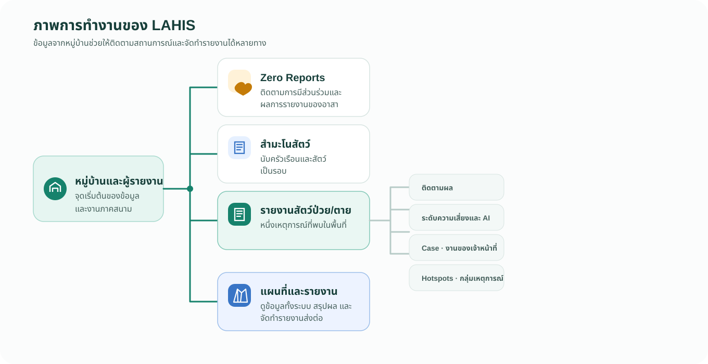

# 1.1 LAHIS มีอะไร และการอบรมนี้จะใช้ส่วนใด

LAHIS มีเมนูมากกว่าส่วนที่ใช้ในหลักสูตรนี้ ขอแนะนำให้ผู้ดูแลระบบเห็นภาพการทำงานทั้งหมดก่อน แล้วจึงสอนเฉพาะส่วนที่ผู้ฝึกสอนจะใช้หรืออธิบายต่อได้ ไม่จำเป็นต้องตั้งค่าทุกเมนูที่เห็นใน Dashboard

## ภาพการทำงาน

*ภาพที่ 1.1 — ภาพรวมการเก็บข้อมูล ติดตามงาน และดูผลใน LAHIS*

แผนภาพนี้แสดงเส้นทางของข้อมูล ไม่ได้บอกว่าเหตุการณ์ทุกรายการต้องกลายเป็น `Case` หรือ `Hotspots`.

## ส่วนที่ LAHIS มี

ให้จำเป็นสี่กลุ่ม: **ตั้งต้นระบบ → เก็บข้อมูล → ตั้งค่าแบบฟอร์ม → ติดตามและดูผล**.

### ตั้งต้นระบบ: สถานที่และคน

| ส่วน | ใช้ทำอะไร |
|---|---|
| พื้นที่ระบบ, Authority และหมู่บ้าน | กำหนดสภาพแวดล้อมการทำงานและโครงสร้างพื้นที่ |
| ผู้ใช้และ Invitation Code | กำหนดว่าใครเข้า Dashboard ได้ และใครลงทะเบียนเป็นผู้รายงานได้ |

### เก็บข้อมูลจากพื้นที่

| ส่วน | ใช้ทำอะไร |
|---|---|
| สำมะโนสัตว์ | นับครัวเรือนและสัตว์ในหมู่บ้านเป็นรอบ |
| สำมะโนคน | มีแบบฟอร์ม แต่ชุดสาธิตปัจจุบันไม่มีรอบที่เปิดอยู่ |
| รายงานสัตว์ป่วย/ตาย | บันทึกหนึ่งเหตุการณ์ที่พบสัตว์ป่วยหรือตาย |
| ติดตามผล | บันทึกจำนวนภายหลังในรายงานเดิม |

### ตั้งค่าแบบฟอร์มและวิธีรวมตัวเลข

| ส่วน | ใช้ทำอะไร |
|---|---|
| Form builder | แก้ป้ายชื่อ ชนิดสัตว์ กลุ่มโรค อาการ และเงื่อนไขแสดง/ซ่อน |
| ตัวชี้วัดติดตามผล | กำหนดว่าแต่ละจำนวนจะสะสม หรือแทนที่จำนวนเดิม |

### ติดตามงานและดูผล

| ส่วน | ใช้ทำอะไร |
|---|---|
| `Case` | งานของเจ้าหน้าที่เมื่อรายงานต้องติดตามต่อ |
| ระดับความเสี่ยงและความเห็นจาก AI | ผลประกอบการดูรายงาน |
| `Hotspots` | กลุ่มรายงานที่เกี่ยวข้องกัน |
| แผนที่และรายงาน | ดูเหตุการณ์ สรุปข้อมูล และจัดทำรายงานเพื่อส่งต่อขึ้นตามสายงาน |
| `Zero Reports` | ติดตามว่าอาสาหรือผู้รายงานยังอยู่ในกระบวนการรายงาน ส่งรายงานอย่างต่อเนื่อง และมีผลการรายงานเป็นอย่างไร |

## ส่วนที่ใช้ในการอบรมนี้

ขอแนะนำให้สอนและให้ผู้ฝึกสอนทดลองเฉพาะส่วนต่อไปนี้

1. สถานที่และคน
2. สำมะโนสัตว์: เปิดรอบ ตรวจความครอบคลุม และส่งออกข้อมูล แต่ไม่สอนสร้างโครงสร้างแบบฟอร์มสำมะโน
3. รายงานสัตว์ป่วย/ตาย และการติดตามผล
4. Form builder: ป้ายชื่อ ชนิดสัตว์ กลุ่มโรค อาการ และเงื่อนไขแสดง/ซ่อน
5. ตัวชี้วัดติดตามผล: ความต่างระหว่างสะสมกับแทนที่
6. `Case`: แยกภาพรวมเส้นทาง การตั้ง `Case Definition` และแบบฟอร์มปิด Case ตามบทบาทผู้ใช้
7. `Reporter Alert`: ออกแบบข้อความอัตโนมัติที่ส่งความรู้และสิ่งที่ต้องทำกลับไปยังผู้รายงาน
8. งานของ Officer: ตรวจรายงาน เปลี่ยนรายงานทดสอบ ใช้ AI และกำหนดระดับความเสี่ยง
9. แผนที่และรายงาน: รวมถึง `Zero Reports`, ตารางสรุป และการส่งออกรอบสำมะโน

Officer สามารถอ่าน AI Suggest, ใช้ `Ask AI` และกำหนด Risk Level ตามข้อมูลที่ตรวจสอบแล้ว แต่ไม่ตั้งค่าระบบ AI หรือ Integration ส่วน `Hotspots` เปิดดูได้ในภาพรวม แต่ไม่ใช่หัวข้อการตั้งค่าในคู่มือนี้

ส่วนต่อไปนี้ไม่ใช้ในการอบรมนี้: `Observation`, Outbreak Plans, State Definitions, Integration Clients, Webhook Endpoints, การสร้างโครงสร้างแบบฟอร์มสำมะโน และการเปิดรอบสำมะโนคน

## ใครใช้ส่วนใด

| ส่วน | ผู้ดูแลระบบ | ผู้ฝึกสอน | เจ้าหน้าที่ | ผู้รายงาน |
|---|---|---|---|---|
| สถานที่ คน และ Invitation Code | ตั้งค่าและตรวจ | อธิบายวิธีใช้ | ใช้ตามสิทธิ์ | ใช้รหัสเพื่อลงทะเบียน |
| สำมะโนสัตว์ | เปิดรอบและติดตาม | สอนขั้นตอน | ตรวจและติดตาม | บันทึกข้อมูลจากหมู่บ้าน |
| รายงานสัตว์ป่วย/ตาย | ตั้งค่าแบบฟอร์ม | สอนเส้นทางข้อมูล | ตรวจรายงานและทำงานต่อ | ส่งรายงาน |
| ติดตามผล | ตั้งค่าแบบฟอร์มและตัวชี้วัด | สอนความหมายของตัวเลข | บันทึกหรือตรวจติดตาม | ให้ข้อมูลเมื่อมีการติดตาม |
| `Case` | กำหนดกติกาและโครงสร้างแบบฟอร์มปิด | อธิบายขอบเขตของแต่ละบทบาท | Promote, ติดตาม และปิด Case | ไม่ตั้งค่าและไม่ปิด Case |
| `Reporter Alert` | ออกแบบและทดสอบข้อความที่ได้รับอนุมัติ | อธิบายเส้นทางข้อความ | อ่านผลและตอบ Comment ตามงาน | รับความรู้และสิ่งที่ต้องทำใน Mobile |
| AI และ Risk | ดูแลความพร้อมของระบบ | อธิบายว่า AI เป็นข้อมูลประกอบ | อ่าน AI, ใช้ Ask AI และกำหนด Risk | เห็นการตอบกลับที่ระบบส่งให้ตามสิทธิ์ |
| แผนที่และรายงาน | ดูภาพรวมและสนับสนุน | อธิบายภาพรวม | ใช้ติดตามงานและวิเคราะห์ | ไม่ใช้เป็นงานหลัก |
| `Zero Reports` | ติดตามการมีส่วนร่วมและผลการรายงานของอาสา | อธิบายวิธีอ่านผล | ติดตามผู้รายงานในพื้นที่รับผิดชอบ | ส่งรายงานตามงานที่ได้รับ |

### ข้อควรปฏิบัติ

- ขอแนะนำให้เริ่มการอบรมด้วยภาพการทำงานนี้ก่อนเข้าสู่เมนู
- โปรดเน้นเฉพาะส่วนที่ระบุว่าใช้ในการอบรม
- ควรแจ้งผู้ฝึกสอนว่าเมนูอื่นอาจมีอยู่ แต่ไม่ใช่หัวข้อของหลักสูตรนี้

### ข้อควรหลีกเลี่ยง

- ไม่ควรแก้การตั้งค่าระบบ AI, Integration หรือ `Hotspots` ในการฝึก
- โปรดหลีกเลี่ยงการเปิดหรือแก้ไข Integration Clients, Webhook Endpoints หรือข้อมูลลับ
- ยังไม่ควรสอนการสร้างแบบฟอร์มสำมะโนหรือการเปิดรอบสำมะโนคนในหลักสูตรนี้

### ประเด็นที่ใช้พูด

- หนึ่งรายงานคือหนึ่งเหตุการณ์สัตว์ป่วยหรือตาย
- การติดตามผลเพิ่มข้อมูลภายหลังในรายงานเดิม
- `Case` เป็นงานต่อของเจ้าหน้าที่ ไม่ใช่งานของผู้รายงาน
- หลักสูตรนี้เลือกสอนเฉพาะเมนูที่จำเป็น
- ถ้าเห็นเมนูอื่น ให้รู้ว่าเมนูนั้นอาจอยู่นอกขอบเขตการอบรม

## Check

| ผู้ฝึกสอนควรสามารถ | วิธีตรวจ |
|---|---|
| อธิบายภาพการทำงานจากหมู่บ้านถึงการส่งออกข้อมูลได้ | ชี้เส้นทางในแผนภาพ แล้วอธิบายด้วยคำของตนเอง |
| แยกรายงานสัตว์ป่วย/ตายกับการติดตามผลได้ | บอกได้ว่ารายงานคือเหตุการณ์ และติดตามผลคือข้อมูลภายหลังของเหตุการณ์เดิม |
| บอกได้ว่าหลักสูตรนี้สอนส่วนใด | เลือกอย่างน้อยสามส่วนจากรายการที่ใช้ในการอบรม |
| บอกได้ว่าส่วนใดไม่ควรตั้งค่าในการฝึก | ยกตัวอย่าง Integration Clients, Webhook Endpoints หรือการตั้งค่าระบบ AI ได้หนึ่งรายการ |
