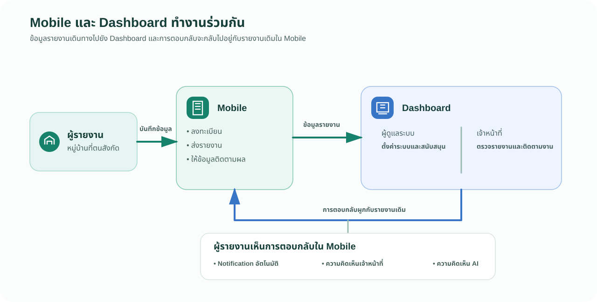
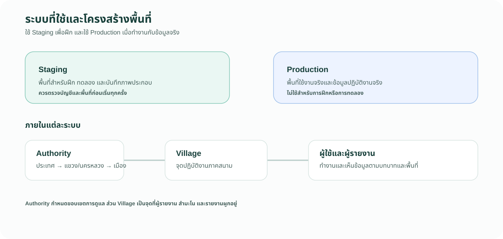
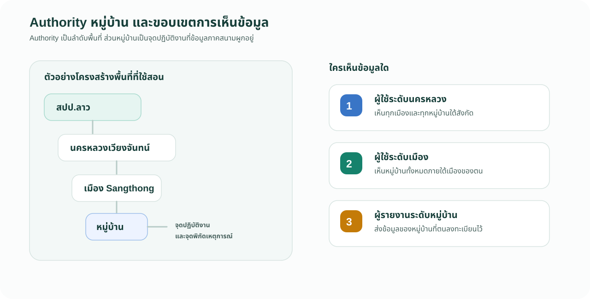
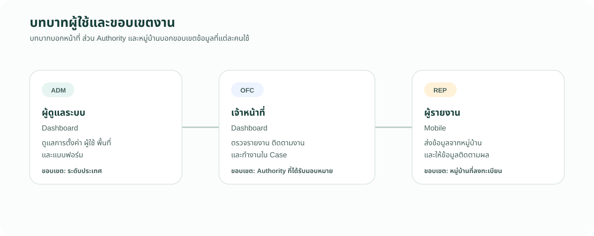

# 1.2 แผนผังระบบ

บทนี้ช่วยให้ผู้ดูแลระบบและผู้ฝึกสอนเห็นว่า Dashboard กับ Mobile ทำงานร่วมกันอย่างไร รวมทั้งเข้าใจความสัมพันธ์ระหว่าง Staging, Production, Authority, หมู่บ้าน และผู้ใช้ ก่อนเริ่มสอนขั้นตอนการตั้งค่าหรือการรายงาน

## Dashboard และ Mobile

*ภาพที่ 1.2.1 — รายงานจาก Mobile ไปยัง Dashboard และการตอบกลับกลับมาอยู่กับรายงานเดิมใน Mobile*

ข้อมูลที่ผู้รายงานบันทึกใน Mobile จะปรากฏให้ผู้มีสิทธิ์ดูได้ใน Dashboard.

เมื่อมีการตอบกลับ ข้อความจะกลับมาอยู่กับรายงานเดิมใน Mobile ผู้รายงานจึงสามารถเปิดรายงานของตนและดูการตอบกลับได้จากสามแหล่ง:

1. การแจ้งเตือนอัตโนมัติ (`Notification`)
2. ความคิดเห็นจากผู้ใช้ระดับเมืองที่ติดตามรายงาน
3. ความคิดเห็นจาก AI (`AI comment`)

การตอบกลับเหล่านี้ช่วยให้ผู้รายงานทราบว่ารายงานยังอยู่ในกระบวนการ และสามารถเห็นข้อมูลที่เกี่ยวข้องกับรายงานของตนได้.

## ระบบที่ใช้และโครงสร้างพื้นที่

*ภาพที่ 1.2.2 — Staging และ Production มีวัตถุประสงค์ต่างกัน แต่ทั้งสองระบบใช้ Authority หมู่บ้าน และผู้ใช้เพื่อกำหนดขอบเขตงาน*

ในการอบรมนี้ ให้คิดถึงระบบเพียงสองส่วนคือ Staging สำหรับฝึก และ Production สำหรับใช้งานจริง ภายในแต่ละระบบมี Authority ตามลำดับพื้นที่ ส่วนหมู่บ้านเป็นหน่วยปฏิบัติงานที่ผูกกับผู้รายงานและสำมะโน ผู้ใช้แต่ละคนจึงทำงานในขอบเขตพื้นที่ที่กำหนดไว้. คำว่า `Tenant` อาจปรากฏบนหน้าจอเลือก `LAHIS Demo` แต่ไม่ใช่คำหลักที่ต้องใช้สอนในบทนี้.

## Authority และหมู่บ้านต่างกันอย่างไร

`Authority` คือโครงสร้างลำดับชั้นของหน่วยงานและพื้นที่ ใช้กำหนดว่าใครรับผิดชอบหรือเห็นข้อมูลได้ถึงระดับใด ส่วนหมู่บ้านคือจุดปฏิบัติงานภาคสนามที่ผูกกับผู้รายงานและข้อมูลสำมะโน จึงไม่ควรอธิบายสองคำนี้ว่าเป็นสิ่งเดียวกัน.

*ภาพที่ 1.2.3 — ตัวอย่างโครงสร้างพื้นที่และขอบเขตการเห็นข้อมูลของแต่ละระดับ*

กล่าวโดยง่าย: **Authority บอกว่าใครดูแลพื้นที่ใด ส่วนหมู่บ้านบอกว่าข้อมูลภาคสนามมาจากที่ใด**.

## ขอบเขตการดูแลและการเห็นข้อมูล

ผู้ใช้จะเห็นข้อมูลตาม Authority ที่ตนสังกัด และพื้นที่ทั้งหมดที่อยู่ใต้ Authority นั้น จึงควรอธิบายขอบเขตการเห็นข้อมูลตามลำดับชั้น ไม่ใช่ตามชื่อบัญชีผู้ใช้.

ตัวอย่างเช่น ผู้ใช้ที่สังกัดนครหลวงเวียงจันทน์สามารถติดตามภาพรวมของทุกเมืองและหมู่บ้านในสังกัดได้ ส่วนผู้ใช้ที่สังกัดเมือง Sangthong จะติดตามข้อมูลของหมู่บ้านภายใต้เมือง Sangthong.

## โครงสร้างพื้นที่ที่ใช้ในการอบรม

ในหน้า `Authorities` อาจมีรายการที่สร้างไว้เพื่อการทดลองหรือการทำงานของผู้อื่น เพื่อให้การอบรมเข้าใจง่าย โปรดเน้นเฉพาะโครงสร้างของ สปป.ลาว ที่ได้รับการใช้ในหลักสูตรนี้ ไม่จำเป็นต้องอธิบายทุกรายการในหน้า `Authorities`.

ให้สื่อสารลำดับนี้ว่า **ประเทศ → แขวง/นครหลวง → เมือง → หมู่บ้าน**. รายการอื่นที่ไม่อยู่ในเส้นทางการอบรม สามารถข้ามไปก่อนได้.

## บทบาทผู้ใช้

*ภาพที่ 1.2.4 — หน้าที่การทำงานและขอบเขตข้อมูลของผู้ดูแลระบบ เจ้าหน้าที่ และผู้รายงาน*

บัญชี `L01` เป็นผู้ดูแลระบบระดับประเทศ ส่วน `V01` และ `S01` เป็นเจ้าหน้าที่ที่มีขอบเขต Authority ต่างกัน ผู้ฝึกสอนควรอธิบายว่าเมนูและข้อมูลที่เห็นอาจต่างกันตามบทบาทและขอบเขตพื้นที่

### ข้อควรปฏิบัติ

- ก่อนสอนขั้นตอน ขอให้เริ่มจาก Staging หรือ Production แล้วไล่ไปยัง Authority หมู่บ้าน และผู้ใช้
- โปรดอธิบายว่าบทบาทและขอบเขตพื้นที่เป็นคนละเรื่องกัน
- โปรดแยก Authority ซึ่งเป็นลำดับชั้นของพื้นที่ ออกจากหมู่บ้านซึ่งเป็นจุดปฏิบัติงานภาคสนาม
- ควรยกตัวอย่างว่าผู้ใช้ระดับบนเห็นพื้นที่ทั้งหมดที่อยู่ใต้สังกัดของตน
- หากผู้ฝึกสอนใช้บัญชีเจ้าหน้าที่ ควรให้ตรวจ Authority ของตนก่อนเริ่มทำงาน

### ข้อควรหลีกเลี่ยง

- ไม่จำเป็นต้องใช้คำว่า `Tenant` อธิบายโครงสร้างพื้นที่ เว้นแต่กำลังชี้ชื่อบนหน้าจอ
- โปรดหลีกเลี่ยงการคาดเดาสิทธิ์จากชื่อบัญชีเพียงอย่างเดียว
- ยังไม่ควรเปลี่ยน Authority หรือหมู่บ้านในชุดสาธิตเพื่อการฝึก

### ประเด็นที่ใช้พูด

- Staging ใช้สำหรับฝึก ส่วน Production ใช้สำหรับงานจริง
- Authority คือชั้นของหน่วยงานหรือพื้นที่ภายในระบบ
- หมู่บ้านคือจุดที่ผู้รายงานและข้อมูลสำมะโนผูกอยู่
- ผู้รายงานสามารถเห็นการตอบกลับที่ผูกกับรายงานของตนใน Mobile
- ผู้ใช้แต่ละคนเห็นข้อมูลตามบทบาทและ Authority ของตน

## Check

| ผู้ฝึกสอนควรสามารถ | วิธีตรวจ |
|---|---|
| แยกงานของ Dashboard และ Mobile ได้ | อธิบายว่าผู้รายงานทำงานใดใน Mobile และเจ้าหน้าที่ทำงานใดใน Dashboard |
| อธิบายระบบและโครงสร้างพื้นที่ได้ | แยก Staging กับ Production ได้ แล้วไล่จาก Authority ไปยังผู้ใช้ |
| แยก Authority กับหมู่บ้านได้ | อธิบายได้ว่า Authority กำหนดขอบเขตความรับผิดชอบ ส่วนหมู่บ้านเป็นจุดปฏิบัติงาน |
| อธิบายขอบเขตการเห็นข้อมูลได้ | เปรียบเทียบสิ่งที่ผู้ใช้ระดับนครหลวงและผู้ใช้ระดับเมืองเห็นได้ |
| อธิบายบทบาททั้งสามได้ | บอกความต่างระหว่าง `ADM`, `OFC` และ `REP` |
| อธิบายขอบเขตพื้นที่ได้ | ใช้ตัวอย่าง ประเทศ → แขวง/นครหลวง → เมือง → หมู่บ้าน |
