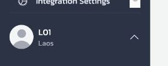

# 2.1 เข้าสู่ระบบ Staging

ก่อนเริ่มตั้งค่าหรือสอนผู้ฝึกสอน ควรตรวจให้แน่ใจว่ากำลังใช้ LAHIS Staging ด้วยบัญชีผู้ดูแลระบบและอยู่ในพื้นที่ที่ถูกต้อง ขั้นตอนสั้น ๆ นี้ช่วยลดความเสี่ยงของการแก้ไขข้อมูลในระบบผิดแห่ง.

## ขั้นตอนเข้าสู่ระบบ

1. กรุณาเปิด `https://lahis.ohtk.org`
2. ที่ตัวเลือก `Tenant` บนหน้าจอ กรุณาเลือก `LAHIS Demo`
3. กรุณาเข้าสู่ระบบด้วยบัญชีผู้ดูแลระบบ `L01`
4. หลังเข้าสู่ระบบ ให้ดูด้านล่างของแถบเมนูด้านซ้าย
5. ตรวจว่าชื่อผู้ใช้แสดงเป็น `L01` และพื้นที่แสดงเป็น `Laos`
6. เมื่อชื่อผู้ใช้หรือพื้นที่ไม่ตรงกับการฝึก ขอให้หยุดตรวจสอบก่อน และยังไม่เปลี่ยนการตั้งค่าใด ๆ

*ภาพที่ 2.1.1 — หลังเข้าสู่ระบบ ให้ตรวจ `L01` และ `Laos` ที่มุมล่างของแถบเมนูด้านซ้ายก่อนเริ่มงาน*

## สิ่งที่ควรเห็นหลังเข้าสู่ระบบ

| ตำแหน่งบนหน้าจอ | สิ่งที่ควรเห็น |
|---|---|
| มุมล่างของแถบเมนูด้านซ้าย | `L01` และ `Laos` |

ชื่อ `L01` ช่วยยืนยันว่ากำลังใช้บัญชีผู้ดูแลระบบ ส่วน `Laos` แสดงพื้นที่ระดับประเทศของบัญชีนั้น เมนู `Settings` ที่เห็นจึงอาจมากกว่าเมนูของเจ้าหน้าที่ระดับเมือง.

## เมื่อไม่ควรดำเนินการต่อ

| สิ่งที่พบ | แนวทางที่ควรทำ |
|---|---|
| ไม่พบ `LAHIS Demo` | กรุณาหยุดและแจ้งผู้ดูแล Staging |
| หน้าเว็บเปิดไม่ได้ | กรุณาตรวจการเชื่อมต่อและ URL แล้วแจ้งผู้ดูแล Staging หากยังเปิดไม่ได้ |
| ชื่อผู้ใช้หรือพื้นที่ไม่ตรง | กรุณาออกจากระบบและตรวจบัญชีที่ใช้ใหม่ |
| หน้าเว็บแจ้งว่าโหลดข้อมูลผู้ใช้ไม่ได้ | ยังไม่ควรทำงานต่อ ให้ตรวจว่าเข้าสู่ Staging ผ่านเว็บไซต์ที่กำหนด |
| เห็นข้อมูลที่ไม่ใช่ข้อมูลฝึก | กรุณาหยุดก่อนและแจ้งผู้รับผิดชอบระบบ |

### ข้อควรปฏิบัติ

- ก่อนเริ่มทุกช่วงการฝึก โปรดตรวจชื่อผู้ใช้และพื้นที่ที่แสดง
- ควรใช้ Staging สำหรับการฝึกและการบันทึกภาพหน้าจอ
- หากต้องเปรียบเทียบสิทธิ์ของเจ้าหน้าที่ ให้ใช้บัญชีที่กำหนดสำหรับการสาธิตเท่านั้น

### ข้อควรหลีกเลี่ยง

- ไม่ควรเปลี่ยนการตั้งค่าเมื่อยังไม่ยืนยันบัญชีและพื้นที่
- โปรดหลีกเลี่ยงการใช้ Production ในการฝึก
- ไม่ควรบันทึกรหัสผ่านลงในภาพหน้าจอหรือเอกสารที่แจกจ่าย

### ประเด็นที่ใช้พูด

- Staging ใช้สำหรับฝึก ส่วน Production ใช้สำหรับงานจริง
- ชื่อผู้ใช้และพื้นที่เป็นการตรวจครั้งแรกก่อนทำงาน
- ผู้ใช้คนละระดับอาจเห็นเมนูไม่เท่ากัน
- หากไม่แน่ใจ ควรหยุดและขอความช่วยเหลือก่อนเปลี่ยนการตั้งค่า

## Check

| ผู้ฝึกสอนควรสามารถ | วิธีตรวจ |
|---|---|
| เปิด Staging ที่ถูกต้องได้ | เปิด `https://lahis.ohtk.org` และเลือก `LAHIS Demo` |
| ตรวจบัญชีผู้ดูแลระบบได้ | หา `L01` และ `Laos` ที่มุมล่างของแถบเมนูด้านซ้าย |
| รู้เวลาที่ควรหยุดได้ | ยกตัวอย่างหนึ่งกรณีที่ชื่อผู้ใช้ พื้นที่ หรือข้อมูลไม่ตรงกับการฝึก |
