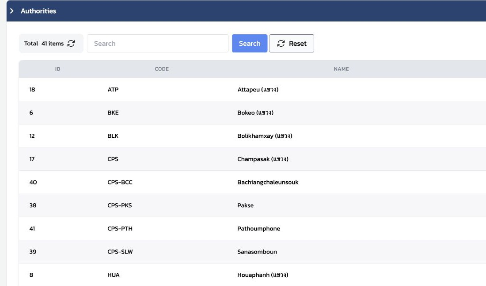
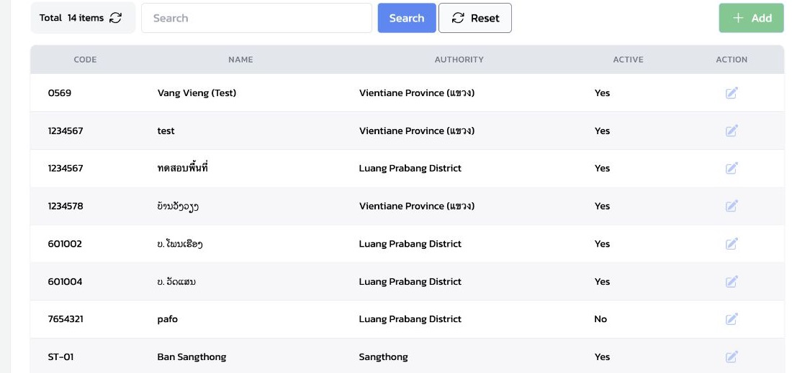
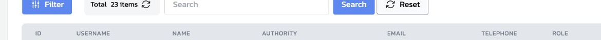

# 2.2 ตรวจข้อมูลพื้นที่และผู้ใช้เบื้องต้น

บทนี้เป็นการเปิดดูข้อมูลที่มีอยู่ เพื่อให้ผู้ฝึกสอนรู้ว่าข้อมูลพื้นที่และผู้ใช้เชื่อมโยงกันอย่างไร ยังไม่ใช่ขั้นตอนสร้างหรือแก้ไขข้อมูล

| สิ่งที่เปิดดู | สิ่งที่ตรวจเบื้องต้น |
|---|---|
| Authority | ลำดับชั้นและขอบเขตการดูแล |
| Village | จุดปฏิบัติงานและจุดพิกัดของหมู่บ้าน |
| Users | ผู้ใช้ บทบาท และขอบเขตพื้นที่ |

## เปิดดู Authority และ Village

1. จาก `Settings` กรุณาเปิด `Authorities` แล้วค้นหาพื้นที่ตัวอย่าง
2. เปิดรายละเอียดเพื่อตรวจ `Inherits` ว่าพื้นที่แม่อยู่ในลำดับที่ถูกต้อง
3. เปิด `Villages` และตรวจ `NAME`, `AUTHORITY` และ `ACTIVE`
4. เปิดรายละเอียดหมู่บ้านเมื่อจำเป็นต้องตรวจว่าจุดพิกัดละติจูดและลองจิจูดสมเหตุสมผล เพราะใช้เป็นจุดอ้างอิงของเหตุการณ์ในพื้นที่

*ภาพที่ 2.2.1 — หน้า `Authorities` ใช้ค้นหาชื่อพื้นที่และตรวจลำดับพื้นที่ก่อนเปิดรายละเอียด*

*ภาพที่ 2.2.2 — หน้า `Villages` ให้ตรวจ `NAME`, `AUTHORITY` และ `ACTIVE`; หากต้องตรวจพิกัดจึงเปิดรายละเอียดของหมู่บ้านนั้น*

## เปิดดู Users

1. จาก `Settings` กรุณาเปิด `Users`
2. ใช้ช่องค้นหาเพื่อหาบัญชีตัวอย่าง
3. ตรวจ `USERNAME`, `AUTHORITY` และ `ROLE` ร่วมกัน

ชื่อผู้ใช้เพียงอย่างเดียวไม่พอ: `AUTHORITY` บอกขอบเขตพื้นที่ที่ดูแล และ `ROLE` บอกหน้าที่ของผู้ใช้

*ภาพที่ 2.2.3 — เมื่อตรวจบัญชีผู้ใช้ ให้ดู `USERNAME`, `AUTHORITY` และ `ROLE` ร่วมกัน ไม่ดูจากชื่อผู้ใช้เพียงอย่างเดียว*

### ข้อควรปฏิบัติ

หากพบข้อมูลที่ไม่ตรงกัน โปรดบันทึกข้อสังเกตและแจ้งผู้รับผิดชอบระบบ แทนการแก้ไขข้อมูลสาธิตในระหว่างการอบรม

## Check

| ผู้ฝึกสอนควรสามารถ | วิธีตรวจ |
|---|---|
| เปิดดู Authority, Village และ Users ได้ | เปิดแต่ละหน้าจาก `Settings` ได้ |
| อธิบายความต่างของ Authority กับ Village ได้ | Authority คือขอบเขตการดูแล; Village คือจุดปฏิบัติงานและพิกัด |
| ตรวจข้อมูลผู้ใช้เบื้องต้นได้ | อธิบาย `AUTHORITY` และ `ROLE` ของบัญชีตัวอย่างหนึ่งบัญชี |
