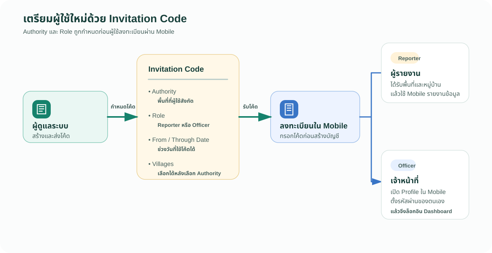
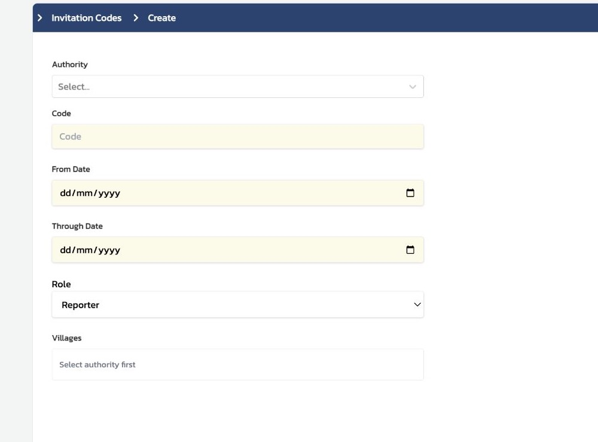

# 3 เตรียมผู้ใช้ใหม่ด้วย Invitation Code

เมื่อมีผู้รายงานหรือเจ้าหน้าที่จำนวนมาก ผู้ดูแลระบบไม่จำเป็นต้องสร้างบัญชีผู้ใช้ทีละรายจากหน้า `Users` เสมอไป สามารถสร้าง `Invitation Code` แล้วให้ผู้รับโค้ดลงทะเบียนผ่าน Mobile ได้ โดยระบบจะสร้างบัญชีให้ตามขอบเขตพื้นที่และบทบาทที่กำหนดไว้ในโค้ดนั้น

## Invitation Code กำหนดอะไรให้ผู้ลงทะเบียน

*ภาพที่ 3.1 — Invitation Code กำหนดพื้นที่ บทบาท และช่วงวันใช้งานก่อนผู้ใช้ลงทะเบียนผ่าน Mobile; Officer ต้องตั้งรหัสผ่านใน `Profile` ก่อนล็อกอิน Dashboard*

| หากผู้รับโค้ดเป็น | กรุณาเลือก Role | ผลหลังลงทะเบียน |
|---|---|---|
| ผู้รายงานระดับหมู่บ้าน | `Reporter` | ผู้ใช้เป็นผู้รายงานในพื้นที่ที่กำหนด และอาจกำหนดหมู่บ้านให้ได้ |
| เจ้าหน้าที่ระดับเมือง | `Officer` | ผู้ใช้เป็นเจ้าหน้าที่ภายใต้ Authority ของเมืองนั้น เพื่อดูและติดตามข้อมูลในขอบเขตที่รับผิดชอบ |

### ข้อควรเข้าใจ

`Authority` บอกว่าผู้ใช้สังกัดและดูแลพื้นที่ใด ส่วน `Role` บอกว่าผู้ใช้นั้นทำหน้าที่ใด ทั้งสองส่วนจะถูกกำหนดก่อนผู้ใช้ลงทะเบียน จึงควรตรวจให้ถูกต้องก่อนส่งโค้ด

*ภาพที่ 3.2 — แบบฟอร์มกำหนด `Authority`, `Code`, ช่วงวันใช้งาน และ `Role`; ตัวเลือกหมู่บ้านจะแสดงหลังเลือก Authority*

## เตรียมโค้ดให้เจ้าหน้าที่เมือง

1. จาก `Settings` กรุณาเปิด `Invitation Codes`
2. เลือกสร้างโค้ดใหม่ และเลือก Authority ของเมืองที่เจ้าหน้าที่จะสังกัด
3. ในช่อง `Role` กรุณาเลือก `Officer`
4. กำหนดวันเริ่มใช้และวันหมดอายุของโค้ดตามแผนการอบรม
5. ตรวจ Authority และ Role อีกครั้งก่อนบันทึก แล้วจึงส่งโค้ดให้ผู้เข้าร่วมลงทะเบียนผ่าน Mobile

สำหรับผู้รายงานหมู่บ้าน ให้เลือก `Reporter` แทน และกำหนดหมู่บ้านเมื่อหน้าจอแสดงตัวเลือกดังกล่าวหลังเลือก Authority แล้ว

## หลังผู้ใช้ลงทะเบียน

ผู้ลงทะเบียนกรอก Invitation Code ใน Mobile ก่อนกรอกข้อมูลบัญชี เมื่อระบบตรวจโค้ดผ่าน บัญชีที่สร้างจะได้รับ Authority และ Role ตามโค้ดนั้น ผู้ดูแลระบบสามารถกลับไปตรวจใน `Users` ได้ภายหลัง โดยดู `USERNAME`, `AUTHORITY` และ `ROLE` ร่วมกัน

### ขั้นตอนสำคัญสำหรับ Officer

หน้าลงทะเบียนใน Mobile ยังไม่มีช่องให้ตั้งรหัสผ่าน ดังนั้นหลังเจ้าหน้าที่ที่มีบทบาท `Officer` ลงทะเบียนเสร็จแล้ว กรุณาให้เจ้าหน้าที่เปิด `Profile` ใน Mobile และตั้งรหัสผ่านของตนเอง รหัสผ่านนี้ใช้สำหรับล็อกอินเข้า Dashboard เพื่อทำงานในบทบาทเจ้าหน้าที่

### ข้อควรระวัง

ไม่ควรถือว่าการลงทะเบียนเสร็จสมบูรณ์เพียงเมื่อสร้างบัญชีได้ ควรตรวจว่าเจ้าหน้าที่ `Officer` เข้า `Profile` และตั้งรหัสผ่านด้วยตนเองแล้ว

## Check

| ผู้ฝึกสอนควรสามารถ | วิธีตรวจ |
|---|---|
| อธิบายได้ว่า Invitation Code ใช้ทำอะไร | อธิบายว่าโค้ดช่วยให้ผู้ใช้ลงทะเบียนผ่าน Mobile ได้ |
| แยกการใช้ `Officer` และ `Reporter` ได้ | บอกได้ว่าเจ้าหน้าที่เมืองใช้ `Officer` และผู้รายงานหมู่บ้านใช้ `Reporter` |
| เลือก Authority ให้ตรงกับผู้รับโค้ดได้ | อธิบายขอบเขตข้อมูลที่ผู้ใช้ระดับเมืองควรเห็น |
| ตรวจโค้ดก่อนส่งได้ | ตรวจ Authority, Role, From Date และ Through Date |
| แนะนำขั้นตอนหลังลงทะเบียนสำหรับ Officer ได้ | บอกได้ว่า Officer ต้องไปตั้งรหัสผ่านที่ `Profile` ใน Mobile เพื่อล็อกอินเข้า Dashboard |
