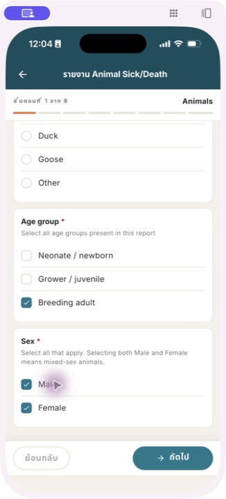
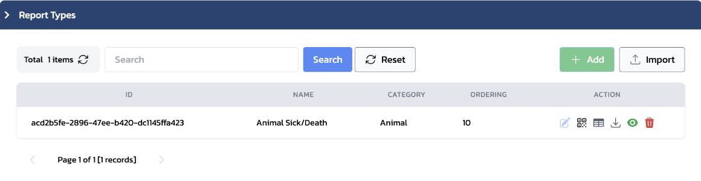
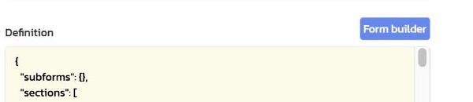
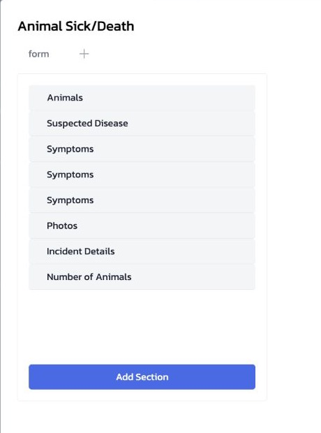
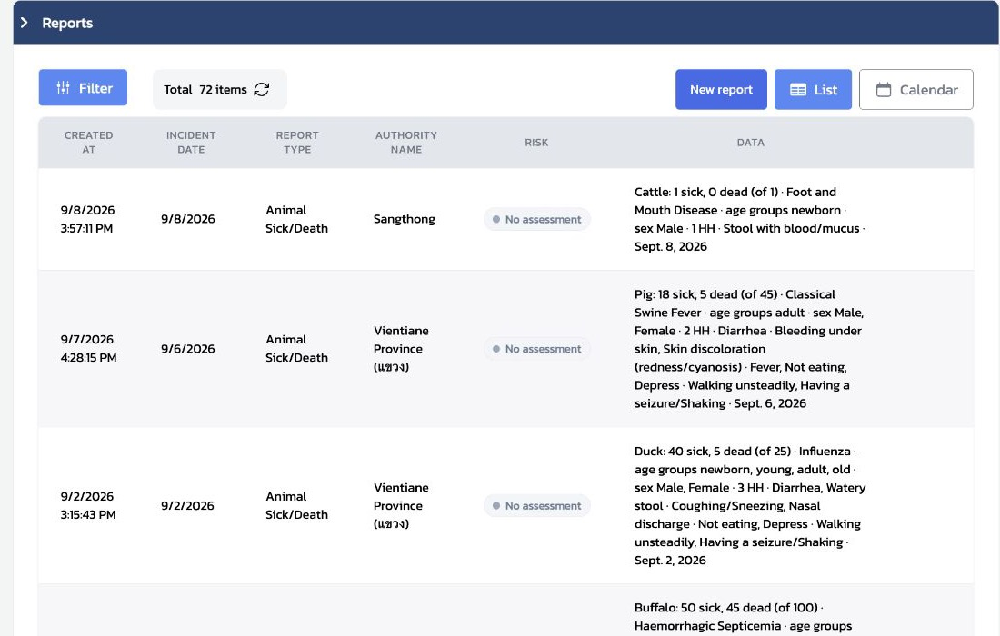
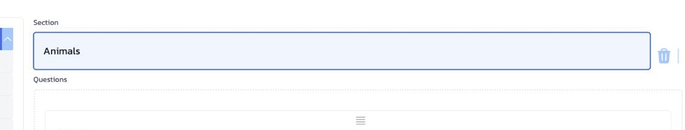
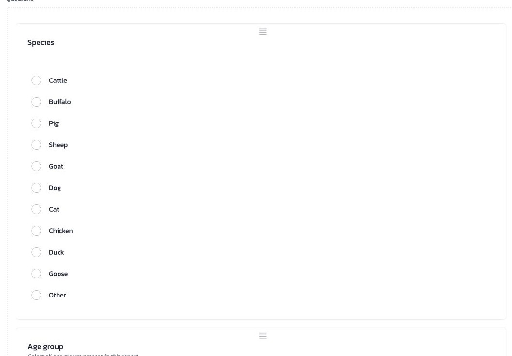
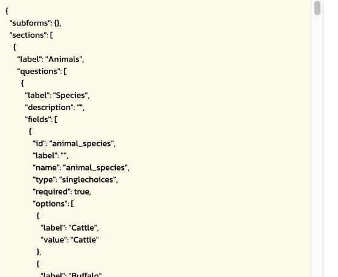
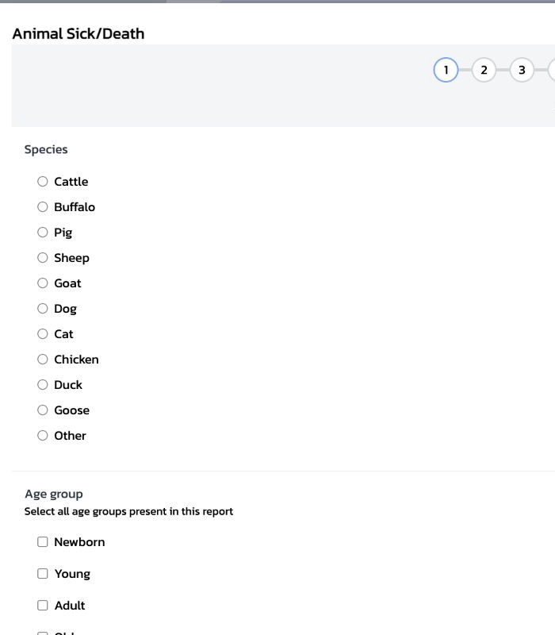

# 4.1 ปรับแบบฟอร์มรายงาน: ข้อความและกติกาข้อมูล

บทนี้ช่วยให้ผู้ฝึกสอนอธิบายได้ว่า การตั้งค่าใน `Animal Sick/Death` ส่งผลต่อสิ่งที่ผู้รายงานเห็นและตอบบน Mobile อย่างไร เริ่มจากดูหน้าจอ Mobile ก่อน แล้วจึงเปิด Form builder เพื่อตรวจข้อความ รูปแบบคำตอบ และกติกาตรวจข้อมูลตามลำดับ

### ใช้ Staging สำหรับการฝึก

การเปลี่ยนข้อความหรือกติกาต้องมีข้อตกลงจากผู้รับผิดชอบข้อมูลก่อนเสมอ หากเป็นเพียงการสาธิต ให้คืนค่าที่เปลี่ยนทันทีเมื่อจบการสอน

## เริ่มจากสิ่งที่ผู้รายงานเห็นบน Mobile

แบบฟอร์มหนึ่งชุดประกอบด้วยหลาย Section โดย **หนึ่ง Section จะแสดงเป็นหนึ่งหน้า** บน Mobile หากมีหลาย Section ผู้รายงานใช้ `ถัดไป` และ `ย้อนกลับ` เพื่อเปลี่ยนหน้า จึงควรเรียง Section ตามลำดับที่ผู้รายงานควรตอบจริง



*ภาพที่ 4.1.1 — Section `Animals` แสดงเป็น “ขั้นตอนที่ 1 จาก 8”; ด้านล่างมีปุ่ม `ย้อนกลับ` และ `ถัดไป`*

ก่อนแก้แบบฟอร์ม ให้ผู้ฝึกสอนชวนผู้เรียนตอบคำถามสั้น ๆ:

1. ผู้รายงานควรเห็นคำถามนี้ในหน้าใด และตอบหลังคำถามใด
2. ผู้รายงานต้องเลือกได้หนึ่งคำตอบ หลายคำตอบ หรือกรอกข้อมูล
3. ข้อมูลนี้จำเป็นต่อการส่งรายงานหรือไม่
4. จำนวนหรือวันที่ที่ยอมรับได้มีขอบเขตใด

คำตอบสี่ข้อจะช่วยแยกได้ว่าเป็นการปรับ “ข้อความ” เท่านั้น หรือเป็นการเปลี่ยนรูปแบบและกติกาของข้อมูล

## ภาพรวม: อะไรเปลี่ยนได้ในระดับใด

| ชั้นของแบบฟอร์ม | สิ่งที่กำหนด | ผลที่ผู้รายงานเห็น | แนวทางในบทนี้ |
|---|---|---|---|
| Section | หน้าและลำดับของหัวข้อ | หนึ่ง Section เป็นหนึ่งหน้า | ตรวจลำดับก่อนเพิ่มหรือแยก Section |
| Question | หัวข้อและคำอธิบาย | ชื่อคำถามและคำแนะนำ | ปรับภาษาได้เมื่อทบทวนแล้ว |
| Field type | รูปแบบการตอบ | เลือกหนึ่ง/หลายคำตอบ, กรอกจำนวน, วันที่, รูปภาพ | เปลี่ยนเมื่อออกแบบคำตอบใหม่และทดสอบแล้ว |
| Validation | กติกาที่ข้อมูลต้องผ่าน | ต้องตอบ, ช่วงจำนวน, จำนวนรูป, ช่วงวันที่ | เปลี่ยนเมื่อมีเกณฑ์ข้อมูลที่อนุมัติและทดสอบแล้ว |
| Summary Template | ข้อความสรุปจากคำตอบที่บันทึก | บรรทัดย่อบนรายการ Report หรือ Follow-up | ออกแบบข้อความให้ผู้รับงานอ่านสถานการณ์ได้เร็ว |
| ข้อมูลระบบ | `name`, `value`, `condition` | การเชื่อมข้อมูลและการแสดงตามเงื่อนไข | ไม่แก้เพื่อปรับภาษา |

## เปิด Form builder

1. จาก `Settings` กรุณาเปิด `Report Types`
2. เปิด `Animal Sick/Death`



*ภาพที่ 4.1.2 — แถว `Animal Sick/Death` คือจุดเริ่มต้นของการตรวจแบบฟอร์มรายงาน*

3. ในส่วน `Definition` กรุณาเลือก `Form builder`



*ภาพที่ 4.1.3 — ส่วน `Definition` และปุ่ม `Form builder` สำหรับเปิดแบบฟอร์มรายงาน*

4. เลือก Section ที่ต้องการตรวจ เช่น `Animals` หรือ `Symptoms`



*ภาพที่ 4.1.4 — รายการ Section แสดงลำดับหน้าของแบบฟอร์มรายงาน*

หน้าจอ Report Type เดียวกันยังมี `Followup Definition`, `Description Template`, `Follow Up Description Template` และ `Metric accumulation (JSON)` อยู่ด้วย หัวข้อ Template เป็นส่วนของบทนี้ ส่วน Follow-up Definition และ Metric accumulation จะอธิบายลึกขึ้นในบท 5

## Summary Template: เปลี่ยนคำตอบให้เป็นข้อความสรุป

Form Definition กำหนดว่า “ผู้รายงานกรอกอะไร” ส่วน Summary Template กำหนดว่า “ระบบจะเรียบเรียงคำตอบนั้นให้เจ้าหน้าที่อ่านอย่างไร” Template ไม่ได้สร้าง field ใหม่ และไม่เปลี่ยนข้อมูลดิบของ Report แต่สร้างข้อความสรุป (`renderer data`) เพื่อช่วยอ่านรายการและติดตามงาน

บนหน้า `Report Types` ของ `Animal Sick/Death` มี Template สองชุดที่ใช้กับข้อมูลคนละช่วง

| ช่องบนหน้าจอ | ใช้เมื่อ | ข้อมูลที่ Template อ่านได้เป็นหลัก | ตัวอย่างข้อความที่ต้องการได้ |
|---|---|---|---|
| `Description Template` | ผู้รายงานส่ง Report เหตุการณ์แรก | `data` ของ Report, `incident_date`, วันเวลารายงาน และข้อมูลระบบของ Report | `Dog: 1 sick, 0 dead (of 1) · Rabies` |
| `Follow Up Description Template` | Officer หรือผู้รับผิดชอบบันทึก Follow-up ของ Case/Report | `data` ของ Follow-up และ `incident_data` ของ Report เหตุการณ์แรก | `Dog follow-up: 0 sick · 0 dead · 1 recovered` |

Template ที่สองจะแสดงเมื่อ Report Type เปิด `Followable` เท่านั้น จึงไม่ควรคัดลอก Template ของ Report แรกมาใช้กับ Follow-up โดยไม่ตรวจชื่อข้อมูลก่อน: ใน Follow-up ค่าใหม่อยู่ใน `data` แต่รายละเอียดเหตุการณ์แรกอยู่ใน `incident_data`

### ข้อความที่ render แล้วไปแสดงที่ใด

เมื่อมีการบันทึก Report ระบบจะนำคำตอบมาสร้างข้อความสรุป แล้วเก็บผลไว้กับ Report นั้น บน Dashboard ให้เปิด `Reports` → `List` แล้วอ่านข้อความในคอลัมน์ **DATA** นั่นคือผลที่ `Description Template` render แล้ว ไม่ใช่ JSON ของ Form Definition และไม่ใช่คำตอบดิบทั้งหมด

### ลำดับการสร้างข้อความสรุป

1. `Form Definition` เก็บคำตอบเรื่องสัตว์ จำนวนป่วย/ตาย โรค และอาการ
2. `Description Template` เลือกและเรียงข้อมูลที่ควรอ่านก่อน
3. Dashboard `Reports` → คอลัมน์ **DATA** แสดงข้อความสรุปของแต่ละ Report



*ภาพที่ 4.1.5 — Dashboard `Reports` → `List`: คอลัมน์ `DATA` แสดงข้อความสรุปที่ render แล้ว เช่นชนิดสัตว์ จำนวนป่วย/ตาย โรค อาการ และวันที่*

จึงควรออกแบบ Template ให้สั้นพอสำหรับการกวาดตาในตาราง แต่ยังมีข้อมูลสำคัญสำหรับตัดสินใจว่าจะเปิด Report รายละเอียดใดต่อไป หากข้อความยาวเกินไป ระบบยังแสดงได้ แต่ Officer จะเปรียบเทียบหลาย Report ได้ยากขึ้น

### อ่าน Template แบบไม่ต้องเขียนโค้ดจากศูนย์

Template ปัจจุบันใช้รูปแบบ Django template เช่น `{{ ... }}` เพื่อแทรกค่า, `` เพื่อแสดงข้อความเฉพาะเมื่อมีข้อมูล, และ `default` เพื่อแทนค่าที่ว่าง ตัวอย่างย่อของ Description Template คือ

```django

{{ species }}: {{ sick }} sick, {{ dead }} dead

```

ผลคือระบบนำชนิดสัตว์และจำนวนป่วย/ตายจาก Report มาประกอบเป็นข้อความหนึ่งบรรทัด ไม่ใช่ข้อความที่ผู้รายงานพิมพ์เพิ่ม ในช่อง Template มีคำใบ้ว่าพิมพ์ `{=` เพื่อดูตัวแปรที่ระบบเสนอได้; ให้เลือกตัวแปรจากคำใบ้ก่อนแทนการเดาชื่อ field

### หลักการออกแบบข้อความสรุป

ข้อความสรุปควรตอบคำถามที่ Officer ต้องอ่านก่อนเปิดรายละเอียด ได้แก่ **เกิดกับสัตว์อะไร, ป่วย/ตายกี่ตัว, สงสัยโรคใด, และเป็น Report แรกหรือ Follow-up** ให้เรียงข้อมูลสำคัญก่อนและใช้เงื่อนไข `` กับข้อมูลที่อาจว่าง เช่นชื่อโรคหรืออาการ

อย่าเปลี่ยน `name` หรือ `value` ของ Field เพื่อให้ Template อ่านง่ายขึ้น เพราะ Template, Case Definition, Reporter Alert และรายงานเดิมอาจอ้างค่านั้นอยู่ หากจำเป็นต้องเพิ่มข้อมูลในข้อความ ให้เริ่มจากตรวจชื่อ field ที่มีอยู่ แล้วเพิ่มเฉพาะส่วน Template พร้อมกรณีทดสอบที่มีค่าและไม่มีค่า

การแก้ Template ไม่เขียนทับข้อมูลดิบของ Report แต่ข้อความสรุปถูกสร้างเมื่อมีการบันทึก Report หรือ Follow-up ดังนั้นข้อความของรายการเดิมจะไม่เปลี่ยนเพียงเพราะแก้ Template ใน Report Type ต้องตกลงให้ชัดว่าจะแสดงผลกับข้อมูลใหม่เท่านั้นหรือมีแผนจัดการข้อมูลเดิมแยกต่างหาก

## อ่าน Form builder จาก Section → Question → Field

ให้เริ่มอ่านจากด้านนอกเข้าสู่รายละเอียด

1. **Section** — กำหนดหนึ่งหน้าใน Mobile และชื่อหัวข้อของหน้านั้น
2. **Question** — กำหนดหัวข้อที่ผู้รายงานอ่านและคำอธิบายประกอบ
3. **Field** — กำหนดวิธีตอบ, กติกาตรวจข้อมูล และชื่อที่ระบบใช้เก็บข้อมูล



*ภาพที่ 4.1.6 — ชื่อ Section เป็นข้อความที่ผู้รายงานเห็นบนหัวข้อของหน้า*

## ปรับข้อความที่ผู้รายงานเห็น

เมื่อต้องการปรับภาษา ให้เปลี่ยนเฉพาะข้อความที่ผู้รายงานเห็น โดยคงโครงสร้างข้อมูลเดิมไว้

| ส่วนที่ปรับ | ใช้เมื่อ | ตัวอย่าง |
|---|---|---|
| Section title | ต้องการให้หัวข้อของหน้าชัดขึ้น | `Animals` |
| Question title | ต้องการให้เข้าใจสิ่งที่ต้องตอบ | `Age group` |
| Description | ต้องการเพิ่มคำแนะนำ | คำอธิบายใต้คำถาม |
| Choice label | ต้องการปรับถ้อยคำของตัวเลือก | ชื่อชนิดสัตว์หรืออาการ |



*ภาพที่ 4.1.7 — Question `Species` และ choice label ที่ผู้รายงานเห็น โดยข้อความแสดงผลแยกจากค่าข้อมูลที่ระบบจัดเก็บ*

### หลักสำคัญ

หากเปลี่ยนเพียงถ้อยคำ ให้แก้เฉพาะ title, description หรือ label และคง `name`, `value`, `type` และ `condition` เดิมไว้

## Field type: ผู้รายงานตอบแบบใด

ค่า `type` กำหนดรูปแบบการตอบบน Mobile ไม่ใช่เพียงข้อความ จึงต้องเลือกให้ตรงกับคำตอบที่ต้องการเก็บ

| Field type | ผู้รายงานทำอะไรบน Mobile | ตัวอย่างในแบบฟอร์มนี้ |
|---|---|---|
| `singlechoices` | เลือกได้หนึ่งคำตอบ | ชนิดสัตว์ (`Species`) |
| `multiplechoices` | เลือกได้มากกว่าหนึ่งคำตอบ | กลุ่มอายุหรืออาการ |
| `integer` | กรอกจำนวนเป็นตัวเลข | จำนวนสัตว์ป่วยหรือสัตว์ตาย |
| `date` | เลือกวันที่ | วันที่เกิดเหตุ |
| `textarea` | พิมพ์ข้อความหลายบรรทัด | อาการที่ยังไม่ทราบ |
| `images` | เพิ่มรูปภาพประกอบรายงาน | รูปสัตว์ |

ตัวอย่าง: `singlechoices` เหมาะเมื่อเลือกได้เพียงหนึ่งชนิดสัตว์ ส่วน `multiplechoices` เหมาะเมื่อรายงานอาจมีหลายกลุ่มอายุหรือหลายอาการ การเปลี่ยน `type` ทำให้รูปแบบคำตอบและข้อมูลเดิมอาจไม่ตรงกัน จึงควรทำเมื่อมีการออกแบบคำถามใหม่ ไม่ใช่ระหว่างการปรับคำ

## Validation: ข้อมูลใดจึงจะส่งรายงานได้

Validation เป็นกติกาตรวจข้อมูลก่อนส่งรายงาน การเปลี่ยนกติกาอาจทำให้ผู้รายงานส่งรายงานไม่ได้ หรือทำให้รับข้อมูลที่เดิมไม่ยอมรับ จึงควรตกลงเกณฑ์กับผู้รับผิดชอบข้อมูลก่อน

| ค่าใน field | ผลบน Mobile | ตัวอย่าง |
|---|---|---|
| `required: true` | ต้องตอบก่อนจึงจะส่งรายงานได้ | บังคับเลือกชนิดสัตว์ |
| `min` / `max` ของ `integer` | จำนวนต่ำสุด / สูงสุดที่ยอมรับได้ | จำนวนสัตว์ไม่น้อยกว่า `0` |
| `min` / `max` ของ `images` | จำนวนรูปต่ำสุด / สูงสุดที่ยอมรับได้ | แนบได้ไม่เกิน `10` รูป |
| `minLength` / `maxLength` | จำนวนอักขระต่ำสุด / สูงสุดของข้อความ | จำกัดความยาวคำอธิบาย |
| `backwardDaysOffset: N` ของ `date` | รับวันที่ย้อนหลังได้ไม่เกิน `N` วัน | `N = 7` รับได้ตั้งแต่ 7 วันก่อนถึงวันนี้ |
| `forwardDaysOffset: N` ของ `date` | รับวันที่ล่วงหน้าได้ไม่เกิน `N` วัน | `N = 0` ไม่รับวันที่หลังจากวันนี้ |

หากกำหนดทั้ง `backwardDaysOffset: 7` และ `forwardDaysOffset: 0` ระบบจะรับเฉพาะวันที่ตั้งแต่ 7 วันก่อนถึงวันนี้เท่านั้น

## ก่อนแก้กติกา ให้ระบุผลที่ต้องการก่อน

การเปลี่ยน validation ควรทำเป็นข้อตกลงสั้น ๆ ก่อนเริ่มแก้ เช่น “ต้องมีรูปอย่างน้อย 1 รูป”, “จำนวนสัตว์ต้องไม่ติดลบ” หรือ “รายงานเหตุย้อนหลังได้ไม่เกิน 7 วัน” จากนั้นจึงปรับค่าของ field ที่เกี่ยวข้องทีละรายการ

ไม่ควรใช้ `required` แทนการบอกว่า “ข้อมูลนี้สำคัญ” หากการขาดข้อมูลยังเป็นสิ่งที่ยอมรับได้ในสถานการณ์จริง เพราะ `required` จะหยุดการส่งรายงานทั้งหมด

`name`, `type` และ `value` เป็นข้อมูลระบบ ไม่ใช่ส่วนที่แก้เพียงเพื่อปรับภาษา ดังตัวอย่างต่อไปนี้



*ภาพที่ 4.1.8 — `name`, `type` และ `value` ใน Definition เป็นข้อมูลระบบที่คงเดิมเมื่อปรับเพียงภาษา*

## ทดสอบก่อนบันทึก

หลังปรับข้อความหรือกติกา ให้เปิด `Simulator mode` และทดสอบตามรายการที่เกี่ยวข้อง

| สิ่งที่เปลี่ยน | สิ่งที่ควรทดสอบ |
|---|---|
| Section | ลำดับหน้า และปุ่ม `ถัดไป` / `ย้อนกลับ` พาไปยังหัวข้อที่ถูกต้อง |
| ข้อความ | ชื่อ Section, Question, Description และ Choice label ปรากฏถูกต้อง |
| `singlechoices` / `multiplechoices` | เลือกได้จำนวนคำตอบตามที่ออกแบบ |
| `required` | เว้นคำตอบแล้วระบบไม่อนุญาตให้ส่ง |
| `min` / `max` | ลองค่าต่ำกว่าและสูงกว่าขอบเขตอย่างละหนึ่งค่า |
| ช่วงวันที่ | ลองวันที่ก่อนและหลังช่วงที่อนุญาตอย่างละหนึ่งวัน |
| Summary Template | ส่งตัวอย่างที่มีข้อมูลครบและข้อมูลที่เว้นไว้ แล้วตรวจข้อความสรุปว่าอ่านได้ ไม่มีชื่อตัวแปรหรือช่องว่างเกิน |



*ภาพที่ 4.1.9 — Simulator mode แสดงคำถาม ตัวเลือก และลำดับการตอบในมุมมองของผู้รายงาน*

### ข้อควรระวัง

ไม่ควรทดลองแก้ `name`, `value`, `type` หรือ `condition` ใน Staging เพื่อดูผล เพราะอาจกระทบรายงานเดิม เงื่อนไข หรือการสรุปข้อมูล หากต้องปรับ `type` หรือ validation ให้ทำตามเกณฑ์ที่อนุมัติและทดสอบกรณีขอบเขตให้ครบก่อนบันทึก

## Check

| ผู้ฝึกสอนควรสามารถ | วิธีตรวจ |
|---|---|
| อธิบายความสัมพันธ์ของ Section กับหน้า Mobile ได้ | ชี้ Section หนึ่งรายการและอธิบายการใช้ `ถัดไป` / `ย้อนกลับ` |
| เปิด Form builder ของ `Animal Sick/Death` ได้ | เปิด `Report Types` แล้วเข้าสู่ `Definition` → `Form builder` |
| แยกข้อความที่ผู้ใช้เห็นออกจากข้อมูลระบบได้ | ยกตัวอย่าง label หนึ่งรายการ และ `name` / `value` ที่ไม่ควรแก้เพื่อปรับภาษา |
| เลือก field type ให้ตรงกับคำตอบได้ | เปรียบเทียบ `singlechoices` กับ `multiplechoices` จากคำถามหนึ่งข้อ |
| อธิบาย validation ของ field ได้ | อธิบาย `required`, `min` / `max` และช่วงวันที่ย้อนหลัง / ล่วงหน้า |
| แยก Form Definition ออกจาก Summary Template ได้ | อธิบายว่า Template อ่านค่า field เพื่อสร้างบรรทัดสรุปของ Report หรือ Follow-up โดยไม่เปลี่ยนข้อมูลดิบ |
| ใช้ Simulator mode เพื่อตรวจแบบฟอร์มได้ | ทดสอบข้อความและกรณี validation อย่างน้อยหนึ่งกรณี |
