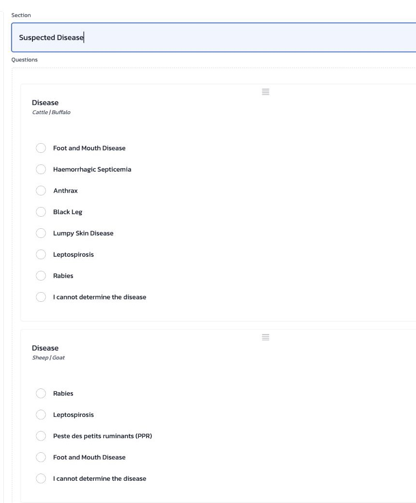
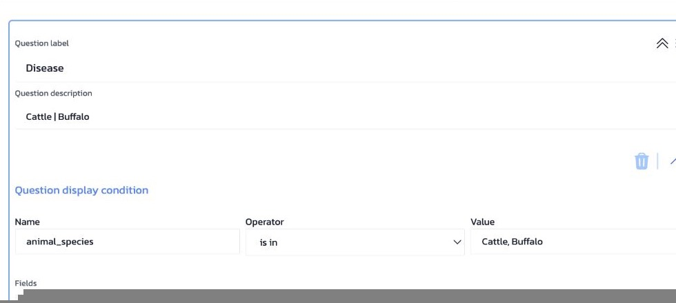
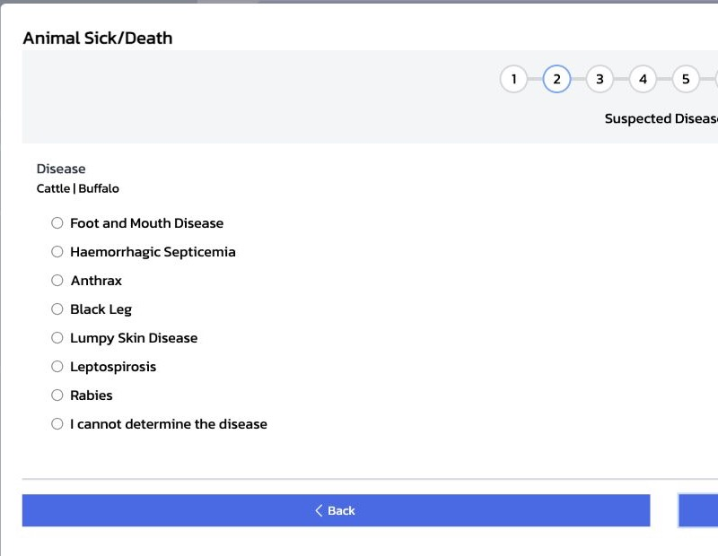

# 4.2 กลุ่มโรคและการแสดงคำถามตามชนิดสัตว์

บทนี้อธิบายเหตุผลที่ผู้รายงานเลือกชนิดสัตว์แล้วจึงเห็นรายการโรคที่ต่างกัน จุดสำคัญคือ ระบบไม่ได้กรองรายการโรคเดียวชุดใหญ่ แต่ใช้คำถาม `Disease` หลายคำถาม ซึ่งแต่ละคำถามจะแสดงเมื่อชนิดสัตว์ตรงกับเงื่อนไขของคำนั้น

## ภาพรวมการทำงาน

1. ผู้รายงานเลือก `Species`
2. ระบบอ่านค่า `animal_species`
3. ระบบแสดงคำถาม `Disease` ที่มี `condition` ตรงกัน
4. ผู้รายงานเลือกโรคจากรายการของกลุ่มสัตว์นั้น
5. ระบบบันทึกคำตอบไว้ใน `suspected_disease`

ดังนั้น ผู้ฝึกสอนไม่ควรอธิบายว่า “มีรายการโรคเดียว แล้วระบบซ่อนบางรายการ” เพราะโครงสร้างจริงคือ “หลายคำถามโรค แต่ใช้ชื่อ field เดียวกัน”

## โครงสร้างที่มีอยู่ใน `Animal Sick/Death`

คำถาม `Species` ใช้ field `animal_species` และคำถามโรคทุกกลุ่มใช้ field `suspected_disease` เหมือนกัน ความต่างอยู่ที่ condition ของแต่ละคำถาม

| กลุ่มสัตว์ที่เลือก | รายการโรคที่แสดง | condition |
|---|---|---|
| Cattle, Buffalo | โรคสำหรับโคและกระบือ | `animal_species in "Cattle, Buffalo"` |
| Sheep, Goat | โรคสำหรับแกะและแพะ | `animal_species in "Sheep, Goat"` |
| Pig | โรคสำหรับสุกร | `animal_species in "Pig"` |
| Dog, Cat | โรคสำหรับสุนัขและแมว | `animal_species in "Dog, Cat"` |
| Chicken | โรคสำหรับไก่ | `animal_species = "Chicken"` |
| Goose, Duck | โรคสำหรับห่านและเป็ด | `animal_species in "Goose, Duck"` |
| Other | ตัวเลือกที่ไม่สามารถระบุโรคได้ | `animal_species = "Other"` |

ทุกกลุ่มมีตัวเลือก `I cannot determine the disease` เพื่อให้ผู้รายงานส่งข้อมูลได้เมื่อยังไม่สามารถระบุโรคได้

*ภาพที่ 4.2.1 — ใน Form builder หนึ่ง Section มีคำถาม `Disease` หลายข้อ แต่ละข้อมีรายการโรคของกลุ่มสัตว์ของตนเอง*

## อ่าน condition ทีละส่วน

condition คือกติกาว่า “คำถามนี้จะปรากฏเมื่อใด” โดยประกอบด้วยสามค่า

| ส่วนของ condition | ความหมาย | ค่าที่ต้องตรวจ |
|---|---|---|
| `name` | field ที่ระบบนำคำตอบมาอ่าน | `animal_species` |
| `operator` | วิธีเปรียบเทียบคำตอบ | `in` สำหรับหลายชนิดสัตว์, `=` สำหรับหนึ่งชนิดสัตว์ |
| `value` | ค่าชนิดสัตว์ที่ทำให้คำถามแสดง | ต้องตรงกับ stored value ของตัวเลือก Species ทุกตัวอักษร |

ตัวอย่างสำหรับโคและกระบือ:

| ค่า condition | ตัวอย่าง |
|---|---|
| `name` | `animal_species` |
| `operator` | `in` |
| `value` | `Cattle`, `Buffalo` |

ความหมายคือ เมื่อผู้รายงานเลือก `Cattle` หรือ `Buffalo` ระบบจะแสดงคำถาม Disease ของกลุ่มนี้ หากเขาเลือก `Chicken` คำถามเดียวกันต้องไม่แสดง

*ภาพที่ 4.2.2 — condition ของคำถาม Disease สำหรับโคและกระบือ: อ่าน `animal_species` ด้วย `is in` และรับค่า `Cattle, Buffalo`*

### ข้อควรระวังเรื่อง value

condition เปรียบเทียบกับ `value` ที่ระบบเก็บ ไม่ใช่เพียงคำแปลหรือ label ที่เห็นบน Mobile หากเปลี่ยน label แต่คง value เดิม condition เดิมยังทำงานได้ หากเปลี่ยน value condition ที่อ้างถึงค่านั้นอาจไม่ทำงาน

## โรคต่างจากอาการอย่างไร

โรคถูกจัดเป็นกลุ่มตามชนิดสัตว์และใช้ condition เพื่อแสดงเฉพาะกลุ่มที่เกี่ยวข้อง ส่วนอาการจัดเป็นกลุ่มตามระบบของร่างกาย เช่น Digestive System, Respiratory System และ Nervous System ซึ่งโดยทั่วไปแสดงเสมอ ไม่ได้ผูกกับ `animal_species`

| สิ่งที่ผู้รายงานตอบ | หลักการแสดงผล |
|---|---|
| `Species` | เลือกกลุ่ม `Disease` ที่เกี่ยวข้อง |
| `Symptoms` | แสดงตามหมวดอาการ เพื่อให้เลือกได้หลายอาการ |

เมื่ออธิบายให้ผู้เรียน ให้เริ่มที่ชนิดสัตว์ก่อนเสมอ แล้วจึงชี้ว่าเหตุใดรายการโรคที่เห็นจึงต่างกัน

## วิธีตรวจกลุ่มโรคก่อนเปลี่ยนรายการ

1. เปิด `Settings` → `Report Types` → `Animal Sick/Death` → `Definition` → `Form builder`
2. เปิด Section `Suspected Disease` และเลือกคำถาม `Disease` ที่ต้องการตรวจ
3. อ่าน description เพื่อดูว่าคำถามนั้นเป็นกลุ่มสัตว์ใด
4. ตรวจ `name`, `operator` และ `value` ของ condition ให้สอดคล้องกับตัวเลือกใน `Species`
5. ตรวจว่าแต่ละชนิดสัตว์อยู่ในกลุ่มโรคเพียงกลุ่มเดียว
6. เปิด `Simulator mode` เพื่อยืนยันผล

บทนี้เป็นการอ่านและตรวจโครงสร้างกลุ่มโรคเท่านั้น การเพิ่มชนิดสัตว์ รายการโรค หรืออาการ จะทำในบท 4.3 หลังจากเข้าใจ condition แล้ว

## ทดสอบใน Simulator mode

ให้เลือกชนิดสัตว์อย่างน้อยสองกลุ่มที่มีรายการโรคต่างกัน เช่น `Cattle` และ `Chicken`

| ขั้นทดสอบ | ผลที่ควรเห็น |
|---|---|
| เลือก `Cattle` | เห็นเฉพาะรายการโรคของ Cattle, Buffalo |
| เปลี่ยนเป็น `Chicken` | รายการโรคของ Cattle, Buffalo หายไป และเห็นรายการโรคของ Chicken |
| เลือก `Duck` | เห็นรายการโรคของ Goose, Duck รวมถึง `Duck Plague` |
| เลือก `Other` | เห็นเพียง `I cannot determine the disease` |

หากพบว่าเลือกชนิดสัตว์หนึ่งแล้วเห็นคำถามโรคสองกลุ่มพร้อมกัน หรือไม่เห็นกลุ่มใดเลย ให้หยุดและตรวจ condition ก่อนบันทึกการเปลี่ยนแปลงใด ๆ

*ภาพที่ 4.2.3 — ใน Simulator mode เมื่อเลือก `Cattle` ระบบแสดงเฉพาะรายการโรคของกลุ่ม Cattle, Buffalo*

## Check

| ผู้ฝึกสอนควรสามารถ | วิธีตรวจ |
|---|---|
| อธิบายเหตุผลที่รายการโรคเปลี่ยนตามชนิดสัตว์ได้ | อธิบายว่าเป็นหลาย Disease question ที่มี condition ต่างกัน |
| อ่าน condition ได้ | ชี้ `name`, `operator` และ `value` ของกลุ่มสัตว์หนึ่งกลุ่ม |
| แยกโรคออกจากอาการได้ | อธิบายว่าโรคผูกกับ Species แต่อาการเป็นหมวดระบบร่างกาย |
| ตรวจ Simulator ได้ | สลับ `Cattle` และ `Chicken` แล้วอธิบายผลที่ควรต่างกัน |
