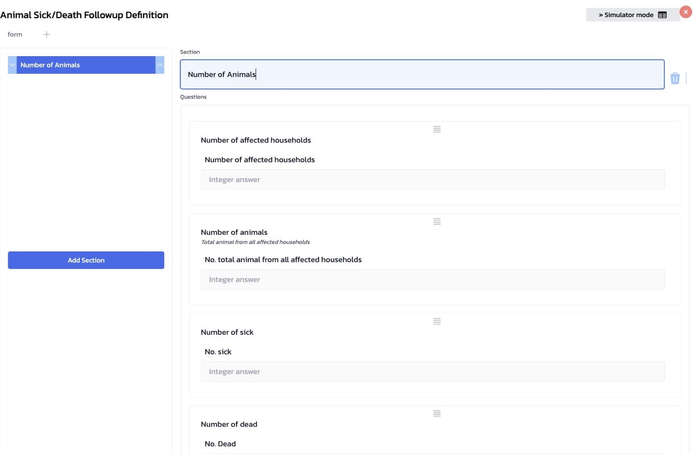

# 5 แบบฟอร์มติดตามผลและการรวมตัวเลข

บทนี้อธิบายว่าตัวเลขในรายงานติดตามผลหมายถึงอะไร และเหตุใดตัวเลขที่ผู้ใช้กรอกจึงอาจไม่เท่ากับยอดรวมที่ Dashboard แสดง จุดสำคัญคือให้แยก **ช่องที่เจ้าหน้าที่กรอก** ออกจาก **กติกาที่ระบบใช้รวมตัวเลข**

## ภาพรวมก่อนเริ่ม

รายงานแรกคือค่าตั้งต้นของเหตุการณ์ ส่วนรายงานติดตามผลใช้บันทึกข้อมูลในการติดตามแต่ละครั้ง แล้ว Dashboard จึงใช้กติกาของแต่ละตัวเลขเพื่อคำนวณยอดที่แสดง

1. Report ครั้งแรกบันทึกตัวเลขตั้งต้นของเหตุการณ์
2. Follow-up ครั้งที่ 1, 2, ... บันทึกตัวเลขของการติดตามแต่ละครั้ง
3. `Metric accumulation` ใช้กติกา `sum` หรือ `latest` กับค่าที่เกี่ยวข้อง
4. Dashboard แสดงยอดรวมจาก Report และ Follow-up

ในหน้า `Settings` → `Report Types` → `Animal Sick/Death` มีส่วนที่เกี่ยวข้องกันอยู่สองส่วน แต่ทำหน้าที่ต่างกันชัดเจน

| ส่วนในหน้าจอ | หน้าที่ | ไม่ได้ทำอะไร |
|---|---|---|
| `Followup Definition` → `Form builder` | กำหนดคำถามและช่องที่เจ้าหน้าที่กรอกเมื่อบันทึกติดตามผล | ไม่ได้กำหนดวิธีรวมตัวเลข |
| `Metric accumulation (JSON)` | กำหนดว่าระบบจะรวม หรือใช้ค่าล่าสุดของตัวเลขแต่ละช่อง | ไม่ได้สร้างช่องคำถามให้ผู้ใช้ |

### ข้อควรระวังในการสอน

การเพิ่มช่องตัวเลขใน Form builder เพียงอย่างเดียว ยังไม่ทำให้ยอดรวมบน Dashboard เปลี่ยนตามช่องใหม่นั้น ต้องมีการกำหนด Metric accumulation ให้ครบก่อนนำแบบฟอร์มไปใช้จริง

## 5.1 ช่องที่ใช้ในรายงานติดตามผล

ให้เปิด `Followup Definition` แล้วกด `Form builder` เพื่อดูสิ่งที่เจ้าหน้าที่จะกรอกในแต่ละครั้งของการติดตามผล สำหรับรายงาน `Animal Sick/Death` ปัจจุบันมี Section เดียวคือ `Number of Animals` และเป็นช่องจำนวนเต็มทั้งหมด

*ภาพที่ 5.1.1 — Followup Definition แสดง Section `Number of Animals` และตัวอย่างช่องจำนวนเต็มที่เจ้าหน้าที่กรอกในการติดตามผล*

| รหัสช่อง | ความหมายที่แสดงในแบบฟอร์ม |
|---|---|
| `num_household` | จำนวนครัวเรือนที่ได้รับผลกระทบ |
| `num_total_animal` | จำนวนสัตว์ทั้งหมด |
| `num_sick` | จำนวนสัตว์ป่วย |
| `num_dead` | จำนวนสัตว์ตาย |
| `num_recover` | จำนวนสัตว์ฟื้น/หายป่วย |

ภาพนี้แสดงตัวอย่างช่องแรก ๆ ใน Section เดียวกัน ส่วน `Number of recover` อยู่ลำดับถัดลงไปในแบบฟอร์มเดียวกัน

## 5.2 กติกา `sum` และ `latest`

ก่อนสอนเจ้าหน้าที่กรอกตัวเลข ให้บอกความหมายของกติกานี้ก่อน เพราะตัวเลขที่ต้องกรอกต่างกันโดยสิ้นเชิง

| ลักษณะของตัวเลข | ผู้ใช้ควรกรอกในการติดตามครั้งนี้ | ยอดที่ระบบแสดง | `op` |
|---|---|---|---|
| สะสม | จำนวนที่ **เพิ่มขึ้นในการติดตามครั้งนี้** | รายงานครั้งแรก + ทุกครั้งที่ติดตาม | `sum` |
| แทนค่าปัจจุบัน | ยอด **ปัจจุบันทั้งหมด** ในเวลานั้น | ค่าจากรายงานติดตามผลล่าสุด หรือรายงานครั้งแรกหากยังไม่มีการติดตาม | `latest` |

### ตัวอย่างที่ต้องอธิบายให้ชัด

รายงานครั้งแรกบันทึกว่า “สัตว์ป่วย 2 ตัว” และช่อง `num_sick` ใช้ `sum`

| จำนวนสัตว์ป่วย | รายงานครั้งแรก | กรอกในรายงานติดตามผล | ยอดที่ระบบแสดง |
|---|---:|---:|---:|
| กรอกถูกต้อง: ป่วยเพิ่มอีก 1 ตัว | 2 | 1 | 3 |
| กรอกผิด: ใส่ยอดปัจจุบัน 3 ตัว | 2 | 3 | 5 — ไม่ถูกต้อง |

ดังนั้น เมื่อเป็น `sum` ผู้ใช้ต้องกรอกเฉพาะจำนวนที่เพิ่มขึ้นในครั้งนั้น ไม่ใช่ยอดรวมที่เห็นอยู่ในขณะนั้น

## 5.3 การตั้งค่าปัจจุบันของ Animal Sick/Death

ในการตรวจ Staging วันที่ 8 กันยายน 2026 พบว่า Metric accumulation ของรายงาน `Animal Sick/Death` กำหนดทั้งห้าช่องเป็น `sum` ทั้งหมด

| รหัสช่อง | `op` ที่ใช้อยู่ | วิธีกรอกในการติดตามผล |
|---|---|---|
| `num_household` | `sum` | จำนวนครัวเรือนที่เพิ่มขึ้นในครั้งนี้ |
| `num_total_animal` | `sum` | จำนวนสัตว์ที่เพิ่มขึ้นในครั้งนี้ |
| `num_sick` | `sum` | จำนวนสัตว์ป่วยเพิ่มขึ้นในครั้งนี้ |
| `num_dead` | `sum` | จำนวนสัตว์ตายเพิ่มขึ้นในครั้งนี้ |
| `num_recover` | `sum` | จำนวนสัตว์ที่ฟื้น/หายป่วยเพิ่มขึ้นในครั้งนี้ |

ส่วน `Metric accumulation (JSON)` เป็นการตั้งค่าระดับผู้ดูแลระบบ ไม่ควรเปลี่ยนค่า `op` ใน Staging ระหว่างการฝึกสอน หากต้องตรวจ ให้เปิดดูแบบอ่านอย่างเดียวและยืนยันว่าแต่ละรายการมี `reportField` กับ `followupField` ที่ตรงกัน

## 5.4 เมื่อเพิ่มช่องตัวเลขใหม่

หากมีการอนุมัติให้เพิ่มช่องจำนวนใหม่ในรายงานติดตามผล ให้ดำเนินการเป็นสองงานที่ต้องครบคู่กัน

1. เพิ่มคำถามและ field ใน `Followup Definition` เพื่อให้เจ้าหน้าที่กรอกได้
2. เพิ่มรายการของ field นั้นใน `Metric accumulation (JSON)` แล้วกำหนด `reportField`, `followupField` และเลือก `op` ให้สอดคล้องกับความหมายของข้อมูล

ให้ตัดสินใจก่อนว่า field ใหม่เป็น “จำนวนเพิ่มขึ้นในรอบนี้” (`sum`) หรือ “ยอดทั้งหมด ณ เวลานี้” (`latest`) แล้วจึงทดสอบกับรายงานฝึกที่ได้รับอนุมัติ การเปลี่ยนกติกาของ field ที่ใช้งานอยู่แล้วมีผลต่อการตีความรายงานเดิม จึงต้องได้รับความเห็นชอบจากผู้รับผิดชอบข้อมูลก่อนเสมอ

## 5.5 สาธิตจากรายงานที่มีอยู่

เพื่อไม่สร้างข้อมูลฝึกจำนวนมาก ให้เลือกรายงานตัวอย่างที่มี Follow-up อยู่แล้ว

1. เปิดรายงานตัวอย่าง แล้วชี้ให้เห็นตัวเลขจากรายงานครั้งแรก
2. เปิดรายการ Follow-up และให้ผู้เรียนอ่านว่าตัวเลขครั้งนั้นหมายถึง “เพิ่มขึ้น” หรือ “ยอดปัจจุบัน” ตาม `op`
3. กลับมาดู `Totals (report + follow-ups)` บน Dashboard และเปรียบเทียบยอดกับตัวอย่างที่คำนวณร่วมกัน
4. หากรายงานตัวอย่างไม่มี Follow-up ให้เปลี่ยนไปใช้รายงานตัวอย่างอื่น แทนการสร้างรายงานใหม่โดยไม่จำเป็น

## Check

| ผู้ฝึกสอนควรสามารถ | วิธีตรวจ |
|---|---|
| แยกหน้าที่ของ Followup Definition และ Metric accumulation ได้ | อธิบายว่าแต่ละส่วนกำหนดอะไร และส่วนใดทำให้ Dashboard รวมตัวเลข |
| คำนวณตัวอย่าง `sum` ได้ | อธิบายเหตุผลที่ 2 + 1 = 3 และเหตุผลที่กรอก 3 แล้วได้ 5 |
| ระบุทั้งห้าช่องที่ปัจจุบันใช้ `sum` ได้ | เปิดรายการในหัวข้อ 5.3 แล้วทวนชื่อ field และความหมาย |
| อธิบายงานที่ต้องทำเมื่อเพิ่ม field ตัวเลขใหม่ได้ | ระบุทั้ง Form builder และ Metric accumulation พร้อมเลือก `sum` หรือ `latest` |
| พาผู้เรียนไปดูยอดรวมของรายงานตัวอย่างได้ | เปิดรายงานที่มี Follow-up แล้วชี้ `Totals (report + follow-ups)` |
