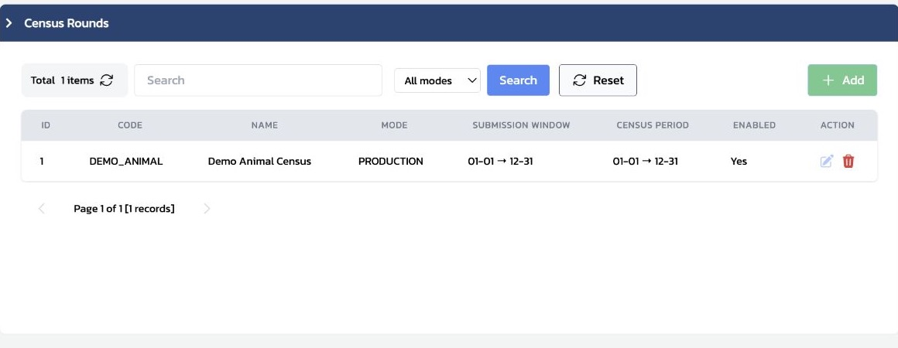
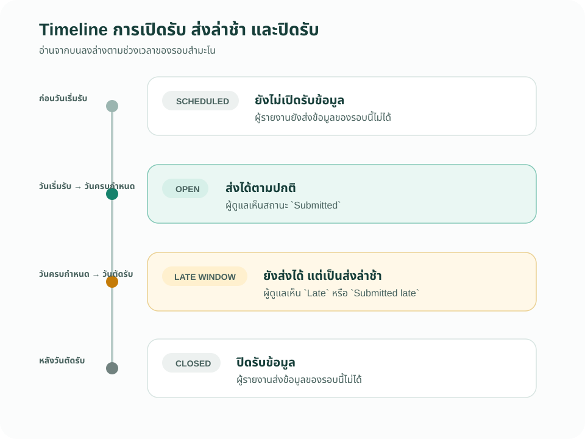
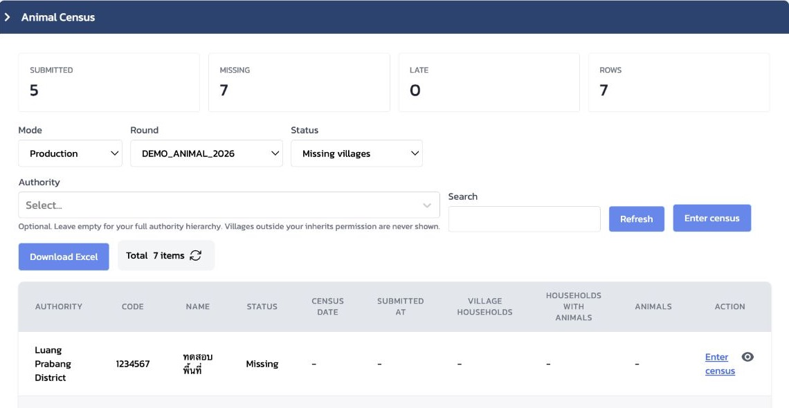
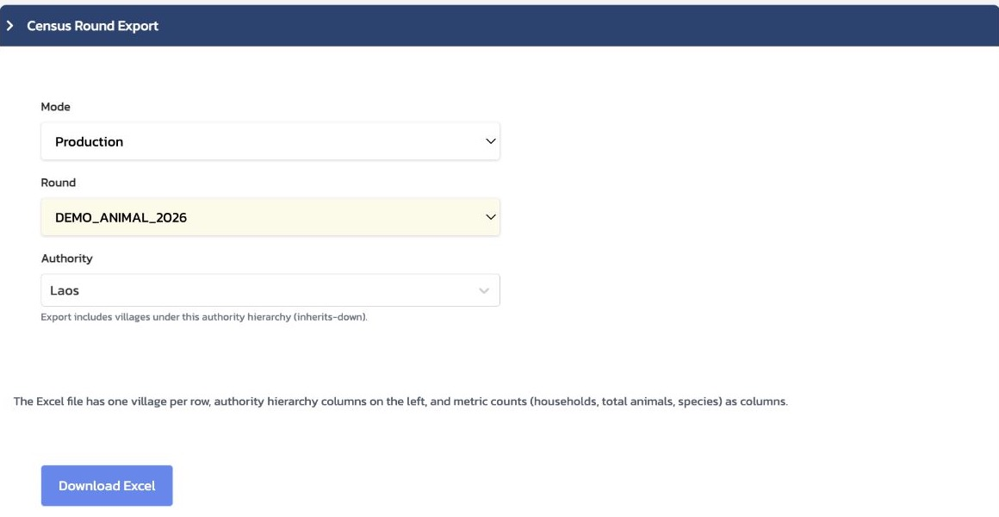

# 6 เตรียมและติดตามรอบสำมะโนสัตว์

บทนี้สอนผู้ฝึกสอนให้ตรวจว่ารอบสำมะโนพร้อมใช้งาน ติดตามความครอบคลุมของหมู่บ้าน และส่งออกผลสำหรับการรายงาน ไม่ใช่บทสำหรับออกแบบแบบสำมะโนหรือสร้างข้อมูลฝึก

## 6.1 แยก Census Definition ออกจาก Census Round

ก่อนเริ่ม ให้แยกสองคำนี้ให้ชัดเจน เพราะอยู่ในเมนู Settings เหมือนกัน แต่ตอบคนละคำถาม

| รายการ | ตอบคำถาม | ใช้ในบทนี้อย่างไร |
|---|---|---|
| `Census Definition` | ผู้รายงานจะกรอกคำถามอะไรใน Mobile | ตรวจเพียงว่ามีแบบ `Animal census` ที่ Active และ Published |
| `Census Rounds` | จะเก็บสำมะโนในช่วงใด โหมดใด และเปิดใช้หรือไม่ | ตรวจรอบที่จะใช้ติดตามและรายงาน |

Staging ที่ตรวจในวันที่ 8 กันยายน 2026 มี `Animal census` เวอร์ชัน `v2` สถานะ `Active` และ `Published` อยู่แล้ว จึงไม่ต้องเปิด Form builder ในบทนี้

### ข้อควรระวัง

ปุ่ม `Ensure Defaults` ในหน้า Census Definition ใช้สำหรับงานตั้งค่าระบบ ไม่ใช่ขั้นตอนเตรียมการสอน ห้ามกดปุ่มนี้ เว้นแต่ผู้รับผิดชอบระบบขอให้ทำโดยตรง

## นโยบายที่ต้องตัดสินใจก่อนเปิดรอบ

ก่อนกำหนดวันที่ของ `Census Round` หน่วยงานควรตกลงก่อนว่า **ในหนึ่งปี หมู่บ้านต้องปรับปรุงข้อมูลสำมะโนกี่ครั้ง** คำตอบนี้เป็นนโยบายการเก็บข้อมูล ไม่ใช่ค่าที่ระบบควรกำหนดแทนหน่วยงาน

| การตัดสินใจเชิงนโยบาย | สิ่งที่ต้องกำหนดในระบบ |
|---|---|
| อัปเดตปีละกี่ครั้ง | จำนวน `Census Rounds` ที่ต้องเปิดในปีนั้น |
| อัปเดตช่วงใดของปี | `Census period` ของแต่ละรอบ |
| เปิดรับส่งข้อมูลนานเท่าใด | `Submission start`, `Soft finish / due` และ `Hard finish / cutoff` |

ตัวอย่างเช่น หากนโยบายกำหนดให้ปรับปรุงข้อมูลทุก 6 เดือน ผู้รับผิดชอบจึงเตรียมรอบสำมะโน 2 รอบในปีนั้น พร้อมกำหนดช่วงอ้างอิงและช่วงเปิดรับส่งของแต่ละรอบให้ชัดเจน คู่มือนี้ไม่กำหนดความถี่แทนหน่วยงาน

## 6.2 ตรวจรอบที่จะใช้

เปิด `Settings` → `Census Rounds` แล้วตรวจรายการของรอบก่อนเริ่มอบรมหรือเริ่มเก็บข้อมูลจริง

*ภาพที่ 6.2.1 — รายการ Census Rounds แสดง mode, ช่วงรับข้อมูล, ช่วงสำมะโน และสถานะ Enabled*

จุดที่ควรอ่านจากรายการมีดังนี้

| จุดตรวจ | สิ่งที่ควรยืนยัน |
|---|---|
| `MODE` | เลือกใช้ `Production` เมื่อติดตามข้อมูลจริง และแยกจากข้อมูล `Training` |
| `SUBMISSION WINDOW` | ช่วงเวลาที่ระบบรับการส่งข้อมูล |
| `CENSUS PERIOD` | ช่วงวันที่อ้างอิงของการสำมะโน |
| `ENABLED` | รอบพร้อมให้ใช้งานหรือไม่ |

หน้ารายการใน Staging แสดงรหัส `DEMO_ANIMAL` ของรายการตั้งค่า ขณะที่หน้า `Animal Census` และ `Census Round Export` เลือกรอบปฏิบัติงานชื่อ `DEMO_ANIMAL_2026` ในโหมด Production ให้ผู้ฝึกสอนเลือกค่าที่แสดงในหน้าปฏิบัติงาน และไม่แก้ code เพื่อให้ชื่อทั้งสองเหมือนกัน

### Timeline การเปิดรับ ส่งล่าช้า และปิดรับ

การรับส่งข้อมูลของหนึ่งรอบมีสามวันสำคัญ: วันเริ่มรับ (`Submission start`), วันครบกำหนด (`Soft finish / due`) และวันตัดรับ (`Hard finish / cutoff`) ควรอธิบายเส้นเวลานี้ก่อนดูยอด `Late`

*ภาพที่ 6.2.2 — Timeline แนวตั้งช่วยให้เห็นจุดเปลี่ยนของสถานะได้ชัดเจน แม้เอกสารถูก render ในพื้นที่แคบ*

| ช่วงเวลา | ผู้รายงานทำอะไรได้ | สถานะที่ผู้ดูแลเห็น |
|---|---|---|
| ก่อน `Submission start` | ยังส่งข้อมูลของรอบนี้ไม่ได้ | `SCHEDULED` |
| ตั้งแต่วันเริ่มรับถึงวันครบกำหนด | ส่งข้อมูลได้ตามปกติ | `Submitted` |
| หลังวันครบกำหนดถึงวันตัดรับ | ยังส่งได้ แต่ระบบนับเป็นส่งล่าช้า | `Late` / `Submitted late` |
| หลังวันตัดรับ | ส่งข้อมูลของรอบนี้ไม่ได้ | `CLOSED` |

`Census period` เป็นช่วงวันที่อ้างอิงของการสำมะโน ส่วน Timeline ข้างต้นเป็นช่วงเวลาที่ระบบเปิดรับการส่ง จึงควรอ่านสองส่วนนี้แยกกัน ไม่ใช้ช่วงใดช่วงหนึ่งแทนกัน

## 6.3 ดูความครอบคลุมของหมู่บ้าน

เปิดเมนู `Animal Census` เพื่อดูการส่งแบบสำมะโนของรอบที่เลือก หน้าจอนี้ใช้ทั้งตรวจสถานะรวม และค้นหาหมู่บ้านที่ต้องติดตาม

*ภาพที่ 6.3.1 — หน้าติดตามความครอบคลุม: เลือก Mode, Round และ Status แล้วดูยอด `SUBMITTED`, `MISSING`, `LATE` และรายชื่อหมู่บ้านด้านล่าง*

ให้สอนผู้เรียนอ่านหน้าจอตามลำดับนี้

1. เลือก `Mode` ให้ตรงกับงานที่จะติดตาม: การทำงานจริงใช้ `Production`
2. เลือก `Round` เป็น `DEMO_ANIMAL_2026`
3. อ่านยอดรวม `SUBMITTED`, `MISSING` และ `LATE` ก่อน เพื่อเห็นภาพรวม
4. ใช้ `Status` เปลี่ยนมุมมองระหว่าง `Missing villages`, `Submitted villages`, `Late submissions` และ `All target villages`
5. จำกัด `Authority` เมื่อต้องติดตามเฉพาะพื้นที่หนึ่ง หรือเว้นว่างเพื่อดูพื้นที่ทั้งหมดที่ผู้ใช้มีสิทธิ์เห็น
6. ใช้ Search เพื่อหา code หรือชื่อหมู่บ้าน แล้วส่งต่อรายการ `Missing` หรือ `Late` ให้ผู้รับผิดชอบติดตาม

ค่าในภาพเป็นข้อมูลสาธิต ณ เวลาที่ตรวจเท่านั้น ไม่ใช่เป้าหมายหรือยอดที่ต้องจำสำหรับการอบรม ให้ผู้ฝึกสอนอ่านค่าจริงของวันนั้นจากหน้าจอเสมอ

## 6.4 ส่งออกผลของรอบ

เมื่อต้องจัดทำรายงาน ให้เปิด `Reports` → `Census Round Export` ไม่จำเป็นต้องเข้าสู่หน้ากรอกสำมะโน

*ภาพที่ 6.4.1 — ตั้ง Mode, Round และ Authority ก่อนกด `Download Excel` เพื่อให้ไฟล์ตรงกับขอบเขตที่ต้องการรายงาน*

ลำดับการส่งออกมีดังนี้

1. เลือก `Mode` เป็น `Production` สำหรับข้อมูลจริง
2. เลือก `Round` เป็น `DEMO_ANIMAL_2026`
3. เลือก `Authority` ตามขอบเขตที่จะรายงาน เช่น `Laos` เมื่อต้องการทุกหมู่บ้านใต้โครงสร้างประเทศ
4. ตรวจอีกครั้งว่าพื้นที่และรอบถูกต้อง แล้วจึงกด `Download Excel`

ไฟล์ Excel มีหนึ่งหมู่บ้านต่อหนึ่งแถว มีคอลัมน์โครงสร้างพื้นที่อยู่ด้านซ้าย และมีจำนวนครัวเรือน จำนวนสัตว์ และข้อมูลตามชนิดสัตว์เป็นคอลัมน์ จึงควรเก็บชื่อรอบและขอบเขต Authority ไว้คู่กับไฟล์ทุกครั้ง

## Check

| ผู้ฝึกสอนควรสามารถ | วิธีตรวจ |
|---|---|
| แยก Census Definition กับ Census Round ได้ | อธิบายว่าอย่างแรกกำหนดแบบฟอร์ม ส่วนอย่างหลังกำหนดรอบการเก็บข้อมูล |
| อธิบายการตัดสินใจเชิงนโยบายได้ | บอกได้ว่าหน่วยงานต้องตัดสินใจว่าจะให้หมู่บ้านอัปเดตสำมะโนกี่ครั้งต่อปี ก่อนเปิด Census Rounds |
| ตรวจความพร้อมของรอบได้ | เปิด Census Rounds แล้วชี้ Mode, ช่วงเวลา และ Enabled |
| อธิบายสถานะ Late ได้ | วาดหรืออ่าน Timeline แล้วบอกว่าช่วงใดยังส่งได้แต่ถูกนับเป็น Late และช่วงใดปิดรับแล้ว |
| อ่านความครอบคลุมของรอบได้ | เปิด Animal Census แล้วบอกความหมายของยอด Submitted, Missing และ Late ที่หน้าจอแสดง |
| ค้นหารายชื่อหมู่บ้านที่ต้องติดตามได้ | เลือก `Missing villages` หรือ `Late submissions` แล้วใช้ Authority หรือ Search |
| ส่งออกข้อมูลตามขอบเขตที่เลือกได้ | เลือก Mode, Round และ Authority ให้ตรง ก่อนกด Download Excel |
