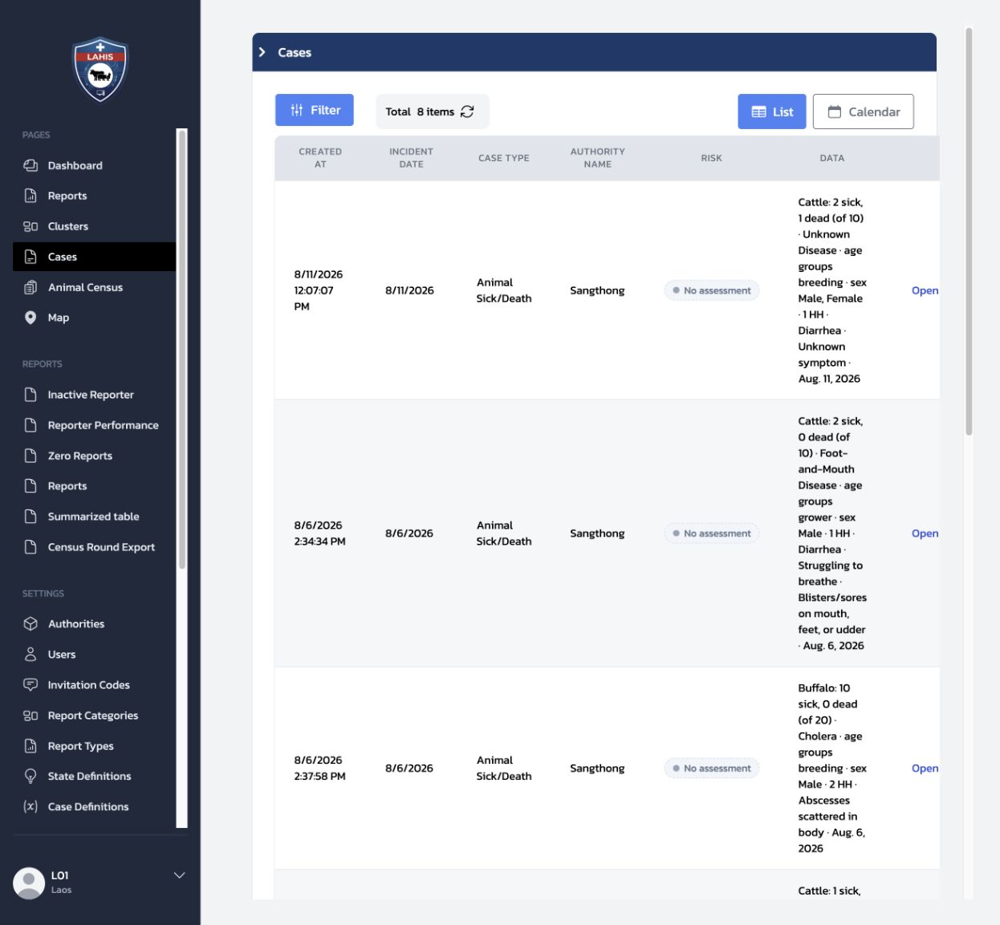

# 7.1 Case Workflow: ภาพรวมเส้นทางของ Case

บทนี้ใช้เล่าให้ผู้ฝึกสอนเห็นว่า Case เป็นส่วนหนึ่งของงานหลังรับ Report ไม่ใช่คู่มือกดปุ่มหรือบทสอนปิด Case เป้าหมายคือให้ผู้เรียนรู้ว่า Case เริ่มอย่างไร อยู่ตรงไหนในกระบวนการ และจบได้แบบใด

### เส้นทางของ Case

1. Report ทำให้เกิด Case ได้ 2 ทาง: ระบบเปิดตาม `Case Definition` หรือ Officer ใช้ `Promote to case`
2. Case อยู่ในสถานะ `Open` เพื่อให้ตรวจสอบ ติดตาม และบันทึกความเห็น
3. Case จบได้ด้วย `Close case`, `False positive`, หรือ `Automatic close`
4. เมื่อจบแล้ว Case อยู่ในสถานะ `Finished`

## 7.1.1 เรื่องที่ผู้เรียนควรเข้าใจ

| ช่วง | ความหมาย |
|---|---|
| Report → Case | Report ต้นฉบับยังอยู่เหมือนเดิม; Case คือการนำ Report นั้นเข้าสู่งานติดตาม |
| Case เปิดอยู่ | Officer ใช้ข้อมูล Report, Follow-up, Risk, AI และความคิดเห็นประกอบการทำงานตามหน้าที่ |
| Case สิ้นสุด | Case จบได้จากการปิดเหตุการณ์จริง, ตรวจแล้วไม่เข้าข่ายดำเนินเป็น Case ต่อ, หรือระบบปิดตามนโยบายเวลา |
| หลังจบ | สถานะ Case ไม่ได้เปลี่ยน Report ต้นฉบับ; ข้อมูลการปิดเก็บกับ Case |

ภาพรวมนี้ไม่บอกว่า Report ทุกฉบับต้องเป็น Case และไม่บอกว่า Case ทุกฉบับต้องดำเนินการแบบเดียวกัน รายละเอียดว่า rule อัตโนมัติทำงานอย่างไรอยู่ใน [บทที่ 7.2](08a-case-definition.md); ขั้นตอนงานของ Officer อยู่ใน [บทที่ 8](09-daily-work.md)

## 7.1.2 อธิบายผลลัพธ์ปลายทางให้แยกกัน

| ผลลัพธ์ | ใช้เมื่อ | สิ่งที่ต้องจำ |
|---|---|---|
| `Close case` | ตรวจสอบเหตุการณ์จริงเสร็จแล้ว | Officer บันทึกแบบฟอร์มปิด Case ตาม Report Type |
| `False positive` | ตรวจสอบ Case แล้วไม่เข้าข่ายเหตุที่ต้องดำเนินต่อ | ไม่ใช้แบบฟอร์มผลตรวจหรือจำนวน `Stamped out` ของการปิดเหตุการณ์จริง |
| `Automatic close` | ระบบปิด Case ที่ไม่มีความเคลื่อนไหวตามนโยบายเวลา | เป็นการสิ้นสุดโดยระบบ ไม่ใช่ข้อสรุปเชิงวิชาการแทนเจ้าหน้าที่ |

ให้ผู้ฝึกสอนใช้คำว่า “ผลลัพธ์ของ Case” แทนคำว่า “สถานะของ Report” เพราะ Report กับ Case เป็นข้อมูลคนละส่วนที่เชื่อมกัน

หาก Officer พบว่า **Report ตั้งต้นไม่ใช่เหตุการณ์จริงหรือเป็นข้อมูลทดสอบ** ให้ใช้ `Convert to test report` ก่อนเข้าสู่งาน Case ไม่ใช้ `False positive` แทนกัน เพราะ `False positive` เป็นผลลัพธ์ของ Case ที่เปิดแล้ว รายละเอียดอยู่ใน [บทที่ 8.4](09-daily-work.md)

*ภาพที่ 7.1.1 — หน้ารายการ Cases ช่วยให้ชี้ว่า Case มีสถานะของตนเอง; ในบทนี้ให้ดูภาพรวม ไม่ต้องเปิดหรือเปลี่ยนสถานะ Case ระหว่างสอน*

## Check

| ผู้ฝึกสอนควรสามารถ | วิธีตรวจ |
|---|---|
| เล่าความต่างระหว่าง Report และ Case ได้ | ชี้ว่า Report ต้นฉบับยังอยู่ และ Case คือการติดตามที่เชื่อมกับ Report |
| บอกทางเริ่มและผลลัพธ์ของ Case ได้ | อธิบาย auto/manual และ Close case / False positive / Automatic close ได้ |
| ส่งต่อไปยังบทที่เหมาะสมได้ | ชี้บท 7.2 สำหรับ rule, บท 7.3 สำหรับแบบฟอร์มปิด และบท 8 สำหรับงาน Officer |
