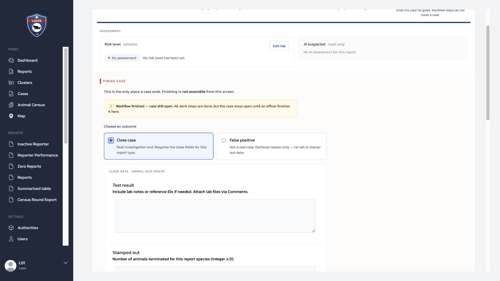
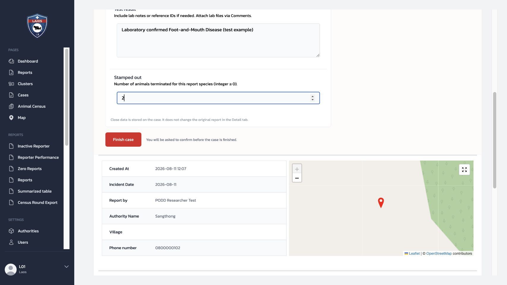

# 7.3 แบบฟอร์มปิด Case: ข้อมูลผลการตรวจสอบ

เมื่อ Officer เลือกผลลัพธ์ `Close case` ระบบแสดงแบบฟอร์มปิด Case ตาม `Report Type` ของ Report ต้นฉบับ แบบฟอร์มนี้เก็บผลของการตรวจสอบไว้กับ **Case** และไม่แก้ไขข้อมูลใน Report ต้นฉบับ

## 7.3.1 บทบาทและขอบเขต

| บทบาท | หน้าที่ |
|---|---|
| System Admin / เจ้าของแบบฟอร์ม | ออกแบบและอนุมัติ field ของแบบฟอร์มปิด Case สำหรับแต่ละ Report Type |
| Officer | กรอกและตรวจทานข้อมูลที่แบบฟอร์มแสดง; ไม่เพิ่ม ลบ หรือแก้ field ของแบบฟอร์ม |
| Reporter | ไม่กรอกแบบฟอร์มปิด Case |

การแก้โครงสร้างแบบฟอร์มปิด Case เป็นการเปลี่ยนข้อมูลระบบของ Report Type จึงต้องแยกจากการอบรม Officer อย่างชัดเจน

## 7.3.2 Form Builder ของแบบฟอร์มปิด Case

แบบฟอร์มปิด Case ผูกกับ `Report Type` ผ่าน `close_definition` และใช้โครงสร้าง Form Builder เดียวกับแบบฟอร์มรายงาน: Section → Question → Field → validation แต่มีจุดที่ต่างกันคือแบบฟอร์มนี้จะแสดงใน Dashboard **เมื่อ Officer เลือก `Close case`** ไม่ได้แสดงใน Mobile ตอนส่ง Report

1. `Report Type` ผูกกับ `Close-definition Form Builder`
2. Dashboard แสดง `Close case` panel เมื่อ Officer เลือกปิด Case
3. Officer กรอกเฉพาะ field ที่ System Admin ออกแบบไว้

### สิ่งที่ System Admin ออกแบบ

| องค์ประกอบ Form Builder | สิ่งที่ต้องตัดสินใจ |
|---|---|
| Section และ Question | จัดกลุ่มคำถามตามผลที่หน่วยงานต้องสรุปเมื่อจบ Case |
| Field type | เลือกชนิดข้อมูลให้ตรงคำตอบ เช่น `textarea` สำหรับผลตรวจ หรือ `integer` สำหรับจำนวนสัตว์ |
| `required` | กำหนดว่าข้อมูลใดต้องมีจึงปิดเหตุการณ์จริงได้ |
| validation | กำหนด `min` / `max` สำหรับตัวเลข และคำอธิบายที่ช่วยลดการกรอกผิด |
| field name | ใช้ชื่อคงที่และมีความหมาย เพราะเป็นกุญแจข้อมูลที่เก็บกับ Case และใช้ต่อในรายงาน/การส่งออก |

สำหรับ `Animal Sick/Death` แบบฟอร์มที่ใช้อยู่ประกอบด้วย `test_result` เป็น `textarea` บังคับกรอก และ `stamp_out` เป็น `integer` บังคับกรอกโดยมีค่าอย่างน้อย 0 นี่เป็นตัวอย่างของการออกแบบ field ไม่ใช่ข้อกำหนดที่ต้องคัดลอกไปทุก Report Type

### การเปลี่ยนโครงสร้างในระบบปัจจุบัน

ตรวจหน้า `Report Types` → `Animal Sick/Death` แบบอ่านอย่างเดียวบน Production วันที่ 8 กันยายน 2026 แล้ว พบปุ่ม Form Builder สำหรับ **Definition ของ Report** แต่ยังไม่พบช่องหรือปุ่ม Form Builder สำหรับ `close_definition` บนหน้าจอจัดการ Report Type นี้ ดังนั้นคู่มือนี้จะไม่บอกให้ System Admin แก้ JSON หรือเดาส่วนตั้งค่าจากหน้าจอปัจจุบัน

จนกว่าจะมีหน้าจอ Close-definition Form Builder ที่รองรับ ให้ใช้ขั้นตอนควบคุมการเปลี่ยนแปลงนี้แทน:

1. เจ้าของงานระบุ Section, field, ชนิดข้อมูล, validation และตัวอย่างคำตอบในแบบคำขอ
2. System Admin และทีมเทคนิคตรวจความเข้ากันได้กับข้อมูลเดิมและรายงานส่งออก
3. ทีมเทคนิคใช้วิธีตั้งค่าที่ได้รับอนุมัติในสภาพแวดล้อมควบคุม ไม่แก้ Production ระหว่างอบรม
4. ทดสอบเส้นทางเต็ม: เปิด Case → เลือก `Close case` → ตรวจ field และ validation → บันทึก → ตรวจข้อมูลที่เก็บกับ Case

## 7.3.3 เลือกผลลัพธ์ก่อนดูแบบฟอร์ม

| ผลลัพธ์ | แบบฟอร์มปิด Case | ใช้เมื่อ |
|---|---|---|
| `Close case` | แสดงและตรวจช่องบังคับตาม Report Type | เหตุการณ์จริงและการตรวจสอบสิ้นสุดแล้ว |
| `False positive` | ไม่ใช้ช่องผล Lab หรือ `Stamped out`; เหตุผลประกอบเป็นข้อมูลเลือกกรอก | ตรวจสอบ Case แล้วไม่เข้าข่ายเหตุที่ต้องดำเนินต่อ |
| `Automatic close` | ระบบปิดตามนโยบายเวลาและไม่ได้กรอกผลแทน Officer | Case ไม่มีความเคลื่อนไหวตามระยะเวลาที่กำหนด |

จึงไม่ควรเลือก `False positive` เพียงเพราะยังไม่มีผล Lab หรือกรอกแบบฟอร์มไม่ครบ ต้องเลือกตามข้อเท็จจริงของเหตุการณ์

## 7.3.4 ตัวอย่าง Animal Sick/Death

แบบฟอร์มปิด Case ของ `Animal Sick/Death` ที่ใช้ในสภาพแวดล้อมฝึกมีสอง field บังคับเมื่อเลือก `Close case`

| Field | ความหมาย | กติกาข้อมูล |
|---|---|---|
| `Test result` | ผลสรุปของ Case เช่น ผลตรวจจากห้องปฏิบัติการ เลขอ้างอิง หรือหมายเหตุผลตรวจ | ต้องกรอกข้อความ; หากมีไฟล์ผลตรวจ ให้แนบผ่าน Comments |
| `Stamped out` | จำนวนสัตว์ของชนิดที่รายงานซึ่งถูกกำจัด | ต้องเป็นจำนวนเต็มตั้งแต่ `0` ขึ้นไป |

*ภาพที่ 7.3.1 — หลังเลือก `Close case` ระบบแสดง field ตาม Report Type; หากเลือก `False positive` จะไม่ใช้สอง field นี้*

## 7.3.5 การอ่านข้อมูล ไม่ใช่การเปลี่ยนสถานะ

ในการอบรมให้ใช้ Case ตัวอย่างที่ปิดแล้ว หรือใช้ภาพประกอบ เพื่อให้ผู้เรียนตรวจสามอย่างนี้โดยไม่กด `Finish case`

1. `Outcome` ตรงกับข้อเท็จจริงของ Case
2. `Test result` สื่อสารผลได้ชัดเจนและไม่ใส่ข้อมูลส่วนบุคคลที่ไม่จำเป็น
3. `Stamped out` เป็นจำนวนของสัตว์ที่ถูกกำจัด ไม่ใช่จำนวนป่วย จำนวนตาย หรือจำนวนสัตว์ทั้งหมด

*ภาพที่ 7.3.2 — ใช้ฝึกอ่านข้อมูลก่อนยืนยัน; การกด `Finish case` ใน Case จริงเปลี่ยนสถานะและไม่ย้อนกลับจากหน้าจอนี้*

หาก Officer ปิด Case เองและข้อมูลครบ ระบบแสดง `Finished · Close case` พร้อมผู้ปิด เวลา และข้อมูลปิดแบบอ่านอย่างเดียว หากเป็น `Automatic close` ผู้มีสิทธิ์สามารถบันทึกข้อมูลปิดเพิ่มเติมภายหลังได้ตามสิทธิ์ โดย Case จะไม่เปิดกลับมา

## 7.3.6 จุดส่งต่อ

| สถานการณ์ | การดำเนินการที่เหมาะสม |
|---|---|
| แบบฟอร์มไม่แสดง หรืออ่านแบบฟอร์มไม่ได้ | เก็บ Case ID, Report Type, ภาพหน้าจอ และส่งต่อ System Admin/ทีมเทคนิค |
| ข้อมูลยังไม่ครบ | ยังไม่ควรปิด Case; ติดตามข้อมูลหรือบันทึกความคิดเห็นตามกระบวนการหน่วยงาน |
| ต้องการเพิ่ม/เปลี่ยน field | จัดทำข้อกำหนดของ field, เหตุผล, ตัวอย่างค่า และผู้อนุมัติ; ไม่แก้ข้อมูลด้วยตนเองในระหว่างอบรม |
| ตรวจสอบ Case แล้วไม่เข้าข่ายเหตุที่ต้องดำเนินต่อ | ใช้ `False positive` พร้อมเหตุผลเมื่อมี ไม่ใช่การปล่อยช่อง Close case ว่าง |

## Check

| ผู้ฝึกสอนควรสามารถ | วิธีตรวจ |
|---|---|
| แยก `Close case` จาก `False positive` ได้ | อธิบายว่า Close case ใช้แบบฟอร์มของ Report Type ส่วน False positive ไม่ใช้ผล Lab หรือ Stamped out |
| อธิบายข้อมูลปิด Case ของ Animal Sick/Death ได้ | ชี้ความหมายและกติกาของ Test result กับ Stamped out ได้ถูกต้อง |
| แยกหน้าที่ Officer กับ System Admin ได้ | ระบุว่า Officer กรอกข้อมูล แต่ไม่แก้โครงสร้างแบบฟอร์ม |
| อธิบายความสัมพันธ์ของ Form Builder กับการปิด Case ได้ | บอกได้ว่าแบบฟอร์มผูกกับ Report Type แต่แสดงบน Dashboard หลังเลือก `Close case` |
| ส่งต่อปัญหาได้ครบ | ระบุ Case ID, Report Type และภาพหน้าจอเมื่อแบบฟอร์มไม่แสดงหรืออ่านไม่ได้ |
