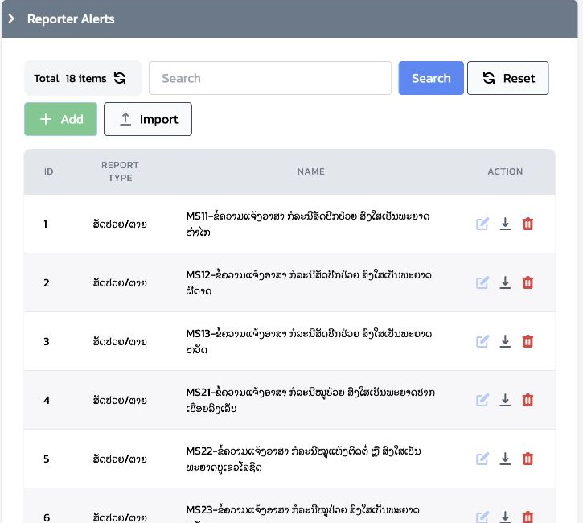

# 7.4 Reporter Alerts: ข้อความอัตโนมัติถึงผู้รายงาน

`Reporter Alert` คือข้อความที่ระบบส่งให้ **ผู้รายงานคนเดิม** โดยอัตโนมัติ หลัง Report ที่ส่งเข้าระบบตรงตามเงื่อนไขของ Alert นั้น ในบริบทของลาว ผู้รายงานระดับหมู่บ้านเป็นเจ้าหน้าที่ด่านแรกในการจัดการโรค ดังนั้นข้อความนี้ควรส่งกลับเป็น **รายละเอียดเพิ่มและสิ่งที่ต้องทำต่อ** ไม่ใช่เพียงข้อความยืนยันว่าระบบได้รับ Report แล้ว บทนี้สอนการออกแบบและกำกับ Alert สำหรับ System Admin ไม่ใช่ขั้นตอนทำงานของ Officer

1. Reporter ส่ง Report ผ่าน Mobile
2. ระบบตรวจ `Report Type` และเงื่อนไขของ `Reporter Alert`
3. เมื่อ Report ตรงเงื่อนไข ระบบสร้างข้อความถึง Reporter ใน Mobile
4. Reporter อ่านข้อความจากสัญลักษณ์กระดิ่งและรายการ `Notifications`
5. Reporter ดำเนินการเบื้องต้นตามแนวปฏิบัติของโรค และบันทึกหรือประสานงานต่อเมื่อกำหนด

## 7.4.1 แยก Reporter Alert ออกจากสิ่งที่คล้ายกัน

| สิ่งที่เกิดขึ้น | ผู้สร้าง | ผู้รับ/ที่แสดง | ใช้เมื่อ |
|---|---|---|---|
| Reporter Alert | ระบบ ตามเงื่อนไขที่ System Admin อนุมัติ | ผู้รายงานคนที่ส่ง Report ผ่าน Notifications บน Mobile | ต้องการให้คำแนะนำหรือข้อความตอบกลับอัตโนมัติตามข้อมูล Report |
| Comment ของ Officer | Officer | การสนทนาใน Report และ Mobile ของผู้รายงาน | เจ้าหน้าที่ตอบกลับเรื่องเฉพาะรายงานนั้น |
| AI comment | ระบบ AI | รายละเอียด Report / Comments ตามที่ระบบแสดง | ให้ข้อสังเกตจาก AI; ไม่ใช่ข้อความที่ System Admin เขียนเอง |
| Case Definition | ระบบ ตามกติกา | Dashboard เป็น Case สำหรับ Officer | ตัดสินว่าจะเปิดงานติดตามหรือไม่; ไม่ใช่ข้อความถึง Reporter |
| Notification Type | System Admin | ผู้ใช้หรือกลุ่มผู้รับตามการตั้งค่า | เป็นกลไกการแจ้งเตือนอีกประเภทหนึ่ง ไม่ใช่ Reporter Alert ของ Report โดยตรง |

ข้อสำคัญคือ Reporter Alert ตอบกลับ **ผู้ส่ง Report** ไม่ได้เปิด Case แทน Officer และไม่แทนการสนทนาเมื่อจำเป็นต้องติดตามรายละเอียดเพิ่ม

### ตัวอย่างให้เห็นภาพ

สมมติว่าผู้รายงานในหมู่บ้านส่ง `Animal Sick/Death` โดยเลือกว่าเป็น **สุนัข** และสงสัยว่าเป็น **โรคพิษสุนัขบ้า**

| ส่วนของตัวอย่าง | ข้อมูล |
|---|---|
| ข้อมูลที่ผู้รายงานส่ง | สัตว์: สุนัข; โรคที่สงสัย: พิษสุนัขบ้า |
| เงื่อนไขที่ตรง | `Reporter Alert` สำหรับสุนัข/พิษสุนัขบ้า |
| หัวข้อใน Mobile | สิ่งที่ต้องทำ: สุนัขสงสัยพิษสุนัขบ้า |
| เนื้อหาที่ผู้รายงานได้รับ | กักสุนัขไว้ 14 วันเพื่อสังเกตอาการ บันทึกอาการและการเปลี่ยนแปลงทุกวัน หากสุนัขเสียชีวิต ให้ดำเนินการเก็บและส่งศีรษะสุนัขเพื่อพิสูจน์ตาม SOP ของหน่วยงาน และแจ้งผู้รับผิดชอบทันที |

ผู้รายงานจึงได้รับรายละเอียดเพิ่มและรายการงานที่ต้องทำต่อทันที: กักและสังเกตสัตว์ บันทึกผล และส่งตัวอย่างเมื่อเข้าเงื่อนไข ข้อความนี้ **ไม่ได้** ยืนยันว่าเป็นโรคจริง ไม่ได้หมายความว่า Officer อ่าน Report แล้ว และไม่ได้เปิด Case แทนกติกา `Case Definition`

ตัวอย่างนี้ใช้สอนลำดับการทำงานเท่านั้น ไม่ใช่การถอด `Condition`, หัวข้อ หรือข้อความจาก Production ไปใช้ซ้ำ ระยะกัก 14 วัน วิธีเก็บ/ขนส่งตัวอย่าง ผู้มีสิทธิทำ และอุปกรณ์ป้องกัน ต้องยึด SOP ที่ DLF/เจ้าของนโยบายอนุมัติสำหรับพื้นที่นั้นก่อนตั้งค่าข้อความจริง

## 7.4.2 บทบาทและขอบเขต

| บทบาท | หน้าที่ |
|---|---|
| เจ้าของนโยบาย / ผู้เชี่ยวชาญโรค | อนุมัติสถานการณ์ที่ควรได้รับข้อความ และเนื้อหาที่ปลอดภัยต่อผู้รายงาน |
| System Admin | สร้างหรือแก้ Reporter Alert จากแบบออกแบบที่อนุมัติแล้ว และจัดการทดสอบ |
| Officer | เห็นผลของ Report และตอบ Comment ตามงาน; แก้ Reporter Alert ไม่ได้ |
| Reporter | เจ้าหน้าที่ด่านแรกที่ได้รับรายละเอียดเพิ่มและสิ่งที่ต้องทำบน Mobile; ตั้งค่า Alert ไม่ได้ |

การเปลี่ยน Alert มีผลกับข้อความที่จะส่งให้ผู้รายงานจำนวนมาก จึงไม่ควรแก้ใน Production ระหว่างการอบรม

## 7.4.3 อ่านสิ่งที่มีอยู่ก่อนออกแบบใหม่

หน้า `Settings` → `Reporter Alerts` แสดงรายการตาม `Report Type` และ `Name` โดย Production ที่ตรวจแบบอ่านอย่างเดียววันที่ 8 กันยายน 2026 มี 18 รายการ และทั้งหมดอยู่ใต้ `Animal Sick/Death` ชื่อรายการใช้รหัสกลุ่ม `MS` และระบุสถานการณ์โรคหรือกลุ่มสัตว์ไว้ในชื่อ

ให้ผู้เรียนเปิดรายการเพื่ออ่านองค์ประกอบนี้ตามลำดับ โดยไม่กด `Add`, `Import`, `Edit` หรือ `Delete`

1. `Report Type` — Alert ตรวจ Report ชนิดใด
2. `Name` — ชื่อสำหรับให้ผู้ดูแลเข้าใจวัตถุประสงค์ของ Alert ไม่ใช่ชื่อที่ Reporter จำเป็นต้องเห็น
3. `Condition` — เงื่อนไขข้อมูล Report ที่ทำให้ส่งข้อความ
4. `Title Template` — หัวข้อข้อความที่จะเห็นใน Mobile
5. `Body Template` — เนื้อหาที่ส่งให้ Reporter; สามารถอ้างข้อมูลจาก Report ตามตัวแปรที่ระบบรองรับ

`Condition` เป็นตรรกะทางเทคนิคเช่นเดียวกับ Case Definition จึงไม่สอน Officer หรือผู้เข้าร่วมทั่วไปเขียนจากศูนย์

*ภาพที่ 7.4.1 — หน้า Reporter Alerts บน Production แสดงจำนวนรายการ, Report Type และ Name ของ Alert ที่มีอยู่*

## 7.4.4 หลักการทำงานที่ต้องออกแบบให้ชัด

หลัง Report ถูกส่ง ระบบตรวจ Alert ของ `Report Type` เดียวกันตามเงื่อนไข ระบบปัจจุบันจะส่ง **Alert แรกที่ตรงเงื่อนไขเพียงหนึ่งรายการ** แล้วจบการประเมินในรอบนั้น

ดังนั้น Alert สองรายการที่อาจตรงพร้อมกันไม่ใช่เรื่องเล็ก ต้องกำหนดลำดับความสำคัญและทดสอบก่อนใช้งาน ตัวอย่างเช่น Alert “สัตว์ปีกป่วย” ที่กว้างกว่า อาจกลบ Alert “สัตว์ปีกสงสัยโรคเฉพาะ” หากทั้งสองตรงกับ Report เดียวกัน

ตัวอย่างเช่น หาก Report เดียวกันเลือก “สุนัข” และ “พิษสุนัขบ้า” แล้วมีทั้ง Alert กว้างสำหรับ “สุนัขป่วย” และ Alert เฉพาะสำหรับ “สงสัยพิษสุนัขบ้า” ให้กำหนดในแบบออกแบบว่า Reporter ควรได้รับข้อความใดเพียงข้อความเดียว แล้วทดสอบให้เห็นผลนั้นบน Mobile ก่อนอนุมัติใช้จริง

ข้อความควรเป็น “คำสั่งงานพร้อมความรู้ประกอบ” สำหรับเจ้าหน้าที่ด่านแรก โดยระบุให้ครบตามนโยบายโรค: สิ่งที่ต้องทำทันที, ระยะเวลาและสิ่งที่ต้องสังเกต/บันทึก, เงื่อนไขที่ต้องยกระดับหรือส่งตัวอย่าง, และผู้รับผิดชอบที่ต้องประสาน ตัวอย่างเช่น กักสุนัขเพื่อดูอาการ, บันทึกอาการรายวัน, หรือเมื่อเสียชีวิตให้ส่งตัวอย่างเพื่อพิสูจน์ตาม SOP ที่อนุมัติ ข้อความไม่ควรยืนยันผลวินิจฉัยหรือให้คำแนะนำด้านการเก็บตัวอย่างที่เจ้าของนโยบายยังไม่ได้รับรอง

## 7.4.5 Alert design sheet ก่อนเปลี่ยนการตั้งค่า

ให้ใช้ตารางนี้ระหว่างอบรมแทนการสร้าง Alert บนระบบจริง

| หัวข้อ | สิ่งที่ต้องระบุ |
|---|---|
| Name และเจ้าของนโยบาย | ชื่อที่ผู้ดูแลอ่านรู้เรื่อง และชื่อผู้อนุมัติ |
| Report Type | Report ชนิดเดียวที่อยู่ในขอบเขต |
| สถานการณ์ที่จะส่ง | คำอธิบายเชิงนโยบายก่อนแปลงเป็น `Condition` |
| Condition ที่ตรวจทานแล้ว | field และค่าที่อ้างอิงจาก Form Builder ของ Report Type |
| Title Template | หัวข้อสั้น ชัดเจน และไม่เผยข้อมูลเกินจำเป็น |
| Body Template | ข้อความถึง Reporter พร้อมคำแนะนำที่ผ่านการอนุมัติ |
| ตัวอย่างตรงเงื่อนไข | Report ตัวอย่างที่ต้องได้รับข้อความ |
| ตัวอย่างไม่ตรงเงื่อนไข | Report ใกล้เคียงที่ต้องไม่ส่งข้อความ |
| ความเสี่ยงซ้อนทับ | Alert อื่นที่อาจตรงพร้อมกัน และผลที่ต้องการ |
| ผู้รับผิดชอบทบทวน | เจ้าของเนื้อหาและวันที่จะทบทวนอีกครั้ง |

System Admin จึงแปลงแบบออกแบบที่ผ่านการอนุมัติไปยังหน้าจอตั้งค่า ไม่ควรเริ่มจากการคัดลอก `Condition` เดิมแล้วแก้คำบางส่วนโดยไม่ตรวจ field และ choice จริง

## 7.4.6 แผนทดสอบและหลักฐาน

ทดสอบในสภาพแวดล้อมควบคุมด้วยบัญชีผู้รายงานที่กำหนดไว้ ไม่ใช้ Production เพื่อทดลองข้อความ

| กรณีทดสอบ | สิ่งที่ต้องยืนยัน |
|---|---|
| ตรงเงื่อนไข | ผู้รายงานที่ส่ง Report เห็นข้อความใน Notifications บน Mobile |
| ไม่ตรงเงื่อนไข | ไม่มี Reporter Alert ถูกส่ง |
| เงื่อนไขซ้อนทับ | ได้ข้อความเพียงรายการที่ตั้งใจให้ชนะ ไม่ใช่ข้อความกว้างโดยบังเอิญ |
| เนื้อหา template | หัวข้อและข้อความแสดงตัวแปรเป็นภาษาที่อ่านได้ ไม่มีค่าเปล่าหรือข้อมูลที่ไม่ควรเปิดเผย |
| เส้นทางรับข้อความ | กดกระดิ่ง → เปิดรายการ → อ่านรายละเอียดข้อความได้ |

เก็บ Report ID, ชื่อ Alert, เวลาส่ง และภาพหน้าจอ Mobile ของผลทดสอบไว้กับเอกสารอนุมัติ หากข้อความไม่ถึงผู้รายงาน ให้ส่งต่อข้อมูลนี้แก่ System Admin และทีมเทคนิค แทนการส่ง Report ซ้ำหลายครั้ง

## Check

| ผู้ฝึกสอนควรสามารถ | วิธีตรวจ |
|---|---|
| แยก Reporter Alert จาก Comment, AI comment และ Case Definition ได้ | อธิบายผู้สร้าง ผู้รับ และวัตถุประสงค์ของแต่ละอย่างได้ |
| แยกหน้าที่ System Admin, Officer และ Reporter ได้ | ระบุว่า Officer และ Reporter แก้ Alert ไม่ได้ |
| อ่าน Alert ที่มีอยู่ได้อย่างปลอดภัย | เปิดรายการเพื่ออธิบาย Report Type, Name, Condition, Title และ Body โดยไม่แก้ไข |
| วางแบบออกแบบและแผนทดสอบได้ | มีกรณีตรง ไม่ตรง และเงื่อนไขซ้อนทับ พร้อมหลักฐาน Mobile |
