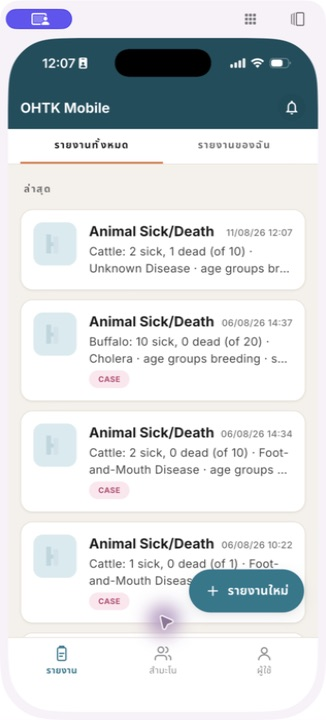
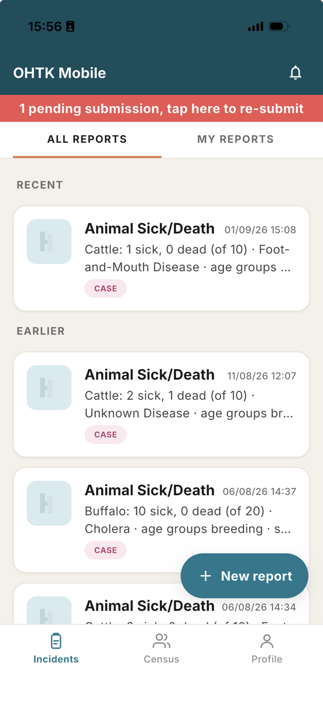
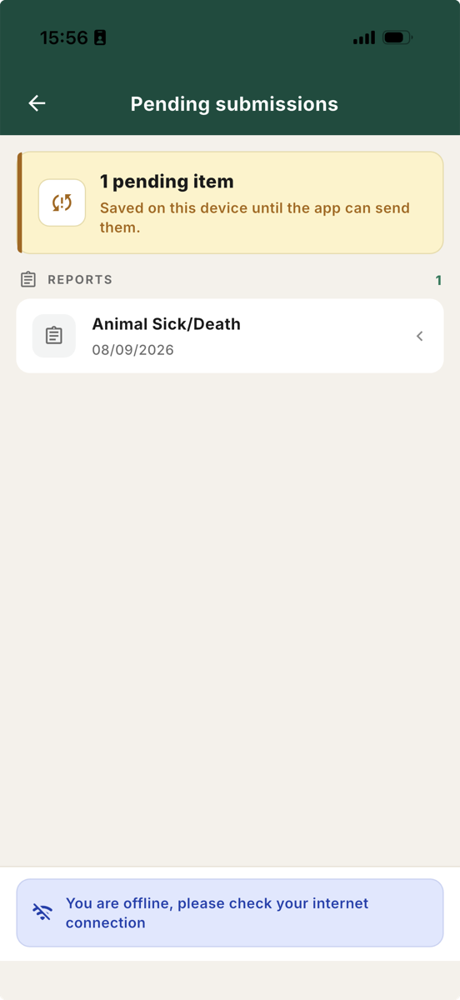
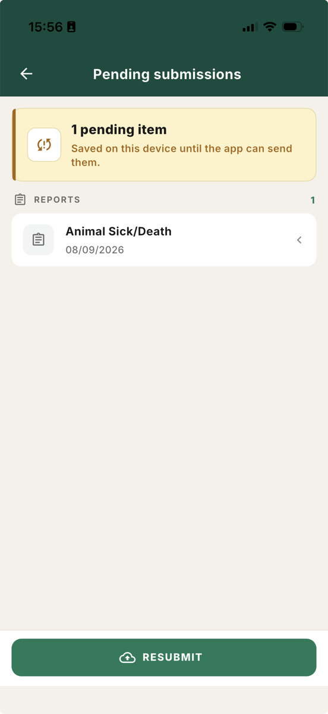
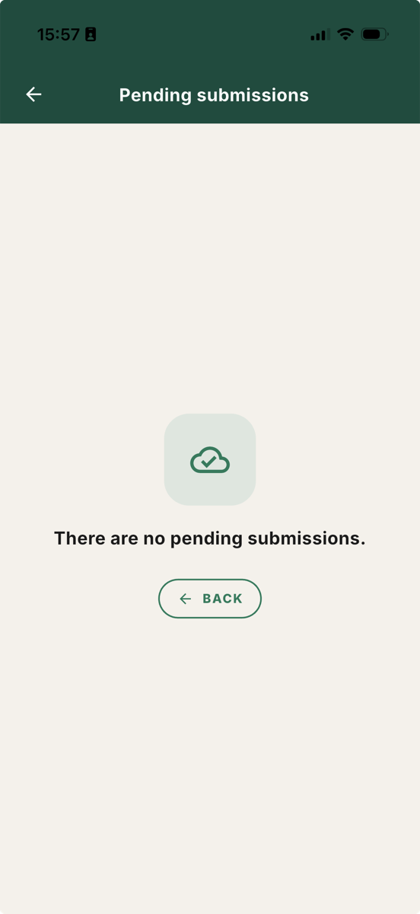
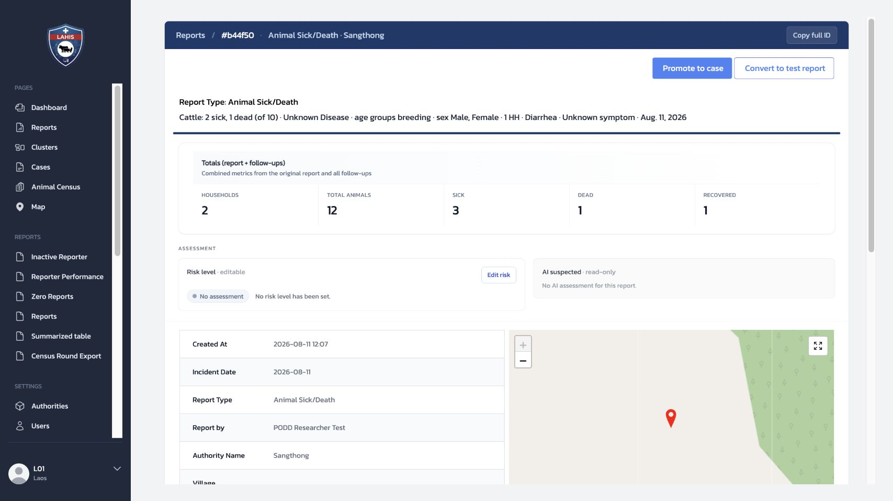
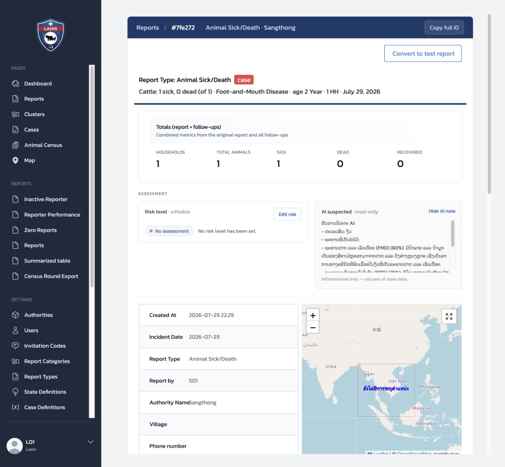
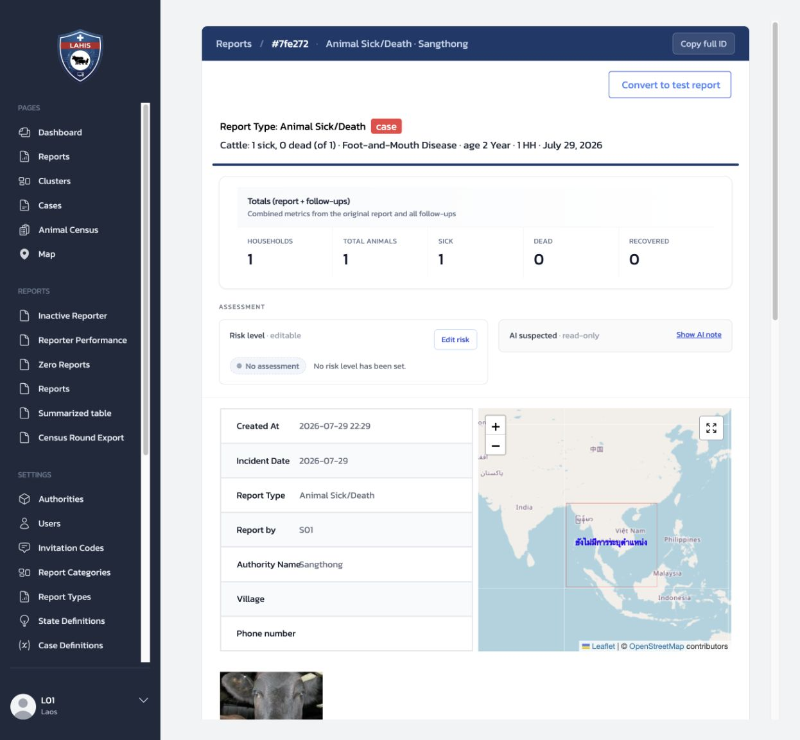
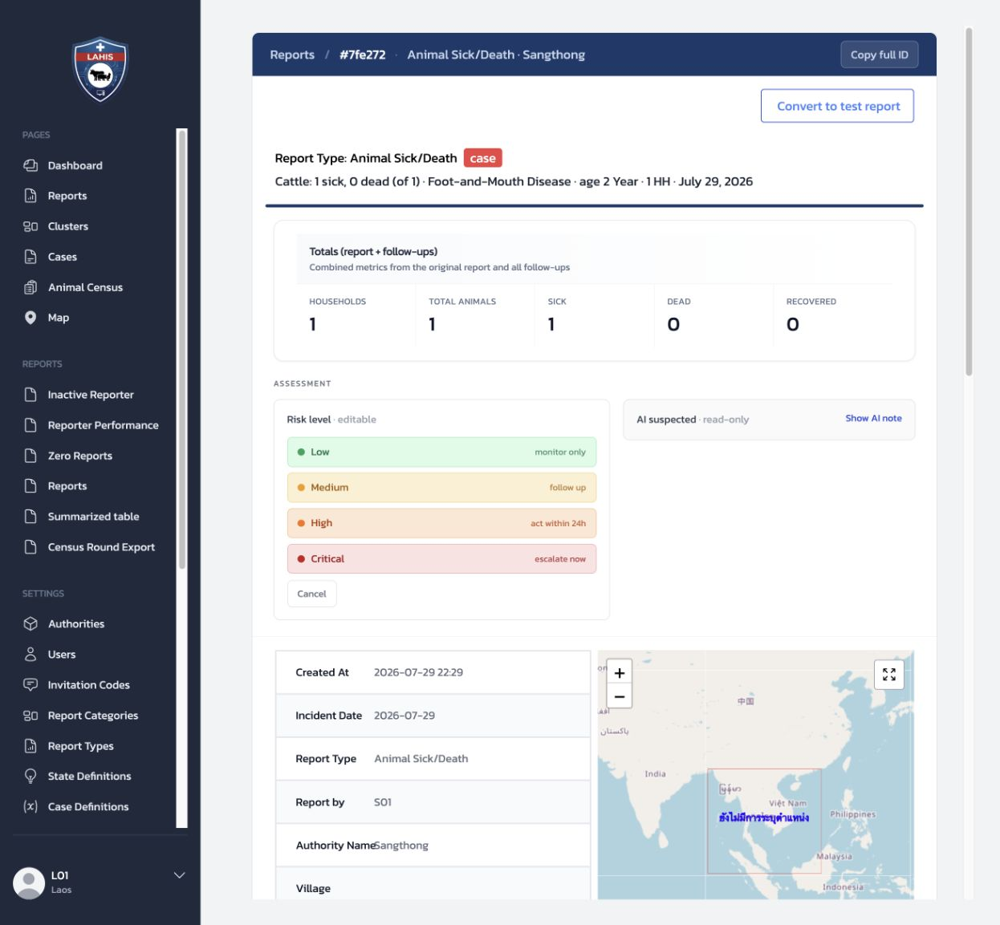

# 8 งานประจำวัน: สาธิตเส้นทางรายงานหนึ่งรายการ

บทนี้เป็นสคริปต์สาธิตแบบสั้นสำหรับผู้ฝึกสอน ไม่ใช่คู่มือ Mobile ฉบับที่สอง เป้าหมายคือให้ผู้ฝึกสอนพาผู้เรียนเห็นว่า รายงานหนึ่งรายการเดินทางจากผู้รายงานไปยังเจ้าหน้าที่อย่างไร และผู้รายงานได้รับการตอบกลับอย่างไร

รายละเอียดการกดแต่ละหน้าจอ ให้ใช้ [คู่มือผู้รายงาน Mobile](../../fao-laos-researcher-guide/FAO_LAOS_RESEARCHER_GUIDE.md) ประกอบ ไม่จำเป็นต้องสาธิตทุกตัวเลือกในวันอบรม

### เส้นทางสาธิต

1. Invitation Code ช่วยให้ Reporter ลงทะเบียนและส่ง `Animal Sick/Death`
2. Follow-up บันทึกจำนวนที่เพิ่มขึ้น
3. Officer ตรวจ Report บน Dashboard
4. ความเห็น, `Notification`, หรือ AI comment กลับไปที่ Mobile เมื่อมี
5. เลือกสาธิต Case, Map หรือรายงานสรุปตามเวลาที่มี

## 8.1 เตรียมก่อนสาธิต

| เตรียมอะไร | เหตุผล |
|---|---|
| Invitation Code ของหมู่บ้านตัวอย่าง | ให้ผู้รายงานลงทะเบียนด้วยบทบาทและพื้นที่ที่ถูกต้อง |
| บัญชี Officer | ใช้เปิด Dashboard เพื่อตรวจรายงานเดียวกัน |
| รายงานตัวอย่างที่มี Follow-up หรือ Case อยู่แล้ว | ลดการสร้างข้อมูลฝึกใหม่ และหลีกเลี่ยงการเปลี่ยนสถานะข้อมูลจริง |
| อินเทอร์เน็ตที่เปิด–ปิดได้ หรือคำอธิบาย Offline ที่เตรียมไว้ | ใช้สาธิตขั้นตอนรายการค้างส่ง |

ให้ใช้ Staging สำหรับการสาธิตเสมอ หากต้องสร้างรายงานใหม่ ให้ระบุชื่อหรือหมายเหตุว่าเป็นข้อมูลฝึก และไม่ใช้รายงานนั้นสำหรับการตัดสินใจจริง

## 8.2 สาธิตเส้นทางรายงาน

### ผู้รายงานลงทะเบียนด้วยรหัสของหมู่บ้าน

เริ่มจากให้ผู้รายงานกรอก Invitation Code ใน Mobile แล้วตรวจว่า Authority และหมู่บ้านที่แสดงตรงกับที่เตรียมไว้ บทที่ 3 อธิบายการเตรียม Invitation Code; ในการสาธิตนี้เพียงย้ำว่าโค้ดกำหนดทั้งบทบาทและพื้นที่ของผู้ใช้

### ผู้รายงานส่ง Animal Sick/Death

ให้เลือก `Animal Sick/Death` กรอกข้อมูลเหตุการณ์ และตรวจทานก่อนส่ง เมื่อส่งสำเร็จ รายงานจะปรากฏในรายการของผู้รายงาน

*ภาพที่ 8.2.1 — รายงานที่ส่งแล้วปรากฏในรายการของผู้รายงาน และเป็นรายงานต้นฉบับที่ Officer จะเปิดดูต่อบน Dashboard*

### เพิ่ม Follow-up ด้วย “จำนวนที่เพิ่มขึ้น”

เปิดรายงานเดิม แล้วเพิ่ม Follow-up โดยกรอกเฉพาะจำนวนที่เปลี่ยนเพิ่มในครั้งนั้น เช่น ป่วยเพิ่ม 1 ตัว ไม่ใช่ยอดป่วยทั้งหมดที่เห็นในขณะนั้น หาก `sum` ใช้อยู่ การกรอกยอดรวมซ้ำจะทำให้ Dashboard รวมซ้ำ

ให้หยุดอธิบายสั้น ๆ ที่จุดนี้ว่า Follow-up ผูกกับรายงานเดิม ไม่สร้างเหตุการณ์ใหม่ และให้ผู้เรียนดู `Totals (report + follow-ups)` เปรียบเทียบกับบทที่ 5

*ภาพที่ 8.2.2 — Dashboard แสดงยอดจากรายงานต้นฉบับรวมกับ Follow-up ของรายงานเดียวกัน*

### Officer เปิดดูรายงานบน Dashboard

ให้ Officer เปิด `Reports` แล้วเลือกดูรายงานเดียวกัน ตรวจรายละเอียด ตัวเลขรวม และการติดตามผล หากหน้า Report มี Risk, AI Suspected หรือความคิดเห็น ให้ชี้ว่าเป็นข้อมูลประกอบการพิจารณา ไม่ใช่คำวินิจฉัยหรือคำสั่งให้ดำเนินการ

ผู้รายงานอาจเห็นการตอบกลับใน Mobile จากสามทาง: Notification อัตโนมัติ, ความคิดเห็นของเจ้าหน้าที่ และ AI comment เมื่อระบบสร้างรายการนั้นขึ้นมา ในวันสาธิตไม่ต้องตั้งค่า Integration หรือสร้าง AI comment เพื่อให้เกิดผล

### ส่วนเลือกสาธิตเมื่อมีเวลา

| สิ่งที่สาธิต | จุดที่ให้ผู้เรียนเห็น | ข้อควรระวัง |
|---|---|---|
| Case | Report ที่เชื่อมกับ Case และสถานะของ Case | ใช้ Case ตัวอย่างที่มีอยู่ก่อน; การ Finish case เปลี่ยนสถานะและย้อนกลับจากหน้านั้นไม่ได้ |
| Map | จุดรายงานในแผนที่และตัวกรอง | ใช้ดูภาพรวม ไม่แก้พิกัดระหว่างสาธิต |
| Summarized table | ตารางสรุปเพื่อประกอบการรายงานตามสายงาน | อ่านขอบเขตข้อมูลและวันอ้างอิงก่อนตีความ |

## 8.3 เมื่อบันทึกรายงานโดยไม่มีอินเทอร์เน็ต

การบันทึกข้อมูลลงเครื่องสำเร็จ ไม่ได้หมายความว่ารายงานเข้าสู่ระบบแล้ว ให้สอนผู้รายงานตรวจการค้างส่งตามลำดับนี้

### ลำดับตรวจรายการค้างส่ง

1. บันทึกรายงานขณะไม่มีอินเทอร์เน็ต
2. หน้า Home แสดงแถบรายการค้างส่ง
3. เมื่อมีสัญญาณอินเทอร์เน็ต ให้เปิดรายการค้างส่ง
4. กด `RESUBMIT`
5. ยืนยัน 2 ส่วน: รายการค้างส่งหาย และ Report อยู่ในรายการของตน

1. เมื่อไม่มีอินเทอร์เน็ต ให้บันทึกรายงานตามปกติ ระบบเก็บรายการไว้ในเครื่องและหน้า Home แสดงแถบสีแดงแจ้งจำนวนรายการค้างส่ง

*ภาพที่ 8.3.1 — ให้แตะแถบสีแดง `pending submission` เพื่อเปิดรายการที่ยังอยู่ในเครื่อง*

2. หน้ารายการค้างส่งจะแสดงชื่อรายงานและข้อความว่าเก็บไว้ในอุปกรณ์จนกว่าแอปจะส่งได้ ขณะที่ไม่มีอินเทอร์เน็ต จะมีข้อความแจ้งให้ตรวจสัญญาณ

*ภาพที่ 8.3.2 — รายการยังอยู่ในเครื่องและยังไม่ควรกดส่งซ้ำจนกว่าสัญญาณอินเทอร์เน็ตจะกลับมา*

3. เมื่อมีอินเทอร์เน็ตกลับมา ให้ผู้รายงานเปิดรายการค้างส่ง แล้วกด `RESUBMIT`

*ภาพที่ 8.3.3 — กด `RESUBMIT` หนึ่งครั้งเมื่อเชื่อมต่ออินเทอร์เน็ตได้*

4. ให้ยืนยันผลด้วยสองข้อพร้อมกัน: หน้ารายการค้างส่งแสดงว่าไม่มีรายการค้างอยู่ **และ** รายงานปรากฏในรายการรายงานของผู้รายงาน

*ภาพที่ 8.3.4 — สถานะ `There are no pending submissions` เป็นหลักฐานส่วนแรก; ให้กลับไปตรวจรายการรายงานของผู้รายงานเป็นหลักฐานส่วนที่สอง*

ข้อความแจ้งว่าบันทึกสำเร็จทันทีหลังกรอกข้อมูลเพียงอย่างเดียว ยังไม่ใช่หลักฐานว่ารายงานส่งถึงระบบแล้ว เพราะรายการอาจยังค้างอยู่ในเครื่อง

## 8.4 เมื่อรายงานไม่ใช่เหตุการณ์จริง: เปลี่ยนเป็นรายงานทดสอบ

เมื่อ Officer ตรวจสอบแล้วพบว่า Report ที่ส่งเข้ามาเป็นข้อมูลฝึก ข้อมูลทดลอง หรือไม่ใช่เหตุการณ์สัตว์ป่วย/ตายจริง ให้แยกออกจากข้อมูลปฏิบัติงานด้วยคำสั่ง `Convert to test report` ในหน้า Report detail คำสั่งนี้ **ไม่ใช่การกล่าวโทษผู้รายงาน** แต่เป็นการจัดประเภทข้อมูลเพื่อไม่ให้นำไปใช้สรุปสถานการณ์จริง

| ควรใช้เมื่อ | ไม่ควรใช้แทน |
|---|---|
| ตรวจข้อเท็จจริงแล้วรายงานไม่ใช่เหตุการณ์จริง หรือเป็นรายงานที่ใช้ทดสอบระบบ | การแก้คำตอบบางช่องในรายงาน, การปิด Case, หรือการเลือก `False positive` ของ Case |

### ขั้นตอนสำหรับ Officer

1. อ่าน Report, Follow-up และข้อมูลที่เกี่ยวข้องให้ครบก่อนตัดสินใจ และตรวจว่ารายงานนั้นยังไม่ถูกนำไปเป็น Case
2. ผู้ใช้ `Officer` หรือ `Admin` ที่มีขอบเขต Authority ดูแล Report นั้น เปิด Report detail แล้วเลือก `Convert to test report`
3. อ่านข้อความยืนยัน แล้วจึงยืนยันคำสั่งเมื่อมั่นใจว่าเป็นรายงานทดสอบจริง
4. ตรวจว่าหน้า Report แสดงป้ายและลายน้ำ `Test Report`; ในหน้ารายการสามารถเปิดตัวกรอง `Show test report` เมื่อต้องการค้นหารายการนั้น
5. แจ้งผู้รับผิดชอบงานพร้อม Report ID และเหตุผลที่จัดเป็นข้อมูลทดสอบ ตามแนวทางของหน่วยงาน

### ข้อควรระวัง

- คำสั่งนี้ตั้งค่า `test_flag` เป็นจริงเพียงอย่างเดียว ไม่ลบ Report หรือแก้ข้อมูลคำตอบเดิม และไม่มีคำสั่งเปลี่ยนกลับจากหน้า Dashboard ปัจจุบัน
- รายงานทดสอบจะไม่อยู่ในรายการ Reports ตามค่าปกติเมื่อยังไม่ได้เลือก `Show test report` และถูกตัดออกจากสรุปผลสำคัญของระบบ
- ระบบจะไม่ประเมิน Case Definition หรือการแจ้งเตือนอัตโนมัติต่อสำหรับ Report ที่เป็นรายงานทดสอบ แต่หาก Case หรือการแจ้งเตือนเกิดขึ้นก่อนเปลี่ยนสถานะแล้ว ต้องแจ้งผู้รับผิดชอบเพื่อจัดการรายการเดิมต่อ ไม่ควรเข้าใจว่าคำสั่งนี้ลบหรือย้อนการทำงานนั้น

`False positive` เป็นผลลัพธ์ของ **Case** หลังการตรวจสอบ ส่วน `Convert to test report` เป็นการจัดประเภท **Report** ก่อนเข้าสู่งาน Case จึงไม่ใช้แทนกัน รายละเอียด `False positive` อยู่ใน [บทที่ 7.1](08b-case-workflow.md) และ [บทที่ 7.3](08c-case-close-form.md)

## 8.5 การจัดการ Case ของ Officer

`Case` คือการนำ Report ที่ต้องติดตามต่อมาเป็นงานของเจ้าหน้าที่ รายงานต้นฉบับยังคงอยู่เหมือนเดิม และ Case จะเชื่อมกลับไปยัง Report นั้นได้

### Officer นำ Report เป็น Case ด้วยตนเอง

หาก Report ยังไม่เป็น Case และมีเหตุผลต้องติดตาม ให้ Officer เปิด Report แล้วกด `Promote to case` จากนั้นยืนยันอีกครั้ง `Case Definition` ที่ทำให้ระบบเปิด Case อัตโนมัติ เป็นหน้าที่ของ System Admin และอธิบายแยกไว้ใน [บทที่ 7.2](08a-case-definition.md)

*ภาพที่ 8.5.1 — Officer สามารถ Promote Report ที่ยังไม่มี Case ได้ด้วยตนเอง; หลังสำเร็จ Report จะแสดงป้าย `case`*

การปิด Case, `False positive` และ `Automatic close` เป็นผลลัพธ์ของ Case ที่อธิบายภาพรวมไว้ใน [บทที่ 7.1](08b-case-workflow.md) ส่วนข้อมูล `Test result` และ `Stamped out` ที่ Officer ต้องกรอกเมื่อเลือก `Close case` อธิบายไว้ใน [บทที่ 7.3](08c-case-close-form.md)

สำหรับการสาธิตแบบสั้น ให้เปิด Case ที่มีอยู่แล้วเพื่อชี้การเชื่อมกับ Report และสถานะเท่านั้น ไม่ใช้ Case ที่ยังจำเป็นต่อการฝึกเพื่อทดลองกด `Finish case`

## 8.6 AI Suggest และ Ask AI

### AI Suggest (`AI suspected`)

`AI suspected` คือข้อเสนอหรือข้อสังเกตที่ระบบ AI ส่งกลับมาเพื่อประกอบการพิจารณา ไม่ใช่คำวินิจฉัยโรค และ Officer ไม่ควรแก้ข้อความนั้น ใน Dashboard ให้เปิด Report detail → `Assessment` แล้วดูกรอบ `AI suspected · read-only` หรือกด `Show AI note` เพื่ออ่านข้อความทั้งหมดเมื่อมี

*ภาพที่ 8.6.1 — AI Suggest เป็นข้อมูลอ่านอย่างเดียวสำหรับประกอบการตัดสินใจของ Officer*

### Ask AI

`Ask AI` เป็นการที่ Admin หรือ Officer ขอให้ AI สรุปรายงานหนึ่งรายการเพิ่มได้ โดยปุ่มจะปรากฏเมื่อเปิดใช้ AI integration แล้ว และผู้ใช้มีสิทธิ์เห็น Report นั้น ผู้รายงาน (`Reporter`) ใช้คำสั่งนี้ไม่ได้

1. เปิด Report detail หรือ Case ที่เชื่อมกับ Report แล้วกด `Ask AI`
2. กรอก `Extra instruction` ได้เมื่อจำเป็น เช่น ขอให้สรุปประเด็นที่ต้องติดตาม โดยไม่ใส่ข้อมูลลับหรือข้อมูลส่วนบุคคลที่ไม่จำเป็น
3. กด `Send` แล้วรอระบบส่งคำขอ ผลสรุปจะปรากฏใน `Comments`
4. อ่านผลเป็นข้อมูลประกอบและตรวจสอบกับข้อมูลจริงก่อนดำเนินการต่อ

หากไม่เห็นปุ่ม `Ask AI` หรือส่งแล้วไม่สำเร็จ ให้ตรวจสิทธิ์ของผู้ใช้ ขอบเขต Authority และสถานะ AI integration กับผู้ดูแลระบบ ไม่ควรแก้ Integration ในระหว่างการสอน Officer

## 8.7 Risk Level

`Risk Level` ใช้บอกความเร่งด่วนของ Report และต่างจาก AI Suggest: AI Suggest เป็นข้อความอ่านอย่างเดียว แต่ Officer สามารถกำหนดหรือแก้ Risk Level ของ Report ในพื้นที่ที่ตนรับผิดชอบได้

| แหล่งของ Risk | สิ่งที่ Officer ทำ |
|---|---|
| ระบบภายนอกส่งผลเข้ามา | อ่านระดับปัจจุบัน แหล่งที่มา และวันเวลา แล้วตรวจสอบกับข้อมูล Report |
| Officer กำหนดเอง | เปิด `Assessment` → `Risk level · editable` แล้วเลือกระดับที่เหมาะสม |

*ภาพที่ 8.7.1 — หากยังไม่มีการประเมิน ระบบจะแสดง `No assessment` ในส่วน Assessment ของ Report detail*

### เลือกระดับความเสี่ยง

| ระดับ | ความหมายบนหน้าจอ | แนวทางสำหรับ Officer |
|---|---|---|
| `Low` | monitor only | เฝ้าติดตาม |
| `Medium` | follow up | ติดตามข้อมูลเพิ่ม |
| `High` | act within 24h | ดำเนินการตามแนวทางหน่วยงานภายใน 24 ชั่วโมง |
| `Critical` | escalate now | ยกระดับการดำเนินงานทันทีตามแนวทางหน่วยงาน |

ให้ Officer เปิด Report detail → `Assessment` → `Edit risk` เลือกระดับหนึ่งค่า ระบบบันทึกทันทีและแสดงผู้กำหนดพร้อมวันเวลา จึงควรอ่านข้อมูล Report และ Follow-up ก่อนเลือก ไม่ใช่เลือกตาม AI Suggest เพียงอย่างเดียว

*ภาพที่ 8.7.2 — Officer เลือก Low, Medium, High หรือ Critical ในกรอบ Risk level; ไม่มีปุ่ม Save แยก*

*ภาพที่ 8.7.3 — ค่าปัจจุบันระบุระดับ ผู้กำหนด และเวลา; เมื่อมีการประเมินใหม่ ค่าล่าสุดเป็นค่าปัจจุบัน ส่วนค่าก่อนหน้ายังอยู่ในประวัติ*

Officer แก้ Risk Level ได้ แต่ไม่ตั้งค่าระบบประเมินความเสี่ยงหรือ Integration หากไม่เห็น `Edit risk` หรือมีข้อผิดพลาดเรื่องสิทธิ์ ให้ส่งต่อผู้ดูแลระบบพร้อม Report ID และภาพหน้าจอ

## Check

| ผู้ฝึกสอนควรสามารถ | วิธีตรวจ |
|---|---|
| นำสาธิตเส้นทางรายงานหนึ่งรายการได้ | พาผู้เรียนจาก Invitation Code ไปถึงรายงานบน Dashboard ตามลำดับในผัง |
| อธิบาย Follow-up แบบจำนวนเพิ่มขึ้นได้ | ยกตัวอย่างว่ากรอกเพิ่ม 1 ไม่ใช่กรอกยอดรวมเดิมซ้ำ |
| อธิบายการเห็นข้อมูลของ Officer และผู้รายงานได้ | ชี้รายงานเดียวกันบน Dashboard และ Mobile พร้อมอธิบายช่องทางตอบกลับที่อาจปรากฏ |
| ยืนยันการส่งรายงานหลัง Offline ได้ | บอกได้ว่าต้องกด `RESUBMIT` และตรวจทั้งรายการค้างส่งหายกับรายงานปรากฏในรายการ |
| จัดการ Report ที่ไม่ใช่เหตุการณ์จริงได้ | แยก `Convert to test report` ออกจากการแก้ข้อมูลและ `False positive` ของ Case พร้อมบอกผลที่ตามมาได้ |
| นำ Report เป็น Case ด้วยตนเองได้ | อธิบายว่า Officer ใช้ `Promote to case`; การตั้ง Case Definition อยู่ในบทที่ 7.2 สำหรับ System Admin |
| อธิบายขอบเขตการสาธิต Case ได้ | ชี้ Case ที่เชื่อมกับ Report และส่งต่อบท 7.1 สำหรับภาพรวม กับบท 7.3 สำหรับแบบฟอร์มปิด Case |
| ใช้ AI Suggest และ Ask AI อย่างเหมาะสมได้ | อธิบายว่า AI Suggest อ่านอย่างเดียว และ Ask AI ส่งคำขอเพื่อให้ผลกลับใน Comments |
| กำหนด Risk Level ได้อย่างมีเหตุผล | เปิด Assessment, เลือกระดับตามข้อมูล Report และ Follow-up แล้วตรวจผู้กำหนดกับเวลา |
| เลือกสาธิต Case, Map หรือ Summarized table อย่างปลอดภัยได้ | ใช้ข้อมูลตัวอย่างที่มีอยู่ และไม่เปลี่ยนสถานะ Case หรือข้อมูลจริงโดยไม่จำเป็น |
