# คู่มือทดสอบฟีเจอร์ FAO Laos บน LAHIS Staging

คู่มือนี้จัดทำสำหรับทีมนักวิจัย PODD เพื่อทดลองใช้งานและบันทึกผลการทดสอบฟีเจอร์ FAO Laos บนระบบ LAHIS Staging

คู่มือนี้ **ไม่ใช่คู่มือการใช้งาน OHTK ทุกฟีเจอร์** แต่เป็นเส้นทางนำทางเข้าสู่ฟีเจอร์ที่พัฒนาและส่งมอบสำหรับ FAO Laos เท่านั้น เมนูอื่นที่ปรากฏในระบบอาจเป็นฟีเจอร์พื้นฐานของ OHTK และไม่อยู่ในขอบเขตการทดสอบครั้งนี้

> **สำคัญ:** Staging เป็นระบบสำหรับทดสอบเท่านั้น กรุณาใช้ข้อมูลจำลอง และไม่กรอกข้อมูลส่วนบุคคล ข้อมูลสุขภาพ หรือข้อมูลภาคสนามจริง

## สารบัญ

1. [สิ่งที่ต้องเตรียมก่อนเริ่มทดสอบ](#chapter-1)
2. [ข้อมูลตัวอย่างที่เตรียมไว้สำหรับการทดสอบ](#chapter-2)
3. [ฟีเจอร์ FAO Laos ที่ส่งมอบสำหรับการทดสอบ](#chapter-3)
4. [ใช้หน้า Home เพื่อนำทางไปยังฟีเจอร์ FAO Laos](#chapter-4)
5. [เริ่มลงทะเบียน Reporter บน LAHIS Mobile](#chapter-5)
6. [ส่งรายงานสัตว์ป่วย/ตายจาก Mobile และตรวจบน Dashboard](#chapter-6)
7. [บันทึก Follow-up และตรวจยอดรวมสะสม](#chapter-7)
8. [AI Suspected: ผลวิเคราะห์เบื้องต้นจากระบบ AI](#chapter-8)
9. [Risk Level: ระดับความเสี่ยงของรายงาน](#chapter-9)
10. [จาก Report สู่ Case และการปิด Case](#chapter-10)
11. [Officer สร้าง Report ผ่าน Dashboard](#chapter-11)
12. [Cluster — ดูกลุ่มรายงานที่อาจเกี่ยวข้องกัน](#chapter-12)
13. [Animal Census — บันทึกและติดตามข้อมูลสำมะโนสัตว์](#chapter-13)
14. [Summarized table — ตารางสรุปสำหรับ FAO Laos](#chapter-14)
15. [การเชื่อมต่อกับระบบภายนอก](#chapter-15)

<a id="chapter-1"></a>

## 1. สิ่งที่ต้องเตรียมก่อนเริ่มทดสอบ

### 1.1 ข้อมูลสำหรับเข้าใช้งาน

ก่อนเริ่มทดสอบ ควรได้รับข้อมูลต่อไปนี้จากผู้ดูแลระบบ

| รายการ | ค่าที่ใช้สำหรับการทดสอบครั้งนี้ | ใช้ทำอะไร |
|---|---|---|
| Server URL | [https://lahis.ohtk.org/](https://lahis.ohtk.org/) | ที่อยู่สำหรับเปิด LAHIS Dashboard |
| Tenant | `LAHIS Demo` (รหัส `demo`) | เลือกพื้นที่ข้อมูลและการตั้งค่าที่จะใช้ทดสอบ |
| Username | `L01` | บัญชีผู้ทดสอบระดับประเทศ (Laos) |
| Password | `1234` | รหัสผ่านสำหรับบัญชีทดสอบบน Staging |

ควรเตรียมอินเทอร์เน็ตและเว็บเบราว์เซอร์รุ่นปัจจุบันให้พร้อม หากผู้ดูแลระบบแจ้ง URL, tenant หรือบัญชีชุดใหม่ ให้ใช้ค่าที่ได้รับล่าสุดแทนค่าในตารางนี้

### 1.2 Tenant คืออะไร

**Tenant** คือพื้นที่ทำงานที่แยกข้อมูล ผู้ใช้ และการตั้งค่าออกจากพื้นที่อื่นในระบบเดียวกัน เปรียบได้กับการเลือก “หน่วยงานหรือโครงการ” ก่อนเข้าทำงาน

ในระบบ LAHIS หนึ่ง server สามารถรองรับได้หลาย tenant การเลือก `LAHIS Demo` จึงเป็นการบอกระบบว่าเราต้องการเข้าไปทดสอบด้วยข้อมูลและการตั้งค่าของพื้นที่สาธิต ไม่ใช่ข้อมูลของ tenant อื่น

คำทั้งสามคำนี้มีความหมายต่างกัน:

| คำ | ความหมายแบบง่าย |
|---|---|
| Server URL | ประตูทางเข้าระบบ |
| Tenant | พื้นที่ข้อมูลที่ต้องการเข้าไปทำงาน |
| Username | ตัวตนและระดับสิทธิ์ของผู้ทดสอบภายใน tenant นั้น |

Tenant **ไม่ใช่** username และ **ไม่ใช่** ตำแหน่งหรือบทบาทของผู้ใช้ ผู้ใช้หลายคนที่มีสิทธิ์ต่างกันสามารถอยู่ใน tenant เดียวกันได้

### 1.3 ตรวจสอบหน้า Login

1. เปิด [https://lahis.ohtk.org/](https://lahis.ohtk.org/)
2. ตรวจสอบว่าเห็นโลโก้ LAHIS และข้อความ `Login to Your Account`
3. ที่ช่องเลือก Server/Tenant ให้เลือก `LAHIS Demo`
4. กรอก Username และ Password จากตารางด้านบน
5. กด `Sign In`

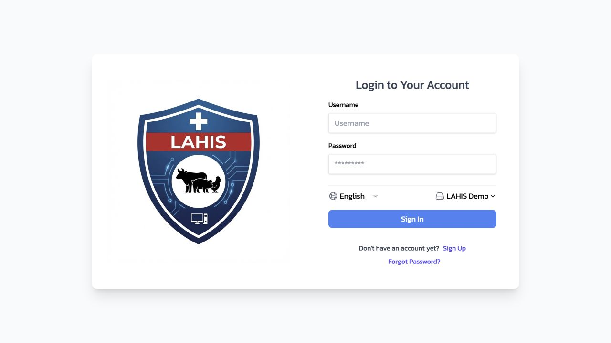

*ภาพที่ 1 — หน้า Login บน LAHIS Staging หลังเลือก tenant `LAHIS Demo`*

### 1.4 หากยังไม่พร้อมทดสอบ

ให้หยุดและแจ้งผู้ดูแลระบบก่อนเริ่มทดสอบ หากพบกรณีใดกรณีหนึ่งต่อไปนี้:

- เปิด Server URL ไม่ได้ หรือหน้าเว็บแสดงคำเตือนด้านความปลอดภัย
- ไม่มี `LAHIS Demo` ในรายการ Tenant
- Username หรือ Password ใช้งานไม่ได้
- หลัง Login แล้วเห็นข้อมูลจริงหรือข้อมูลที่ไม่ควรอยู่ในระบบทดสอบ
- ไม่แน่ใจว่ากำลังใช้งาน Staging หรือระบบจริง

<a id="chapter-2"></a>

## 2. ข้อมูลตัวอย่างที่เตรียมไว้สำหรับการทดสอบ

ใน tenant `LAHIS Demo` มีข้อมูลตัวอย่าง (seed data) เตรียมไว้เพื่อให้เริ่มทดสอบได้โดยไม่ต้องสร้างข้อมูลพื้นฐานทั้งหมดด้วยตนเอง ข้อมูลชุดนี้เป็น **ข้อมูลจำลองสำหรับ Staging** ไม่ใช่ชุดข้อมูลทางการของ สปป.ลาว และไม่ควรนำไปใช้อ้างอิงเชิงวิจัยหรือสถิติ

### 2.1 ภาพรวมข้อมูลที่มี

| กลุ่มข้อมูล | ข้อมูลที่เตรียมไว้ |
|---|---|
| Authority หรือหน่วยงาน | 41 รายการ: ประเทศ 1 รายการ แขวง 18 รายการ และเมือง/อำเภอตัวอย่าง 22 รายการ |
| หมู่บ้าน | บ้านตัวอย่าง 5 แห่งภายใต้ Sangthong |
| บัญชีผู้ใช้ Dashboard | `L01`, `V01` และ `S01` สำหรับทดสอบสิทธิ์ต่างระดับ |
| รหัสเชิญ Mobile | รหัสผู้รายงาน 5 รหัส ผูกกับบ้านตัวอย่างบ้านละ 1 รหัส |
| กลุ่มประเภทรายงาน | `Animal` |
| ประเภทรายงาน | `Animal Sick/Death` พร้อมแบบติดตามผล |
| แบบและรอบสำมะโน | สำมะโนสัตว์และสำมะโนคน ปี 2026 ขอบเขตทั้งประเทศ |
| การตั้งค่า Mobile | ข้อความ Consent สำหรับขั้นตอนลงทะเบียนและยอมรับเงื่อนไข |

### 2.2 Authority หรือโครงสร้างหน่วยงาน

**Authority** คือหน่วยงานหรือขอบเขตพื้นที่ภายใน tenant ใช้จัดโครงสร้างข้อมูลและกำหนดขอบเขตสิทธิ์ของผู้ใช้ ตัวอย่างเช่น ผู้ใช้ระดับประเทศอาจเห็นข้อมูลกว้างกว่าผู้ใช้ที่อยู่ในแขวงหรือเมือง/อำเภอ

Authority แตกต่างจาก Tenant ดังนี้:

| คำ | ตัวอย่าง | ความหมาย |
|---|---|---|
| Tenant | `LAHIS Demo` | พื้นที่ทดสอบทั้งชุดที่แยกจาก tenant อื่น |
| Authority | `Laos`, `Vientiane Capital`, `Sangthong` | หน่วยงานหรือพื้นที่ย่อยภายใน tenant |

โครงสร้างตัวอย่างหลักสำหรับการทดสอบเรียงลำดับดังนี้:

```text
Laos (LA)
└── Vientiane Capital (VTN-CAP)
    └── Sangthong (VTN-SPN)
        ├── ST-01 Ban Sangthong
        ├── ST-02 Ban Nong Buathong
        ├── ST-03 Ban Nasom
        ├── ST-04 Ban Phon Ngam
        └── ST-05 Ban Dong Khamxang
```

นอกจากนี้ยังมีแขวงหลักอื่นและเมือง/อำเภอตัวอย่างบางส่วน เพื่อใช้ตรวจการค้นหา การแสดงลำดับชั้น และขอบเขตสิทธิ์ ข้อมูลระดับเมือง/อำเภอและหมู่บ้านใน seed **ไม่ได้จัดทำให้ครบทุกพื้นที่ของประเทศ**

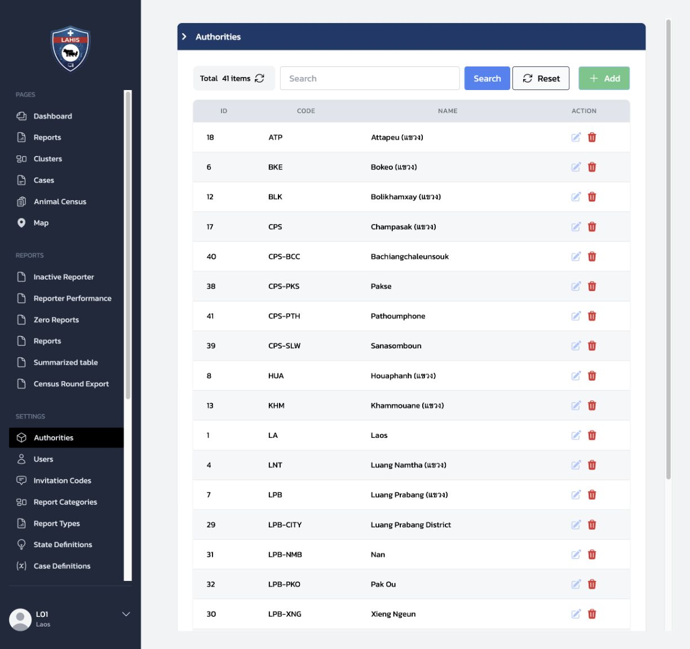

*ภาพที่ 2 — ตัวอย่างรายการ Authority บน tenant `LAHIS Demo`*

### 2.3 ประเภทรายงานที่เตรียมไว้

ข้อมูลทดสอบมีกลุ่มประเภทรายงาน `Animal` และประเภทรายงาน `Animal Sick/Death` ซึ่งเปิดใช้งานแล้วสำหรับทุก Authority ใน tenant นี้

แบบรายงานรองรับการบันทึกข้อมูลสุขภาพสัตว์ เช่น ชนิดสัตว์ กลุ่มอายุ เพศ จำนวนสัตว์ จำนวนป่วย จำนวนตาย โรคที่สงสัย และกลุ่มอาการต่าง ๆ พร้อมแบบติดตามผลสำหรับบันทึกจำนวนป่วย ตาย และฟื้นตัวในภายหลัง

ข้อมูลตัวอย่างนี้ใช้สำหรับทดสอบเส้นทางตั้งแต่ส่งรายงานผ่าน LAHIS Mobile ไปจนถึงตรวจรายละเอียดและผลที่เกี่ยวข้องบน Dashboard

### 2.4 ข้อมูลสำมะโนที่เตรียมไว้

มี Census Definition เริ่มต้นจำนวน 2 ชุด:

| รหัส | ชื่อ | ประเภท | ขอบเขต |
|---|---|---|---|
| `DEMO_ANIMAL` | Demo Animal Census | สำมะโนสัตว์ | ทั้งประเทศ |
| `DEMO_HUMAN` | Demo Human Census | สำมะโนคน | ทั้งประเทศ |

สำหรับการทดสอบในคู่มือนี้ มีรอบ `DEMO_ANIMAL_2026` แบบ `Production` เปิดใช้งานสำหรับสำมะโนสัตว์ ส่วน Human Census มีแบบฟอร์มที่ Published แล้ว แต่ยังไม่มี Census Round เปิดให้ส่งข้อมูลในหน้าจอที่ตรวจ ณ วันที่จัดทำคู่มือ

### 2.5 บัญชีผู้ใช้และขอบเขตที่ใช้ทดสอบ

| Username | Authority | บทบาทสำหรับการทดสอบ |
|---|---|---|
| `L01` | Laos | Admin ระดับประเทศ ใช้ตรวจการตั้งค่าและข้อมูลภาพรวม |
| `V01` | Vientiane Capital | Officer ระดับแขวง |
| `S01` | Sangthong | Officer ระดับเมือง/อำเภอ |

บัญชีเหล่านี้ช่วยให้เปรียบเทียบได้ว่าผู้ใช้ต่างระดับมองเห็นเมนูและข้อมูลต่างกันอย่างไร รหัสผ่านของบัญชีทดสอบระบุไว้ในบทที่ 1

### 2.6 ดูรหัสลงทะเบียน Reporter สำหรับใช้บน Mobile

ผู้วิจัยสามารถดูรหัสสำหรับลงทะเบียนอาสาหรือผู้รายงาน (Reporter) ได้จาก LAHIS Dashboard ตามเส้นทางนี้:

1. Login ด้วยบัญชี `L01`
2. ที่แถบเมนูด้านซ้าย เลื่อนไปยังกลุ่ม `SETTINGS`
3. เลือกเมนู `Invitation Codes`
4. ดูรหัสที่คอลัมน์ `CODE`
5. ตรวจสอบว่า `ROLE` เป็น `Reporter`, `AUTHORITY` เป็น `Sangthong` และวันที่ปัจจุบันอยู่ระหว่าง `FROM DATE` กับ `THROUGH DATE`
6. นำรหัสที่เลือกไปกรอกในขั้นตอนลงทะเบียนผู้ใช้ใหม่บน LAHIS Mobile

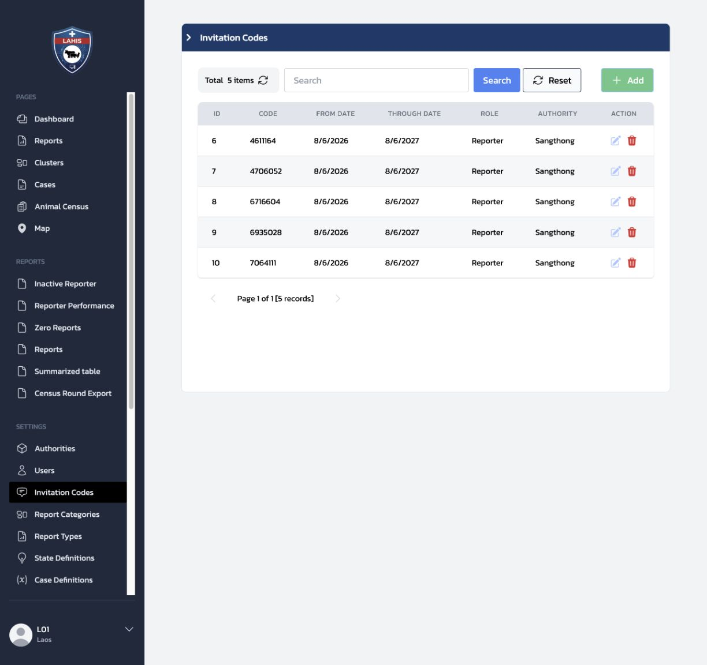

*ภาพที่ 3 — เมนู `Invitation Codes` แสดงรหัส บทบาท Authority และช่วงวันที่ใช้งาน*

รหัสตัวอย่างแต่ละรหัสผูกกับบ้านที่เตรียมไว้ดังนี้:

| รหัสลงทะเบียน | Authority | บ้านที่ผูกกับรหัส |
|---|---|---|
| `4611164` | Sangthong | ST-01 Ban Sangthong |
| `4706052` | Sangthong | ST-02 Ban Nong Buathong |
| `6716604` | Sangthong | ST-03 Ban Nasom |
| `6935028` | Sangthong | ST-04 Ban Phon Ngam |
| `7064111` | Sangthong | ST-05 Ban Dong Khamxang |

หลังลงทะเบียน ให้ตรวจว่าบัญชี Reporter ถูกผูกกับบ้านตรงตามตาราง เพราะบ้านนี้จะกำหนดขอบเขตข้อมูลและการส่งสำมะโนบน Mobile

> **ข้อควรระวัง:** ในการตรวจรหัส ให้ใช้เฉพาะการดูหรือค้นหา อย่ากด `Add`, แก้ไข หรือลบรหัส เว้นแต่ขั้นตอนทดสอบระบุให้ทำ หากไม่พบรหัสหรือรหัสหมดอายุ ให้แจ้งผู้ดูแล Staging

<a id="chapter-3"></a>

## 3. ฟีเจอร์ FAO Laos ที่ส่งมอบสำหรับการทดสอบ

หลังจาก Login แล้ว ให้เริ่มจากการทำความเข้าใจขอบเขตของฟีเจอร์ที่จะทดสอบ คู่มือนี้จะนำทางเฉพาะฟีเจอร์ต่อไปนี้:

| ฟีเจอร์ | สิ่งที่ส่งมอบ | จุดที่เกี่ยวข้องในระบบ |
|---|---|---|
| ข้อมูลหมู่บ้านและผู้รายงาน | จัดการข้อมูลหมู่บ้าน และลงทะเบียนผู้รายงานให้ผูกกับหมู่บ้านผ่านรหัสเชิญ | `Villages`, `Invitation Codes` และ LAHIS Mobile |
| สำมะโนสัตว์และคน | กำหนดแบบสำมะโน เปิดรอบสำมะโน บันทึกข้อมูลจาก Mobile และตรวจข้อมูลบน Dashboard | `Animal Census`, `Census Definition`, `Census Rounds` และ LAHIS Mobile |
| รายงานสัตว์ป่วย/ตายและการติดตามผล | ส่งรายงานสุขภาพสัตว์จาก Mobile หรือให้ Officer สร้าง Report ผ่าน Dashboard สำหรับพื้นที่ที่ไม่มี Reporter รวมถึงดูรายละเอียดและบันทึกข้อมูลติดตามผล | `Reports` และ LAHIS Mobile |
| การประเมินระดับความเสี่ยง | กำหนดระดับความเสี่ยงด้วยเจ้าหน้าที่ และรับผลประเมินความเสี่ยงจากระบบภายนอก | รายละเอียดของรายงานใน `Reports` |
| คำแนะนำหรือความคิดเห็นจาก AI | รับคำแนะนำจากระบบภายนอกและแสดงเป็นความคิดเห็นในรายงาน เพื่อให้เจ้าหน้าที่ตรวจสอบและใช้ประกอบการตัดสินใจ | รายละเอียดและชุดความคิดเห็นของรายงาน |
| การจัดกลุ่มเหตุการณ์ (Cluster) | รับผลการจัดกลุ่มรายงานที่เกี่ยวข้องกัน และแสดงผลกลุ่มเหตุการณ์บน Dashboard และแผนที่ | `Clusters` และ `Map` |
| ตารางสรุปและการส่งออกข้อมูล | ดูตารางสรุปข้อมูล LAHIS และส่งออกข้อมูลรอบสำมะโนสำหรับนำไปตรวจสอบหรือวิเคราะห์ต่อ | `Summarized table` และ `Census Round Export` |
| การเชื่อมต่อระบบภายนอก | ส่งเหตุการณ์จาก LAHIS ไปยังระบบภายนอก และรับผล AI, Risk และ Cluster กลับเข้ามาใน tenant ที่ทดสอบ | `Integration Clients`, `Webhook Endpoints` และผลที่แสดงในรายงาน/Cluster |

การทดสอบในบทถัดไปจะอ้างอิงรายการนี้เป็นหลัก หากพบเมนูอื่นนอกเหนือจากรายการข้างต้น ยังไม่จำเป็นต้องทดสอบ เว้นแต่ทีมผู้ส่งมอบจะระบุเพิ่มเติม

<a id="chapter-4"></a>

## 4. ใช้หน้า Home เพื่อนำทางไปยังฟีเจอร์ FAO Laos

หลังจาก Login สำเร็จ ระบบจะแสดงหน้า `Dashboard` ซึ่งเป็นหน้า Home ของ LAHIS ใช้เป็นจุดเริ่มต้นสำหรับเข้าสู่ฟีเจอร์ FAO Laos ที่ระบุไว้ในบทที่ 3 หน้านี้แบ่งพื้นที่หลักออกเป็น 2 ส่วน ได้แก่ **แถบเมนูหลักด้านซ้าย** และ **พื้นที่ทำงานด้านขวา**

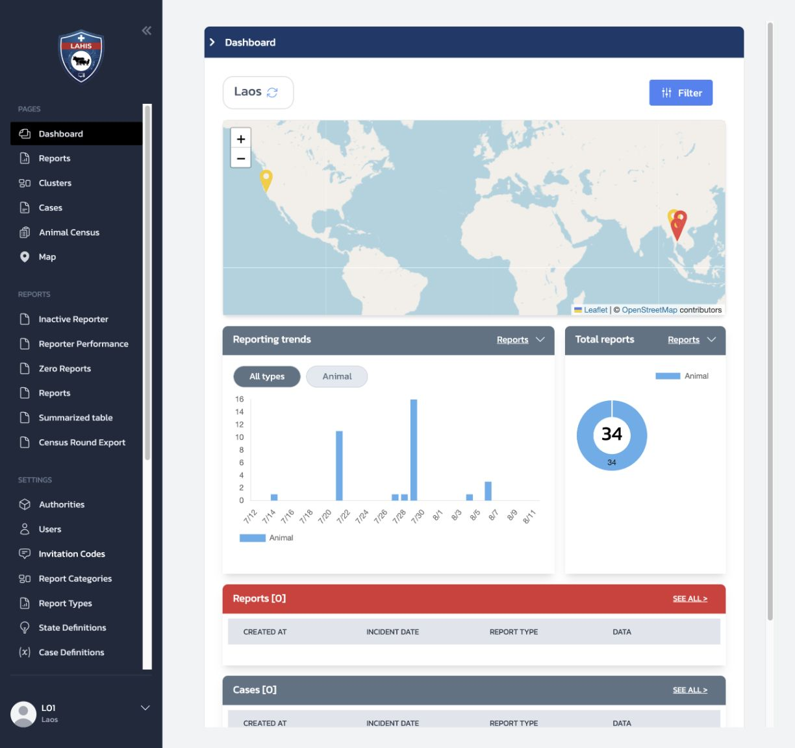

*ภาพที่ 4 — หน้า Home แบ่งเป็นแถบเมนูหลักด้านซ้ายและพื้นที่ทำงานด้านขวา*

### 4.1 แถบเมนูหลักด้านซ้าย

แถบด้านซ้ายใช้สำหรับเลือกหน้าและฟีเจอร์ที่ต้องการทดสอบ เมนูที่เกี่ยวข้องกับขอบเขต FAO Laos ได้แก่ `Reports`, `Clusters`, `Animal Census`, `Map`, `Summarized table`, `Census Round Export`, `Invitation Codes`, `Villages` และเมนูในกลุ่ม `Integration`

รายการเมนูที่แต่ละคนมองเห็นอาจแตกต่างกันตามสิทธิ์ของบัญชีผู้ใช้ ด้านล่างสุดของแถบเมนูจะแสดง Username และหน่วยงานของผู้ที่กำลัง Login อยู่ เช่น `L01` และ `Laos` เมนูอื่นที่มองเห็นแต่ไม่อยู่ในรายการฟีเจอร์ของบทที่ 3 ไม่อยู่ในขอบเขตของคู่มือนี้

### 4.2 พื้นที่ทำงานด้านขวา

พื้นที่ขนาดใหญ่ด้านขวาคือ **พื้นที่ทำงาน** ใช้แสดงข้อมูล เครื่องมือ และปุ่มคำสั่งของเมนูที่กำลังเลือกอยู่

ทุกครั้งที่เลือกเมนูทางด้านซ้าย เนื้อหาในพื้นที่ทำงานด้านขวาจะเปลี่ยนไปตามเมนูนั้น ตัวอย่างเช่น:

- เลือก `Dashboard` — ด้านขวาแสดงภาพรวม แผนที่ กราฟ และข้อมูลสรุป
- เลือก `Reports` — ด้านขวาเปลี่ยนเป็นพื้นที่สำหรับดูและค้นหารายงาน
- เลือก `Animal Census` — ด้านขวาเปลี่ยนเป็นพื้นที่สำหรับทำงานกับข้อมูลสำมะโนสัตว์

ชื่อเมนูที่กำลังเปิดจะแสดงที่ส่วนบนของพื้นที่ทำงาน ในขณะที่แถบเมนูด้านซ้ายยังคงอยู่เพื่อให้เปลี่ยนไปยังหน้าอื่นได้

> **หลักการนำทาง:** เลือกงานจากเมนูด้านซ้าย แล้วทำงานกับเนื้อหาที่แสดงในพื้นที่ด้านขวา

<a id="chapter-5"></a>

## 5. เริ่มลงทะเบียน Reporter บน LAHIS Mobile

หลังจากเลือกรหัสเชิญที่ผูกกับบ้านที่ต้องการทดสอบจากเมนู `Invitation Codes` แล้ว ขั้นตอนต่อไปคือใช้รหัสดังกล่าวลงทะเบียนอาสาหรือผู้รายงาน (Reporter) บน LAHIS Mobile

### 5.1 ตรวจสอบ Server และเปิดหน้าลงทะเบียน

1. เปิดแอป LAHIS Mobile
2. ตรวจสอบด้านล่างของหน้า Login ว่าแสดง `เซิร์ฟเวอร์: LAHIS Demo`
3. หากแสดงชื่อ Server อื่น ให้กด `เปลี่ยน` แล้วเลือก `LAHIS Demo` ก่อนดำเนินการต่อ
4. กดปุ่ม `ลงทะเบียนเป็นผู้รายงาน`

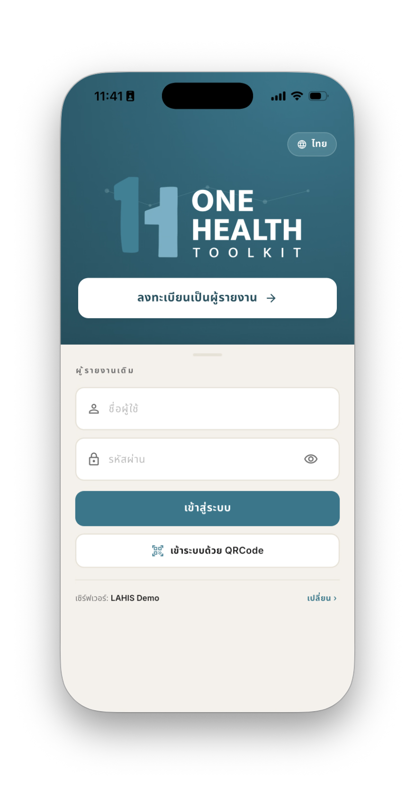

*ภาพที่ 5 — ตรวจสอบ Server เป็น `LAHIS Demo` แล้วกด `ลงทะเบียนเป็นผู้รายงาน`*

> **เหตุผลที่ต้องตรวจ Server:** รหัสเชิญที่เตรียมไว้เป็นข้อมูลของ tenant `LAHIS Demo` หาก Mobile เชื่อมกับ Server หรือ tenant อื่น ระบบจะหารหัสนี้ไม่พบ

### 5.2 กรอกรหัสเชิญ

หน้า `ลงทะเบียนผู้รายงาน` แบ่งเป็น 2 ขั้นตอน โดยขั้นตอนแรกใช้ตรวจรหัสเชิญ:

1. เลือกรหัสเชิญ 7 หลักจากตารางในหัวข้อ 2.6 โดยเลือกให้ตรงกับบ้านที่ต้องการทดสอบ
2. กรอกตัวเลขทั้ง 7 หลักลงในช่อง `กรอกรหัสเชิญ`
3. ตรวจสอบตัวเลขอีกครั้งก่อนดำเนินการต่อ
4. เมื่อกรอกรหัสครบ ให้กด `ถัดไป`

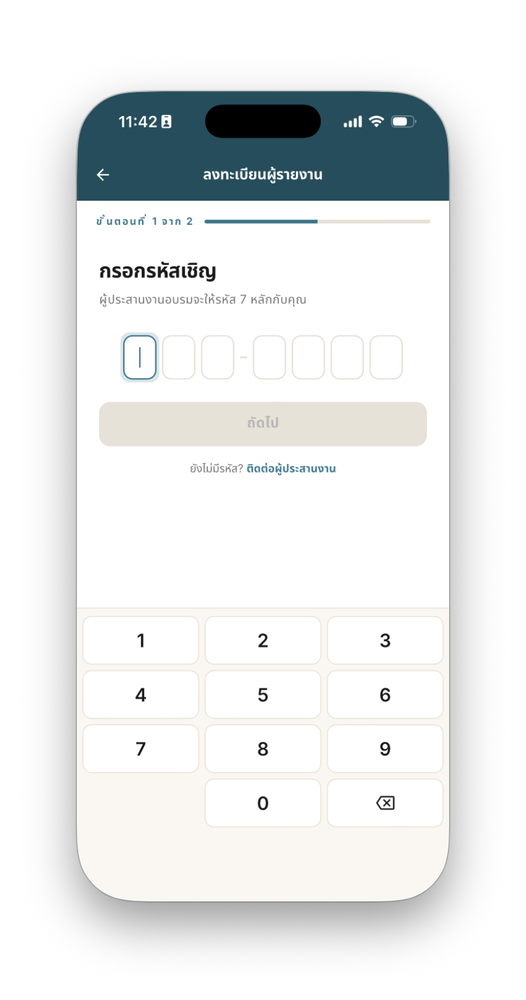

*ภาพที่ 6 — ขั้นตอนที่ 1 จาก 2: กรอกรหัสเชิญสำหรับ Reporter*

เมื่อรหัสถูกต้องและยังอยู่ในช่วงวันที่ใช้งาน แอปควรยอมรับรหัสและนำไปยังขั้นตอนที่ 2 ของการลงทะเบียน

### 5.3 ตรวจสอบ Authority และหมู่บ้านจากรหัสเชิญ

เมื่อระบบตรวจสอบรหัสสำเร็จ แอปจะแสดง `ขั้นตอนที่ 2 จาก 2` พร้อมข้อความ `รหัสถูกต้อง` และข้อมูลที่ผูกกับรหัสเชิญ ก่อนกรอกข้อมูลผู้ใช้ ให้เปรียบเทียบ Authority และหมู่บ้านบนหน้าจอกับตารางในหัวข้อ 2.6

ตัวอย่างจากการทดสอบด้วยรหัส `4706052`:

| รายการ | ผลที่ควรเห็น |
|---|---|
| หน่วยงาน | `Sangthong` |
| หมู่บ้าน | `ST-02 - Ban Nong Buathong` |

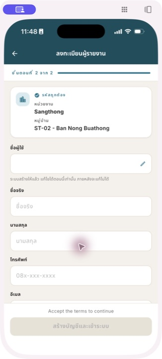

*ภาพที่ 7 — รหัส `4706052` ผ่านการตรวจสอบและพาไปยังบ้าน `ST-02 - Ban Nong Buathong`*

หาก Authority หรือหมู่บ้านไม่ตรงกับรหัสที่เลือก **อย่าดำเนินการลงทะเบียนต่อ** ให้ย้อนกลับ ตรวจตัวเลขรหัส และบันทึกผลเพื่อแจ้งผู้ดูแล Staging

หลังจากยืนยันพื้นที่ถูกต้องแล้ว ขั้นตอนถัดไปจึงเป็นการกรอก Username ชื่อผู้ใช้ เบอร์โทร อีเมล และข้อมูลที่ระบบกำหนด รายละเอียดส่วนนี้จะระบุในหัวข้อถัดไป

### 5.4 กรอกข้อมูล Reporter ด้วยข้อมูลจำลอง

หลังจากตรวจ Authority และหมู่บ้านแล้ว ให้กรอกข้อมูลสำหรับสร้างบัญชี Reporter โดยใช้ **ข้อมูลจำลองสำหรับ Staging เท่านั้น** ไม่ใช้ชื่อ เบอร์โทร หรืออีเมลของบุคคลจริง

แบบลงทะเบียนประกอบด้วยข้อมูล เช่น Username, ชื่อจริง, นามสกุล, โทรศัพท์, อีเมล, ที่อยู่ (ไม่บังคับ), Gender และ Age กรอกข้อมูลที่ระบบกำหนดให้ครบก่อนเข้าสู่ส่วน `Privacy & terms`

ในตัวอย่างนี้ใช้บัญชีทดสอบ `podd_st02_0811` และอีเมลภายใต้โดเมนตัวอย่าง `example.com` เพื่อให้แยกจากข้อมูลผู้ใช้งานจริงได้ชัดเจน

### 5.5 อ่านและยอมรับ Consent

ส่วน `Privacy & terms` เป็นขั้นตอนบังคับก่อนสร้างบัญชี ปุ่มสร้างบัญชีจะยังไม่พร้อมใช้งานจนกว่าจะอ่านและยอมรับ Consent ครบทั้งสองส่วน

1. กด `Read privacy notice`
2. อ่านข้อความ Privacy notice ให้ครบ โดยตรวจหัวข้อสำคัญ เช่น ข้อมูลที่ระบบเก็บ วัตถุประสงค์การใช้ข้อมูล การแบ่งปันและการปกป้องข้อมูล และข้อตกลงของผู้ใช้
3. เมื่ออ่านครบ ให้กด `I have read the terms`

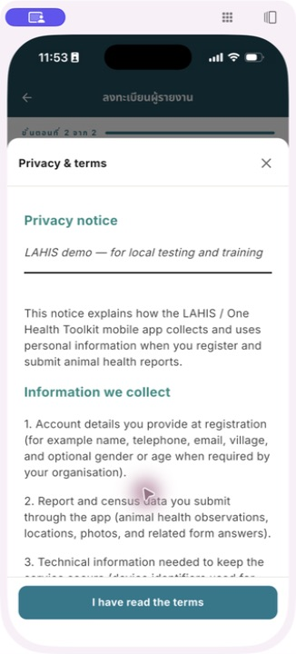

*ภาพที่ 8 — หน้า Consent อธิบายข้อมูลที่ LAHIS Mobile เก็บและนำไปใช้*

ก่อนยืนยัน ให้ตรวจส่วน `Your agreement` ซึ่งอธิบายว่าการยอมรับหมายถึงผู้ใช้เข้าใจวิธีใช้ข้อมูลสำหรับการเฝ้าระวังสุขภาพสัตว์ในระบบทดสอบ

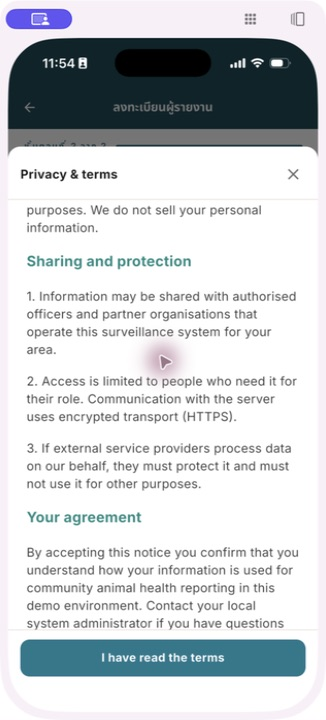

*ภาพที่ 9 — ตรวจส่วน `Your agreement` แล้วกด `I have read the terms`*

หลังกลับมายังแบบลงทะเบียน:

4. ตรวจว่าระบบแสดง `Privacy notice reviewed`
5. เลือกช่อง `I accept the terms and agreement`
6. ตรวจว่าช่องทั้งสองแสดงเครื่องหมายถูก และปุ่ม `สร้างบัญชีและเข้าระบบ` เปลี่ยนเป็นพร้อมใช้งาน

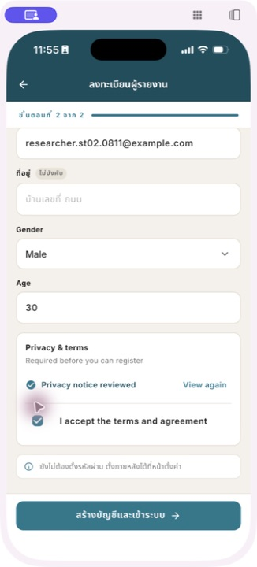

*ภาพที่ 10 — Consent ได้รับการยอมรับครบ และปุ่มสร้างบัญชีพร้อมใช้งาน*

> **จุดตรวจสำคัญ:** การกด `I have read the terms` เพียงอย่างเดียวยังไม่ใช่การยอมรับครบ ผู้ใช้ต้องเลือก `I accept the terms and agreement` เพิ่มอีกหนึ่งขั้นตอน

ในการทดสอบตัวอย่างนี้ได้กด `สร้างบัญชีและเข้าระบบ` แล้ว ระบบสร้าง Reporter `podd_st02_0811` ใน Staging สำเร็จและนำเข้าสู่หน้า Home ของ Mobile ขั้นตอนถัดไปอยู่ในบทที่ 6

### 5.6 Admin ตั้งค่าข้อความ Consent

ข้อความ Consent ที่แสดงบน LAHIS Mobile ไม่ได้เขียนตายตัวอยู่ในแอป Admin สามารถกำหนดข้อความให้เหมาะกับการใช้งานของแต่ละ tenant ได้จากเมนู `SETTINGS` → `Configurations` บน LAHIS Dashboard

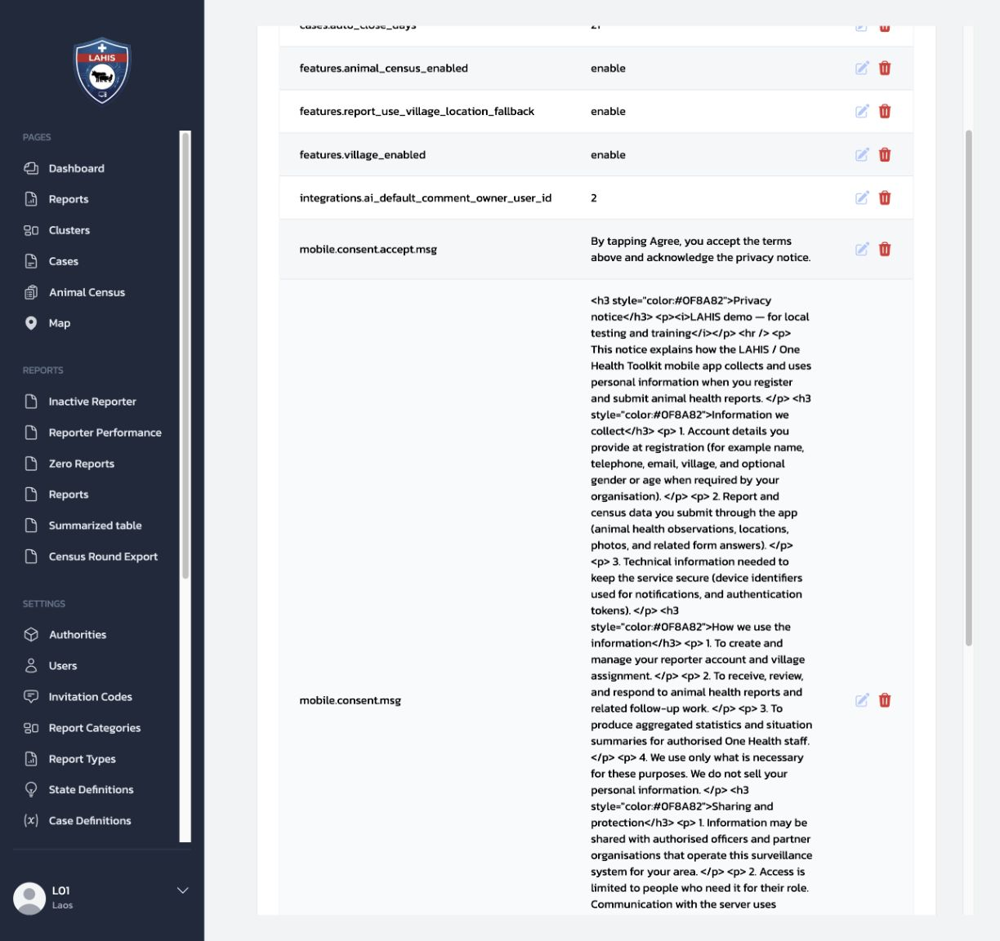

*ภาพที่ 11 — ค่า Consent ของ tenant `LAHIS Demo` ในเมนู `Configurations`*

ค่าหลักที่เกี่ยวข้องมีดังนี้:

| Key | ใช้กำหนด |
|---|---|
| `mobile.consent.msg` | เนื้อหา Privacy notice หลักที่ Mobile แสดงให้ Reporter อ่าน รองรับข้อความแบบ HTML |
| `mobile.consent.accept.msg` | ข้อความกำกับการยอมรับเงื่อนไขก่อนผู้ใช้ยืนยัน Consent |

วิธีตรวจสอบข้อความที่เตรียมไว้:

1. Login เข้า Dashboard ด้วยบัญชี Admin ของ tenant ที่ต้องการทดสอบ
2. เลือก `Configurations` ในกลุ่มเมนู `SETTINGS`
3. ค้นหา key ที่ขึ้นต้นด้วย `mobile.consent`
4. เปรียบเทียบค่าบน Dashboard กับข้อความที่แสดงใน `Privacy & terms` บน Mobile

Configuration เหล่านี้เป็นข้อมูลของ tenant ที่กำลังเลือกอยู่ การแก้ไขใน `LAHIS Demo` จึงมีผลกับ Mobile ที่ลงทะเบียนหรือเข้าใช้งาน tenant นี้ ไม่ได้เปลี่ยนข้อความของทุก tenant

> **ข้อควรระวัง:** ในการทดสอบทั่วไปให้ตรวจสอบค่าเท่านั้น ไม่ควรแก้ไขหรือลบข้อความโดยไม่ได้รับมอบหมาย เนื่องจาก HTML ที่ไม่สมบูรณ์อาจทำให้ข้อความบน Mobile แสดงผิดรูปแบบ และหาก `mobile.consent.msg` ว่าง ส่วน Consent ระหว่างลงทะเบียนอาจไม่แสดง

### 5.7 จุดตรวจสำหรับผู้ทดสอบ

| จุดที่ตรวจ | ผลที่ควรเห็น |
|---|---|
| Server บนหน้า Login | `LAHIS Demo` |
| ปุ่มเริ่มลงทะเบียน | `ลงทะเบียนเป็นผู้รายงาน` |
| รูปแบบรหัสเชิญ | ตัวเลข 7 หลัก |
| รหัสถูกต้อง | สามารถกด `ถัดไป` และไปยังขั้นตอนที่ 2 |
| พื้นที่จากรหัส | Authority และหมู่บ้านตรงกับตารางในหัวข้อ 2.6 |
| รหัสไม่ถูกต้องหรือหมดอายุ | แอปไม่ควรอนุญาตให้ดำเนินการต่อ และควรแสดงข้อความแจ้งผู้ใช้ |
| ก่อนอ่าน Consent | ปุ่มสร้างบัญชียังไม่พร้อมใช้งาน |
| อ่าน Privacy notice แล้ว | แสดง `Privacy notice reviewed` |
| ยอมรับ Consent ครบ | ช่อง `I accept the terms and agreement` ถูกเลือก และปุ่มสร้างบัญชีพร้อมใช้งาน |
| ข้อความ Consent | ตรงกับค่า `mobile.consent.msg` และ `mobile.consent.accept.msg` ของ tenant ใน `Configurations` |

หากรหัสจากหัวข้อ 2.6 ใช้งานไม่ได้ ให้บันทึกรหัสที่ใช้ ชื่อบ้าน Server ที่เลือก และข้อความที่แอปแสดง แล้วแจ้งผู้ดูแล Staging โดยไม่สร้างหรือแก้ไขรหัสใหม่เอง

<a id="chapter-6"></a>

## 6. ส่งรายงานสัตว์ป่วย/ตายจาก Mobile และตรวจบน Dashboard

หัวข้อนี้สาธิตเส้นทางข้อมูลตั้งแต่ Reporter ส่งรายงาน `Animal Sick/Death` บน Mobile จนถึงการตรวจพบข้อมูลบน LAHIS Dashboard ข้อมูลทั้งหมดเป็นข้อมูลจำลองใน Staging

### 6.1 ตรวจหน้า Home หลังลงทะเบียน

เมื่อลงทะเบียนสำเร็จ แอปจะ Login ด้วยบัญชีใหม่และเปิดหน้ารายการรายงานโดยอัตโนมัติ ด้านล่างของหน้ามีเมนู `รายงาน`, `สำมะโน` และ `ผู้ใช้` ส่วนปุ่ม `+ รายงานใหม่` ใช้เริ่มสร้างรายงาน

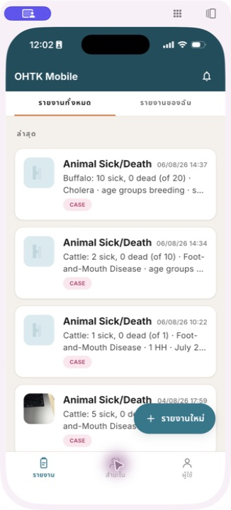

*ภาพที่ 12 — Reporter `podd_st02_0811` เข้าสู่หน้า Home ของ Mobile สำเร็จ*

### 6.2 เลือกประเภทรายงาน

1. กด `+ รายงานใหม่`
2. ตรวจว่าอยู่ในหน้า `ประเภทรายงาน`
3. เลือก `Animal Sick/Death` ในหมวด `Animal`

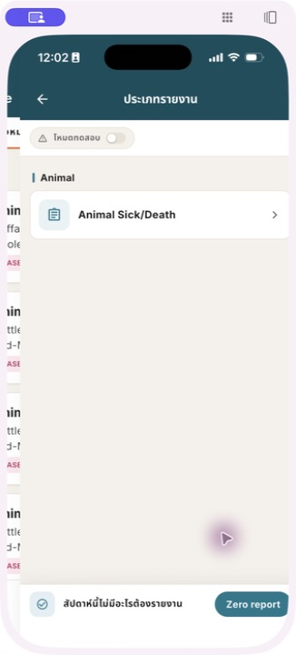

*ภาพที่ 13 — ประเภทรายงานที่ใช้ทดสอบคือ `Animal Sick/Death`*

แบบรายงานตัวอย่างมี 8 ขั้นตอน ได้แก่ ข้อมูลสัตว์ โรคที่สงสัย อาการหลายกลุ่ม รูปถ่าย วันที่เกิดเหตุ และจำนวนสัตว์ ให้กด `ถัดไป` หลังกรอกข้อมูลบังคับของแต่ละขั้นตอนครบ

### 6.3 กรอกข้อมูลสัตว์และอาการด้วยข้อมูลจำลอง

ข้อมูลที่ใช้ในการทดสอบครั้งนี้คือ:

| รายการ | ค่าที่กรอก |
|---|---|
| Species | `Cattle` |
| Age group | `Breeding adult` |
| Sex | `Male` และ `Female` |
| Suspected disease | `Unknown Disease` |
| Symptoms | `Diarrhea` และ `Unknown symptom` |
| Photos | ไม่แนบรูป |
| Incident date | `11/08/2026` |
| Number of households | `1` |
| Number of animals | `10` |
| Number of sick | `2` |
| Number of dead | `1` |
| Number of recover | `0` |

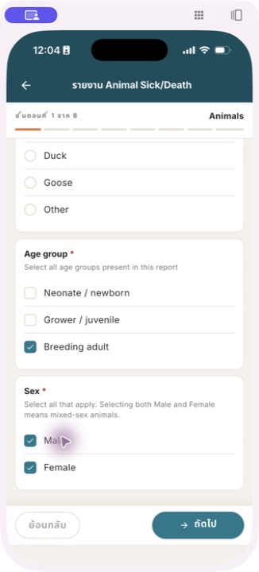

*ภาพที่ 14 — เลือกโคกลุ่ม Breeding adult ทั้งเพศผู้และเพศเมีย*

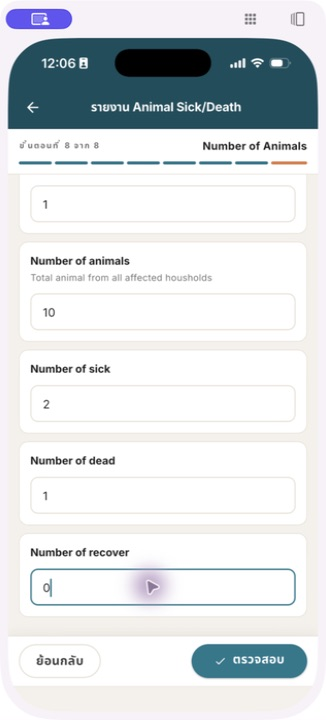

*ภาพที่ 15 — กรอก 1 ครัวเรือน มีสัตว์ทั้งหมด 10 ตัว ป่วย 2 ตัว ตาย 1 ตัว และฟื้นตัว 0 ตัว*

> **ข้อมูลทดสอบ:** หากนักวิจัยส่งรายงานเพิ่ม ให้ใช้ค่าที่แยกออกจากข้อมูลจริงและจดวันเวลา Username หมู่บ้าน และค่าที่กรอกทุกครั้ง เพื่อให้ค้นหารายงานบน Dashboard ได้ถูกต้อง

### 6.4 ตรวจทานและส่งรายงาน

หลังจบขั้นตอนที่ 8 ให้กด `ตรวจสอบ` แล้วดำเนินการดังนี้:

1. ตอบคำถามว่าพื้นที่เกิดเหตุอยู่ในหมู่บ้านที่สังกัดหรือไม่ ตัวอย่างนี้เลือก `ใช่`
2. อ่าน `สรุปรายงาน` และเปรียบเทียบกับค่าที่กรอก
3. เลือก `I confirm that the information provided is accurate`
4. เมื่อปุ่ม `ส่งรายงาน` พร้อมใช้งาน ให้กดเพื่อส่งข้อมูลเข้า Staging

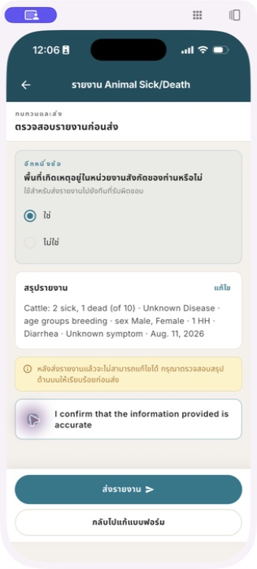

*ภาพที่ 16 — ตรวจสรุปรายงานและยืนยันความถูกต้องก่อนกด `ส่งรายงาน`*

เมื่อส่งสำเร็จ แอปจะกลับไปยังหน้ารายการ และรายงานใหม่ควรแสดงอยู่ด้านบน ตัวอย่างนี้แสดงเวลา `11/08/2026 12:07` พร้อมข้อความ `Cattle: 2 sick, 1 dead (of 10) — Unknown Disease`

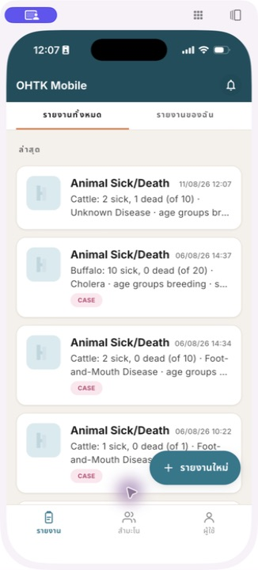

*ภาพที่ 17 — รายงานทดสอบปรากฏเป็นรายการล่าสุดบน Mobile*

### 6.5 ตรวจรายละเอียดรายงานบน LAHIS Dashboard

1. เปิด [LAHIS Staging](https://lahis.ohtk.org/) และ Login ด้วยบัญชี Admin
2. เลือก `Reports` จากเมนูด้านซ้าย
3. ค้นหาแถวโดยใช้วันเวลา ประเภทรายงาน Authority และข้อมูลสรุปที่จดไว้
4. ตรวจว่ารายละเอียดตรงกับข้อมูลจาก Mobile

ผลจากการทดสอบครั้งนี้พบรายการใหม่เป็นแถวแรก โดยมีข้อมูลสำคัญดังนี้:

| รายการบน Dashboard | ผลที่พบ |
|---|---|
| Created At | `8/11/2026 12:07:07 PM` |
| Incident Date | `8/11/2026` |
| Report Type | `Animal Sick/Death` |
| Authority Name | `Sangthong` |
| Risk | `No assessment` |
| Data | `Cattle: 2 sick, 1 dead (of 10) · Unknown Disease · age groups breeding · sex Male, Female · 1 HH · Diarrhea · Unknown symptom` |

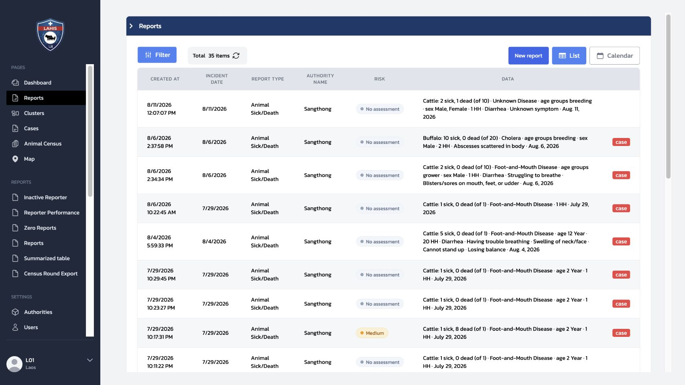

*ภาพที่ 18 — หน้า `Reports` แสดงรายละเอียดรายงานทดสอบที่ส่งจาก Mobile*

### 6.6 ตรวจผลรวมบนหน้า Home Dashboard

กลับไปที่เมนู `Dashboard` เพื่อดูผลในภาพรวม หน้า Home แสดงข้อมูลรายงานบนแผนที่ กราฟ `Reporting trends` และกราฟ `Total reports` ให้ตรวจว่าข้อมูลสะท้อนรายงานที่เพิ่งส่งตามช่วงวันที่ Authority ประเภทรายงาน และ filter ที่เลือก โดยไม่ยึดจำนวนรวมในภาพเป็นค่าที่ต้องได้

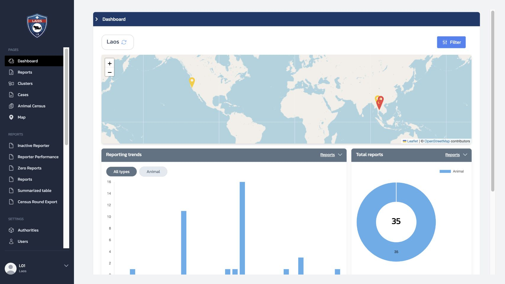

*ภาพที่ 19 — Dashboard แสดงยอดรวม กราฟแนวโน้ม และตำแหน่งบนแผนที่ ตัวเลขในภาพเป็นข้อมูล ณ เวลาที่บันทึกภาพและอาจเปลี่ยนแปลงได้*

หน้า `Reports` ใช้ยืนยันข้อมูลรายงานเป็นรายรายการ ส่วนหน้า `Dashboard` ใช้ดูผลรวม แนวโน้ม และตำแหน่งตามขอบเขตที่เลือก หากใช้ `Filter` ต้องตรวจช่วงวันที่ Authority และประเภทรายงานให้ครอบคลุมรายงานที่เพิ่งส่ง มิฉะนั้นรายการหรือยอดรวมอาจไม่แสดงข้อมูลดังกล่าว

### 6.7 จุดตรวจสำหรับผู้ทดสอบ

| จุดที่ตรวจ | ผลที่ควรเห็น |
|---|---|
| หลังสร้าง Reporter | Mobile เปิดหน้า Home และ Login ด้วยบัญชีใหม่ |
| ก่อนส่งรายงาน | หน้าตรวจทานแสดงค่าตรงกับที่กรอก และต้องยืนยันความถูกต้องก่อนส่ง |
| หลังส่งบน Mobile | รายงานใหม่ขึ้นเป็นรายการล่าสุด |
| หน้า Reports บนเว็บ | พบแถวที่มีวันเวลา Authority ประเภทรายงาน และข้อมูลตรงกับ Mobile |
| หน้า Dashboard | ยอดรวม กราฟ และแผนที่สะท้อนข้อมูลตาม filter ที่เลือก |

<a id="chapter-7"></a>

## 7. บันทึก Follow-up และตรวจยอดรวมสะสม

Follow-up ใช้เพิ่มข้อมูลความคืบหน้าให้กับรายงานเดิม โดยไม่สร้างรายงานเหตุการณ์ใหม่อีกหนึ่งรายการ จุดสำคัญของฟีเจอร์นี้คือค่าจำนวนที่บันทึกในแต่ละ Follow-up จะถูกนำไปบวกกับยอดของรายงานแรก และแสดงเป็นยอดรวมสะสมในหน้า Detail ของรายงาน

หากต้องการยืนยันว่า Follow-up ไม่ได้สร้างรายงานใหม่ ให้จดจำนวนรายการบนหน้า `Reports` ก่อนส่ง Follow-up แล้วเปรียบเทียบอีกครั้งหลังส่ง จำนวนรายการควรเท่าเดิม ขณะที่แท็บ `การติดตาม` และยอดรวมสะสมของรายงานเดิมควรมีข้อมูลเพิ่มขึ้น

### 7.1 เปิดหน้า Detail ของรายงาน

1. เปิดเมนู `รายงาน` บน Mobile
2. เลือกรายงานที่ต้องการติดตาม โดยตรวจวันเวลาและข้อความสรุปให้ตรงกับรายงานต้นทาง
3. ในแท็บ `รายละเอียด` ให้ตรวจส่วน `Totals (report + follow-ups)`

ก่อนเพิ่ม Follow-up รายงานทดสอบแสดงยอดตั้งต้นดังนี้:

| รายการ | ยอดจากรายงานแรก |
|---|---:|
| Households | 1 |
| Total animals | 10 |
| Sick | 2 |
| Dead | 1 |
| Recovered | 0 |

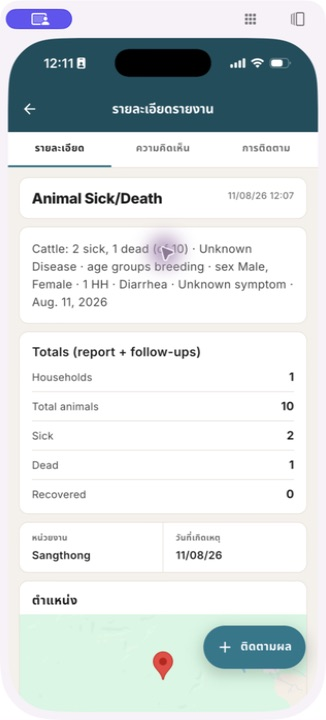

*ภาพที่ 20 — `Totals (report + follow-ups)` ก่อนติดตามผล มีค่าเท่ากับรายงานแรก*

### 7.2 เพิ่มข้อมูล Follow-up

1. กด `+ ติดตามผล` ที่ด้านล่างของหน้า Detail
2. กรอกจำนวนที่พบ **เพิ่มในการติดตามครั้งนี้**
3. กด `ตรวจสอบ`
4. อ่านสรุป เลือก `I confirm that the information provided is accurate`
5. กด `ส่งการติดตาม`

ตัวอย่างนี้บันทึกค่าดังต่อไปนี้:

| รายการ | ค่าที่เพิ่มใน Follow-up |
|---|---:|
| Number of households | 1 |
| Number of animals | 2 |
| Number of sick | 1 |
| Number of dead | 0 |
| Number of recover | 1 |

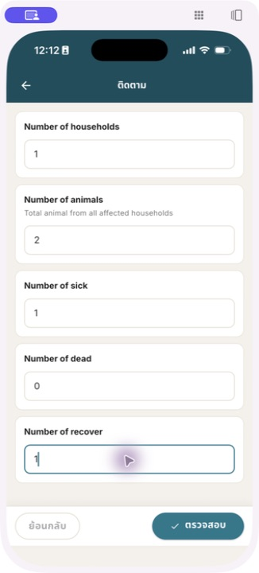

*ภาพที่ 21 — กรอกเฉพาะจำนวนที่ต้องการเพิ่มจากการติดตามครั้งนี้*

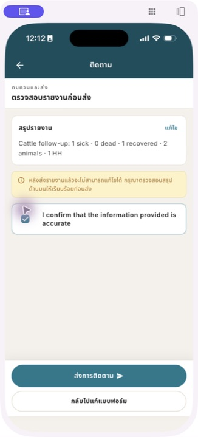

*ภาพที่ 22 — สรุป Follow-up แสดง `1 sick · 0 dead · 1 recovered · 2 animals · 1 HH`*

> **ข้อควรระวังเรื่องการนับ:** ช่องใน Follow-up เป็นจำนวนที่จะนำไป **บวกเพิ่ม** ไม่ใช่ช่องสำหรับกรอกยอดรวมล่าสุดทั้งหมด หากนำยอดเดิมมากรอกซ้ำ ระบบจะสะสมซ้ำและทำให้ยอดรวมสูงกว่าความเป็นจริง

### 7.3 ตรวจยอดรวมสะสมในหน้า Detail

หลังส่ง Follow-up ให้กลับมาเปิดแท็บ `รายละเอียด` แล้วเปรียบเทียบยอดก่อนและหลัง โดยระบบคำนวณตามหลักการ:

`ยอดรวมสะสม = ยอดจากรายงานแรก + ผลรวมของ Follow-up ทุกครั้ง`

ผลจากการทดสอบครั้งนี้คือ:

| รายการ | รายงานแรก | Follow-up ครั้งที่ 1 | ยอดรวมสะสม |
|---|---:|---:|---:|
| Households | 1 | +1 | **2** |
| Total animals | 10 | +2 | **12** |
| Sick | 2 | +1 | **3** |
| Dead | 1 | +0 | **1** |
| Recovered | 0 | +1 | **1** |


*ภาพที่ 23 — หน้า Detail แสดงยอดรวมของรายงานแรกและ Follow-up แล้ว*

### 7.4 ตรวจประวัติการติดตาม

เลือกแท็บ `การติดตาม` ในหน้า Detail ระบบจะแสดงรายการ Follow-up แยกตามวันเวลา พร้อมข้อความสรุปของแต่ละครั้ง ตัวอย่างนี้พบ `ติดตามผล 1 รายการ` เวลา `11/08/2026 12:12`

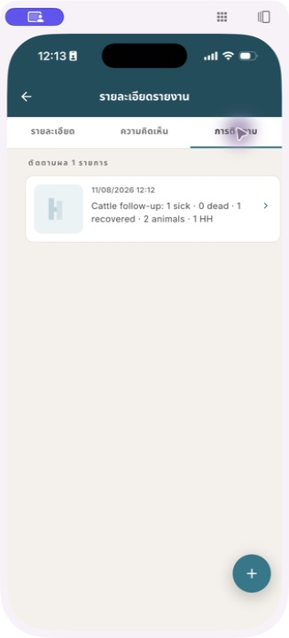

*ภาพที่ 24 — แท็บ `การติดตาม` แสดง Follow-up ครั้งที่ 1 และค่าที่เพิ่มในครั้งนั้น*

### 7.5 ตรวจ Follow-up บน Dashboard

Admin สามารถตรวจยอดสะสมและรายการ Follow-up ของรายงานเดียวกันบน Dashboard ได้ดังนี้:

1. เปิดเมนู `Reports`
2. เปิดหน้า Detail ของรายงานที่ต้องการตรวจ
3. ตรวจส่วน `Totals (report + follow-ups)` ด้านบน ซึ่งแสดงยอดรวมจากรายงานแรกและ Follow-up ทุกครั้ง


*ภาพที่ 25 — Dashboard แสดง `Totals (report + follow-ups)` พร้อมยอด Households, Total animals, Sick, Dead และ Recovered*

4. เลื่อนลงมาด้านล่างแล้วเลือกแท็บ `Followup`
5. ตรวจจำนวนแถวของ Follow-up รวมถึงวันเวลาและข้อมูลที่เพิ่มในแต่ละครั้ง แต่ละแถวหมายถึง Follow-up หนึ่งรายการ

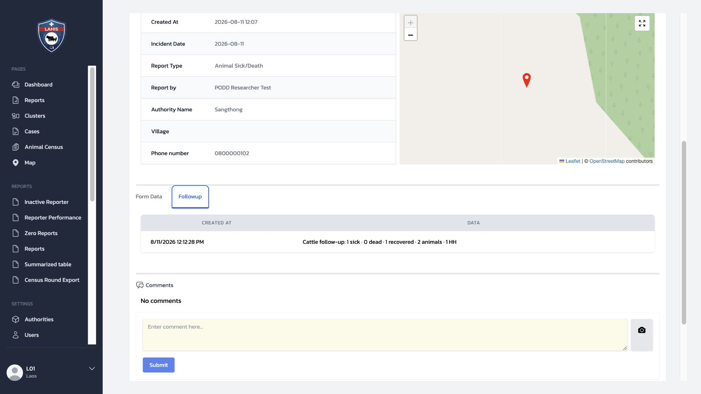

*ภาพที่ 26 — แท็บ `Followup` แสดงรายการติดตาม พร้อมวันเวลาและค่าที่เพิ่มในครั้งนั้น*

จำนวน Follow-up และยอดสะสมที่เห็นจะขึ้นอยู่กับข้อมูล ณ เวลาที่ทดสอบ จึงควรเปรียบเทียบกับรายการในแท็บ `การติดตาม` บน Mobile แทนการยึดจำนวนจากภาพตัวอย่าง

### 7.6 จุดตรวจสำหรับผู้ทดสอบ

| จุดที่ตรวจ | ผลที่ควรเห็น |
|---|---|
| ก่อนเพิ่ม Follow-up | `Totals (report + follow-ups)` ตรงกับยอดจากรายงานแรก |
| หลังส่ง Follow-up | แท็บ `การติดตาม` มีรายการใหม่พร้อมวันเวลาและค่าที่บันทึก |
| ยอดรวมสะสม | แต่ละช่องเท่ากับยอดรายงานแรกบวก Follow-up ทุกครั้ง |
| Dashboard | ส่วน `Totals (report + follow-ups)` และแท็บ `Followup` ตรงกับข้อมูลบน Mobile |
| จำนวนรายงาน | Follow-up ผูกกับรายงานเดิม ไม่ควรสร้างรายงานเหตุการณ์ใหม่ในรายการหลัก |

<a id="chapter-8"></a>

## 8. AI Suspected: ผลวิเคราะห์เบื้องต้นจากระบบ AI

### 8.1 ภาพรวมการทำงาน

LAHIS เชื่อมต่อกับระบบ AI ภายนอกเพื่อช่วยอ่านข้อมูลของรายงานและเสนอโรคที่อาจเป็นไปได้ กระบวนการโดยสรุปมีดังนี้:

1. Reporter ส่งรายงานพร้อมข้อมูลอาการและภาพประกอบผ่าน Mobile
2. LAHIS ส่งข้อมูลที่จำเป็นของรายงานให้ระบบ AI ช่วยวิเคราะห์
3. เมื่อวิเคราะห์เสร็จ ผลลัพธ์จะถูกส่งกลับมาแนบกับ **รายงานเดิม**
4. Reporter เห็นผลใน Mobile ส่วน Officer เห็นผลของรายงานเดียวกันบน Dashboard

AI Suspected เป็น **ข้อมูลประกอบการพิจารณาเบื้องต้น** ไม่ใช่คำวินิจฉัยโรค และไม่ทดแทนการตรวจสอบหรือการตัดสินใจของเจ้าหน้าที่

### 8.2 Reporter ดูผล AI บน Mobile

หลังส่งรายงานแล้ว Reporter สามารถตรวจผลที่ระบบส่งกลับมาได้ดังนี้:

1. เปิดเมนูรายงานของตนเอง
2. เลือกรายงานที่ต้องการตรวจ
3. ในหน้า `รายละเอียดรายงาน` เลือกแท็บ `ความคิดเห็น`
4. ผล AI จะแสดงเป็นความคิดเห็นจากผู้ส่งที่ระบบกำหนด ตัวอย่างในภาพแสดงชื่อ `L01`

ข้อความอาจประกอบด้วยชนิดสัตว์ รายชื่อโรคที่อาจเป็นไปได้ ระดับความเป็นไปได้ และเหตุผลจากอาการหรือภาพที่ได้รับ ผลลัพธ์ของแต่ละรายงานอาจแตกต่างกัน และอาจต้องรอสักครู่หรือเปิดรายงานใหม่อีกครั้งหาก AI ยังประมวลผลไม่เสร็จ

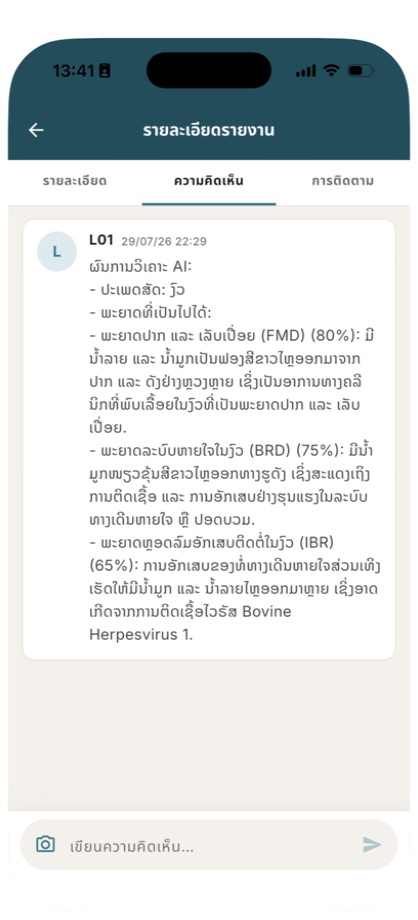

*ภาพที่ 27 — Reporter เปิดหน้า `รายละเอียดรายงาน` > `ความคิดเห็น` และเห็นผลวิเคราะห์ AI ที่ส่งกลับมาแนบกับรายงานเดิม*

### 8.3 Officer ดู AI Suspected บน Dashboard

Officer สามารถเปิดผล AI ของรายงานเดียวกันบน Dashboard ได้ดังนี้:

1. เปิดเมนู `Reports`
2. เลือกรายงานที่ต้องการตรวจเพื่อเปิดหน้า Report detail
3. ดูส่วน `Assessment` บริเวณด้านบนของหน้า
4. ที่กรอบ `AI suspected · read-only` กด `Show AI note` เพื่อแสดงข้อความทั้งหมด หากเปิดอยู่แล้ว ปุ่มจะเปลี่ยนเป็น `Hide AI note`

กรอบนี้เป็นแบบ read-only เพื่อให้ Officer เห็นผลล่าสุดจาก AI โดยไม่แก้ไขข้อความต้นฉบับจากหน้าจอนี้ นอกจากนี้ ข้อความเดียวกันยังปรากฏในส่วน `Comments` ด้านล่างของรายงาน เพื่อให้ตรวจสอบร่วมกับการสนทนาและข้อมูลอื่นของรายงานได้

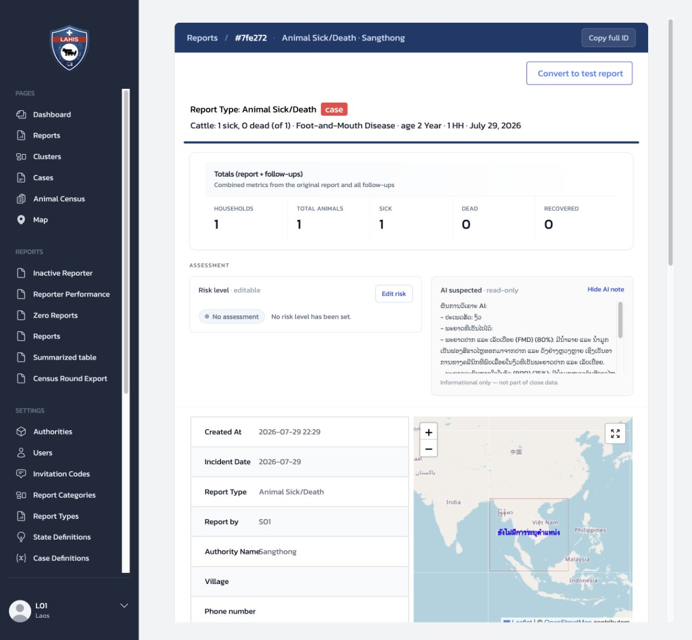

*ภาพที่ 28 — Officer เห็นกรอบ `AI suspected · read-only` ในส่วน `Assessment` ของหน้า Report detail*

### 8.4 ความสัมพันธ์ของข้อมูลที่เห็นสองฝั่ง

| ผู้ใช้งาน | ตำแหน่งที่ดู | สิ่งที่ระบบแสดง |
|---|---|---|
| Reporter | Mobile > รายละเอียดรายงาน > `ความคิดเห็น` | ผล AI ในรูปแบบความคิดเห็นที่อ่านและอ้างอิงจากรายงานได้ |
| Officer | Dashboard > `Reports` > Report detail > `Assessment` | ผลล่าสุดในกรอบ `AI suspected · read-only` สำหรับตรวจอย่างรวดเร็ว |
| Officer | Dashboard > Report detail > `Comments` | ข้อความ AI ในลำดับการสนทนาของรายงาน |

ทั้งสามตำแหน่งอ้างอิงรายงานเดียวกัน การเห็นข้อความใน Mobile จึงควรตรวจคู่กับ `AI suspected` และ `Comments` ของ Report detail บน Dashboard

### 8.5 จุดตรวจสำหรับผู้ทดสอบ

| จุดที่ตรวจ | ผลที่ควรเห็น |
|---|---|
| การผูกข้อมูล | ผล AI กลับมาอยู่ในรายงานเดิม ไม่สร้างรายงานเหตุการณ์ใหม่ |
| Mobile | Reporter เห็นผลในแท็บ `ความคิดเห็น` ของรายงาน |
| Dashboard | Officer เห็นกรอบ `AI suspected · read-only` ในส่วน `Assessment` |
| ความสอดคล้อง | ใจความของผล AI บน Mobile และ Dashboard ตรงกัน |
| การใช้งานผล | ข้อความถูกนำไปใช้เป็นข้อมูลประกอบ ไม่ถือเป็นคำวินิจฉัยหรือคำสั่งดำเนินการอัตโนมัติ |

<a id="chapter-9"></a>

## 9. Risk Level: ระดับความเสี่ยงของรายงาน

### 9.1 ภาพรวม

Risk Level ใช้สื่อสารว่ารายงานควรได้รับความสนใจเร่งด่วนเพียงใด โดยค่าที่แสดงบน LAHIS สามารถมาจากสองส่วน:

1. **ระบบภายนอก** — ระบบประเมินความเสี่ยงที่เชื่อมต่อกับ LAHIS สามารถส่งผล Risk Level กลับมาแนบกับรายงานได้
2. **Officer** — เจ้าหน้าที่ผู้รับผิดชอบสามารถตรวจข้อมูลทั้งหมดแล้วกำหนดหรือแก้ไข Risk Level ด้วยตนเองบน Dashboard

ไม่ว่าผลจะมาจากส่วนใด LAHIS จะแสดงค่าปัจจุบันในกรอบ `Risk level` ของรายงานเดียวกัน พร้อมแหล่งที่กำหนดค่าและวันเวลา เมื่อมีการประเมินใหม่ ค่าล่าสุดจะกลายเป็นค่าปัจจุบัน ส่วนค่าก่อนหน้าจะยังอยู่ในประวัติการประเมิน

Risk Level แตกต่างจาก AI Suspected ดังนี้:

| ข้อมูล | รูปแบบ | การใช้งานบน Dashboard |
|---|---|---|
| AI Suspected | ข้อความอธิบายโรคหรือข้อสังเกตที่ AI เสนอ | อ่านได้อย่างเดียวในกรอบ `AI suspected · read-only` |
| Risk Level | ระดับ `Low`, `Medium`, `High` หรือ `Critical` | Officer สามารถแก้ไขได้ในกรอบ `Risk level · editable` |

### 9.2 ระดับที่เลือกได้

| ระดับ | คำแนะนำที่แสดงบนหน้าจอ | ความหมายสำหรับการทดสอบ |
|---|---|---|
| `Low` | `monitor only` | เฝ้าติดตาม |
| `Medium` | `follow up` | ควรติดตามข้อมูลเพิ่มเติม |
| `High` | `act within 24h` | ควรดำเนินการภายใน 24 ชั่วโมง |
| `Critical` | `escalate now` | ควรยกระดับเพื่อดำเนินการทันที |

ข้อความกำกับเป็นตัวช่วยอ่านระดับบนหน้าจอ การดำเนินงานจริงควรเป็นไปตามแนวทางและอำนาจหน้าที่ของหน่วยงาน

### 9.3 ตำแหน่งที่ Officer ดู Risk Level

1. เปิดเมนู `Reports`
2. เลือกรายงานเพื่อเปิดหน้า Report detail
3. ดูส่วน `Assessment` บริเวณด้านบนของหน้า
4. กรอบ `Risk level · editable` จะแสดงระดับปัจจุบัน ผู้กำหนดค่า และวันเวลา

หากรายงานยังไม่เคยได้รับการประเมิน ระบบจะแสดง `No assessment` และข้อความ `No risk level has been set.`

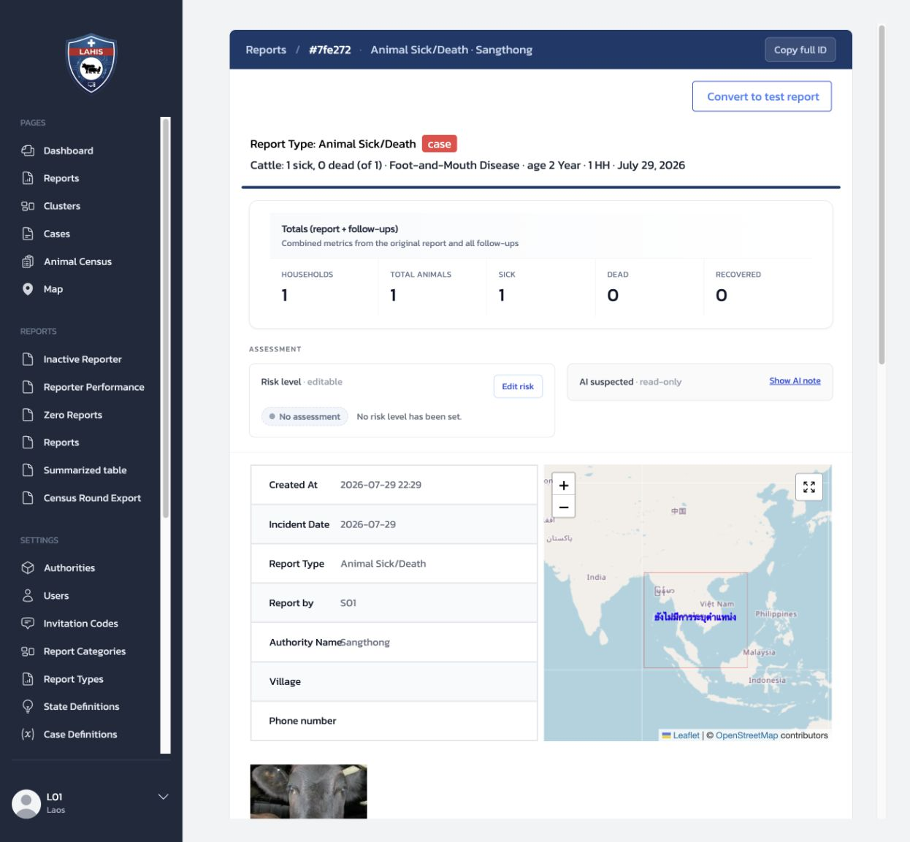

*ภาพที่ 29 — กรอบ `Risk level · editable` แสดง `No assessment` ก่อนกำหนดระดับความเสี่ยง*

### 9.4 Officer แก้ไข Risk Level

1. กด `Edit risk` ในกรอบ Risk level
2. ตรวจข้อมูลของรายงานและเลือกหนึ่งในสี่ระดับ
3. กดระดับที่ต้องการ เช่น `Medium — follow up`
4. ระบบจะบันทึกทันทีและปิดหน้าจอแก้ไข โดยไม่มีปุ่ม Save แยก

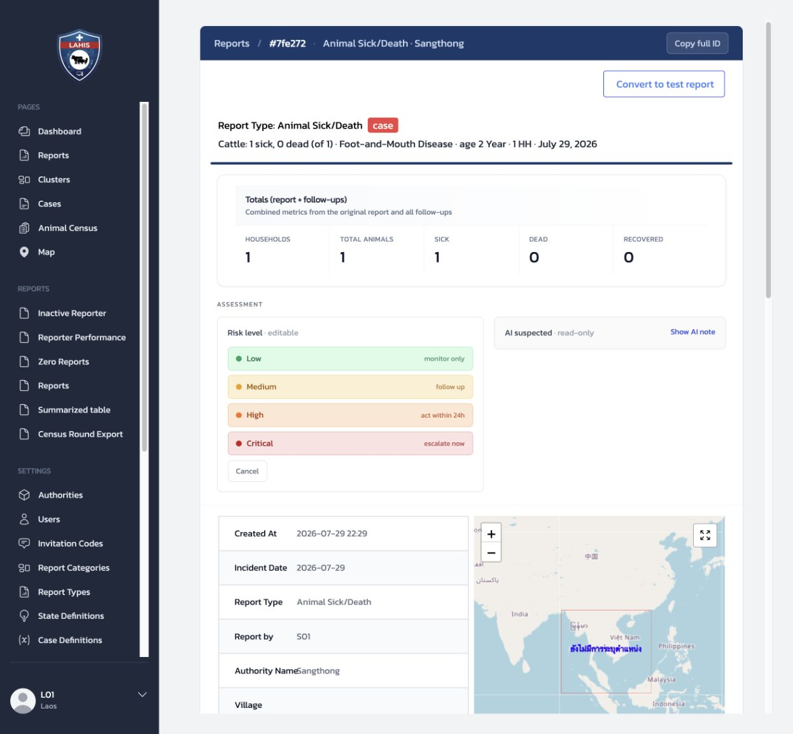

*ภาพที่ 30 — หน้าจอแก้ไขแสดงตัวเลือก Low, Medium, High และ Critical พร้อมคำแนะนำของแต่ละระดับ*

หลังบันทึก กรอบ Risk level จะแสดงระดับที่เลือก พร้อมชื่อผู้กำหนดและวันเวลา ตัวอย่างนี้แสดง `Medium` และ `Set by L01`


*ภาพที่ 31 — Risk Level ปัจจุบันเป็น `Medium` และระบุว่า Officer `L01` เป็นผู้กำหนด*

### 9.5 Risk Level ที่มาจากระบบภายนอก

ระบบประเมินภายนอกสามารถส่งระดับความเสี่ยงกลับมายังรายงานใน LAHIS ได้ เมื่อรับผลแล้ว:

- ระดับจะแสดงในกรอบ `Risk level` ตำแหน่งเดียวกับค่าที่ Officer กำหนด
- ข้อมูลกำกับจะแสดงแหล่งที่มาจากระบบประเมินภายนอกหรือ AI พร้อมวันเวลา
- Officer ยังสามารถพิจารณาข้อมูลของรายงานและกำหนดระดับใหม่ได้
- เมื่อมีค่าใหม่ ค่าก่อนหน้าจะไม่ใช่ค่าปัจจุบัน แต่ยังสามารถตรวจในประวัติการประเมินได้

ดังนั้น Risk Level จากระบบภายนอกเป็นข้อมูลช่วยจัดลำดับความสำคัญ ส่วน Officer ยังคงเป็นผู้ตรวจสอบข้อมูลและตัดสินใจดำเนินงานตามหน้าที่

### 9.6 จุดตรวจสำหรับผู้ทดสอบ

| จุดที่ตรวจ | ผลที่ควรเห็น |
|---|---|
| ตำแหน่งแสดงผล | Risk Level อยู่ในส่วน `Assessment` ของหน้า Report detail |
| รายงานที่ยังไม่มีค่า | แสดง `No assessment` |
| หน้าจอแก้ไข | มีตัวเลือก Low, Medium, High และ Critical |
| การบันทึก | กดระดับแล้วระบบบันทึกทันทีและกลับมาแสดงค่าปัจจุบัน |
| ผู้กำหนดค่า | ค่าที่ Officer กำหนดแสดงชื่อผู้กำหนดและวันเวลา |
| ระบบภายนอก | ผลที่ส่งเข้ามาแสดงในกรอบเดียวกันและระบุแหล่งที่มา |
| การประเมินใหม่ | ค่าล่าสุดเป็นค่าปัจจุบัน และค่าก่อนหน้ายังอยู่ในประวัติ |

<a id="chapter-10"></a>

## 10. จาก Report สู่ Case และการปิด Case

### 10.1 Report และ Case ต่างกันอย่างไร

- **Report** คือข้อมูลเหตุการณ์ที่ Reporter ส่งเข้ามาจาก Mobile เช่น รายงานสัตว์ป่วยหรือตาย
- **Case** คือเรื่องที่ระบบหรือ Officer เลือกให้นำไปติดตาม ตรวจสอบ และสรุปผลอย่างเป็นขั้นตอน

เมื่อ Report ถูก Promote เป็น Case ระบบจะสร้าง Case ที่เชื่อมกับ Report เดิม ข้อมูล Report ต้นฉบับยังคงอยู่ ไม่ถูกลบหรือแทนที่ และ Officer สามารถกลับไปตรวจรายละเอียดกับ Follow-up ของ Report ได้

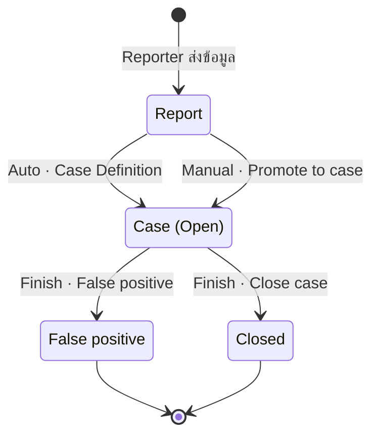
```mermaid
stateDiagram-v2
    state "Report" as Report
    state "Case (Open)" as Case
    state "False positive" as FalsePositive
    state "Closed" as Closed

    [*] --> Report: Reporter ส่งข้อมูล
    Report --> Case: Auto · Case Definition
    Report --> Case: Manual · Promote to case
    Case --> FalsePositive: Finish · False positive
    Case --> Closed: Finish · Close case
    FalsePositive --> [*]
    Closed --> [*]
```

ทั้ง `False positive` และ `Closed` เป็นสถานะสิ้นสุดของ Case แต่ใช้คนละกรณี: False positive หมายถึงตรวจแล้วไม่ใช่เหตุการณ์จริง ส่วน Closed หมายถึงเป็นเหตุการณ์จริงและบันทึก `Test result` กับ `Stamped out` เรียบร้อยแล้ว

### 10.2 วิธีที่ Report กลายเป็น Case

มีสองวิธี:

#### วิธีที่ 1 — ระบบสร้าง Case อัตโนมัติ

หลังรับ Report ระบบจะตรวจข้อมูลกับ **Case Definition** ที่ Admin กำหนดไว้ หากข้อมูลตรงกับเงื่อนไข เช่น รายงานที่ระบุโรค `Anthrax` ระบบจะ Promote Report เป็น Case โดยอัตโนมัติ

การทดสอบวิธีนี้ต้องมี Case Definition สำหรับ Report Type นั้นอยู่ก่อน หากไม่มีเงื่อนไขที่ตรงกัน Report จะยังคงเป็น Report ตามเดิม

#### วิธีที่ 2 — Officer Promote ด้วยตนเอง

1. เปิดเมนู `Reports`
2. เลือก Report ที่ยังไม่มีป้าย `case`
3. ตรวจรายละเอียดและ Follow-up ของ Report
4. กด `Promote to case` ที่ด้านบนของหน้า

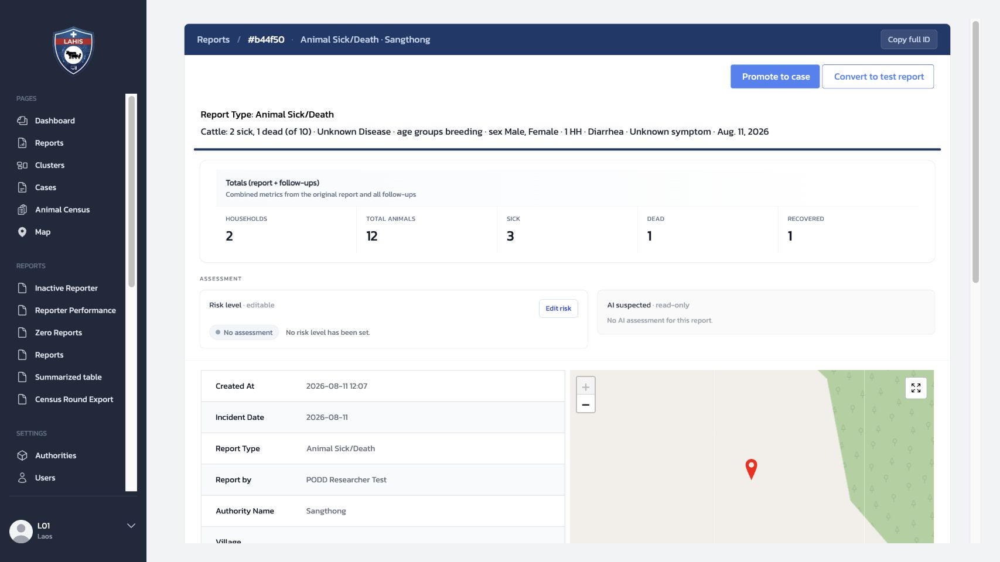

*ภาพที่ 32 — Report ที่ยังไม่เป็น Case จะแสดงปุ่ม `Promote to case`*

5. ระบบจะแสดงหน้าต่างยืนยัน ให้กด `OK` เมื่อต้องการสร้าง Case หรือกด `Cancel` เพื่อยกเลิก

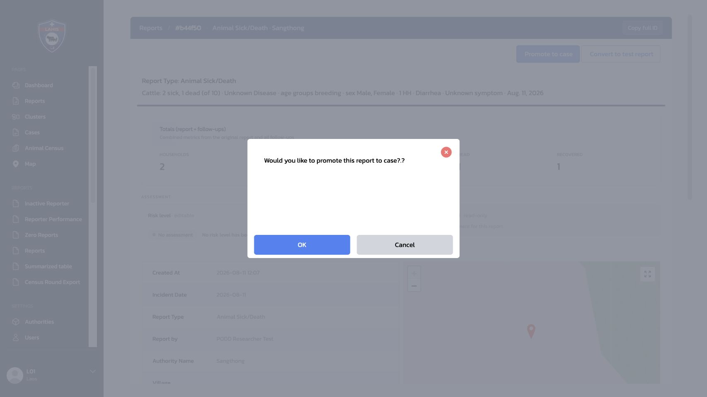

*ภาพที่ 33 — ตรวจสอบ Report ให้เรียบร้อยก่อนยืนยันการ Promote*

หลัง Promote แล้ว ปุ่มจะหายไปและมีป้าย `case` ต่อท้าย Report Type กดป้ายนี้เพื่อเปิด Case ที่เชื่อมกับ Report ได้

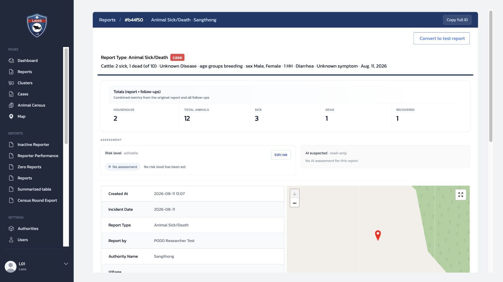

*ภาพที่ 34 — ป้าย `case` แสดงว่า Report นี้ถูกเชื่อมกับ Case แล้ว*

### 10.3 วิธีเปิดดู Case และไปที่ Finish case

Officer สามารถเปิดดู Case ที่ถูกสร้างไว้แล้วได้สองทาง:

#### ทางเลือกที่ 1 — เปิดจาก Report detail

เปิด Report ที่ถูก Promote แล้ว จากนั้นกดป้าย `case` ที่แสดงต่อท้าย Report Type ระบบจะเปิดหน้ารายละเอียดของ Case ที่เชื่อมกับ Report นั้นโดยตรง

#### ทางเลือกที่ 2 — เปิดจากหน้าจอ Cases

1. กดเมนู `Cases` ทางซ้ายมือ
2. ระบบจะแสดงรายการ Case พร้อมวันที่เกิดเหตุ ประเภท Case หน่วยงาน ระดับความเสี่ยง ข้อมูลสรุป และสถานะ
3. ใช้ปุ่ม `Filter` เมื่อต้องการจำกัดรายการ หรือดูรายการในมุมมอง `List`
4. คลิกแถวของ Case ที่ต้องการเพื่อเปิดหน้า Case detail

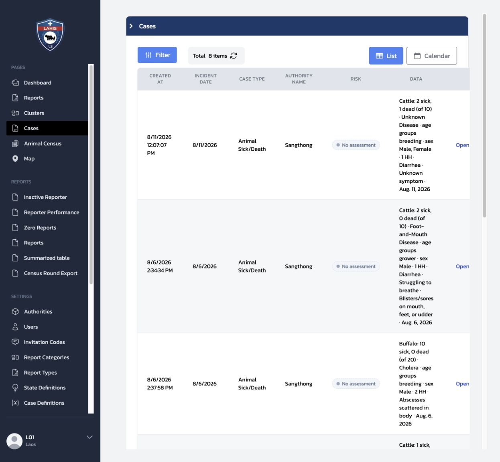

*ภาพที่ 35 — หน้าจอ `Cases` แสดงรายการ Case และสถานะ เช่น Open, False positive และ Close case*

หลังเปิดดู Case ด้วยวิธีใดวิธีหนึ่ง:

1. ตรวจว่าด้านบนของหน้าแสดงสถานะ `Open` ซึ่งหมายถึง Case นี้ยังอยู่ระหว่างดำเนินการ
2. กด `Finish case ↓` หรือเลื่อนไปยังส่วน `Finish case`
3. เลือกผลลัพธ์ที่ตรงกับการตรวจสอบของ Officer

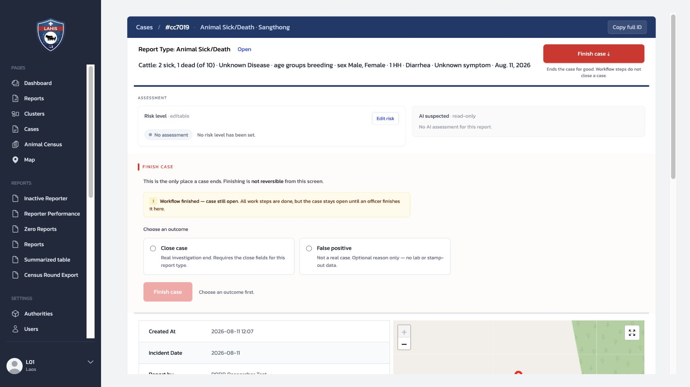

*ภาพที่ 36 — Case ยังเป็น `Open` และให้ Officer เลือกผลลัพธ์ก่อนปิด*

Officer เลือกผลลัพธ์ได้สองแบบ:

| ผลลัพธ์ | ใช้เมื่อ | ข้อมูลที่ต้องบันทึก |
|---|---|---|
| `Close case` | เป็นเหตุการณ์จริงและการตรวจสอบสิ้นสุดแล้ว | ข้อมูลปิด Case ตามที่ Report Type กำหนด เช่น Test result และ Stamped out |
| `False positive` | ตรวจแล้วไม่ใช่ Case จริง | เหตุผลประกอบ (ไม่บังคับ) โดยไม่ต้องมีผล Lab หรือ Stamped out |

#### หมายเหตุสำหรับผู้ที่คุ้นเคยกับ Workflow

Tenant ที่ใช้ในคู่มือนี้ไม่ได้ Config Workflow step สำหรับ `Animal Sick/Death` หลังเปิด Case จึงสามารถไปที่ `Finish case` ได้โดยตรง

### 10.4 บันทึกผลสุดท้ายและจำนวน Stamped out

สำหรับการปิดเหตุการณ์จริง ให้เลือก `Close case` แล้วกรอกข้อมูล:

- **Test result** — ผลสรุปสุดท้ายของ Case เช่น ผลตรวจจากห้องปฏิบัติการ สามารถระบุหมายเลขอ้างอิงหรือหมายเหตุของผล Lab ได้ หากมีไฟล์ผลตรวจ ให้แนบผ่าน `Comments`
- **Stamped out** — จำนวนสัตว์ของชนิดที่รายงานซึ่งถูกกำจัด ต้องเป็นจำนวนเต็มตั้งแต่ 0 ขึ้นไป

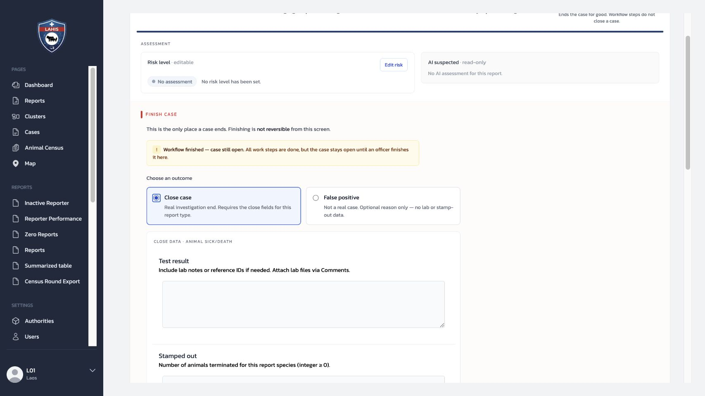

*ภาพที่ 37 — เลือก `Close case` แล้วระบบแสดงช่อง Test result และ Stamped out*

ตัวอย่างการกรอกข้อมูลทดสอบ:

| ช่อง | ตัวอย่าง |
|---|---|
| Test result | `Laboratory confirmed Foot-and-Mouth Disease (test example)` |
| Stamped out | `2` |

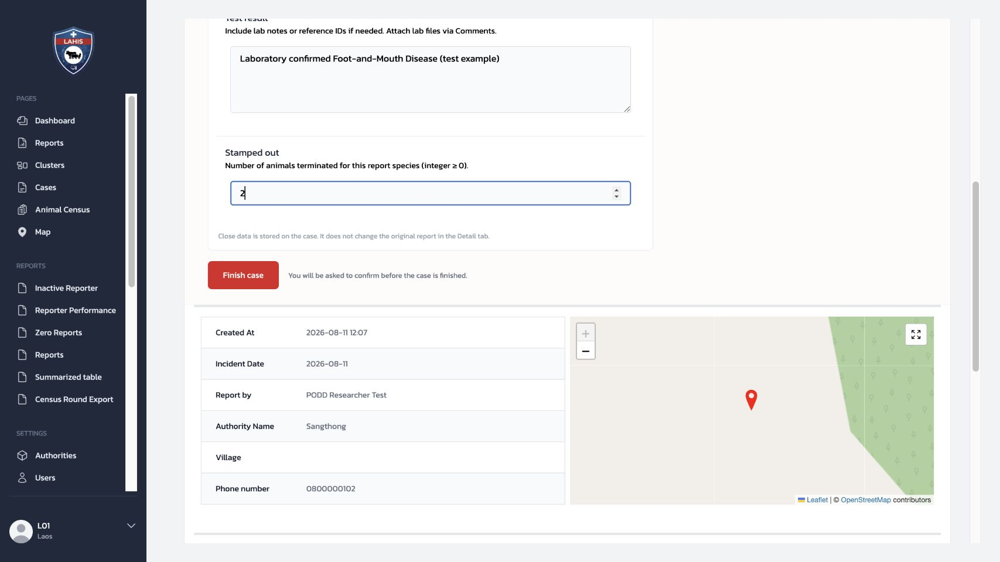

*ภาพที่ 38 — ตรวจข้อความ Test result และจำนวน Stamped out ก่อนกด `Finish case`*

ข้อมูลปิด Case จะถูกเก็บอยู่ที่ Case และไม่แก้ข้อมูล Report ต้นฉบับในแท็บ Detail

### 10.5 ตรวจทานและยืนยันการปิด Case

1. กด `Finish case`
2. ตรวจ Outcome, Test result และ Stamped out ในหน้าต่างยืนยัน
3. หากข้อมูลไม่ถูกต้อง ให้กด `Cancel` แล้วกลับไปแก้ไข
4. หากถูกต้อง ให้กด `Finish case` ในหน้าต่างยืนยันอีกครั้ง

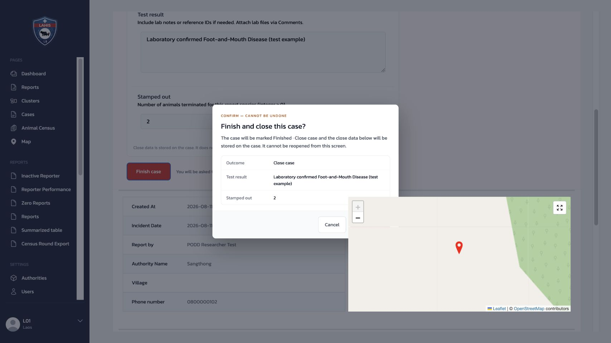

*ภาพที่ 39 — หน้าต่างสุดท้ายสรุป Outcome, Test result และ Stamped out ก่อนปิด Case*

> **ข้อควรระวัง:** การ Finish Case ไม่สามารถย้อนกลับจากหน้าจอนี้ได้ ควรตรวจข้อมูลและเลือก Case ทดสอบให้ถูกต้องก่อนยืนยันขั้นสุดท้าย

หลังยืนยัน Case จะแสดงเป็น `Finished · Close case` พร้อมผู้ปิด วันเวลา และข้อมูลปิด Case แบบอ่านอย่างเดียว

### 10.6 จุดตรวจสำหรับผู้ทดสอบ

| จุดที่ตรวจ | ผลที่ควรเห็น |
|---|---|
| Report ที่ยังไม่เป็น Case | มีปุ่ม `Promote to case` และไม่มีป้าย `case` |
| Promote อัตโนมัติ | Report ที่ตรงกับ Case Definition ถูกสร้างเป็น Case |
| Promote โดย Officer | หลังยืนยัน ปุ่ม Promote หายไปและ Report แสดงป้าย `case` |
| การเชื่อมข้อมูล | กดป้าย `case` แล้วเปิด Case ที่อ้างอิง Report เดิมได้ |
| Case ที่ยังเปิด | แสดงสถานะ `Open` จนกว่า Officer จะ Finish case |
| Close case | แสดงช่อง Test result และ Stamped out ตาม Close Definition ของ Report Type |
| False positive | ไม่บังคับผล Lab หรือจำนวน Stamped out |
| การยืนยัน | หน้าต่างสุดท้ายสรุปข้อมูลก่อนปิดและแจ้งว่าไม่สามารถย้อนกลับได้ |
| หลังปิด | Case แสดง `Finished · Close case` พร้อมข้อมูลผู้ปิดและเวลาปิด |

<a id="chapter-11"></a>

## 11. Officer สร้าง Report ผ่าน Dashboard

ในบางหมู่บ้านอาจยังไม่มี Reporter ลงทะเบียนบน Mobile แต่ Officer ได้รับแจ้งเหตุจากช่องทางอื่น เช่น โทรศัพท์ การลงพื้นที่ หรือการประสานจากหน่วยงานท้องถิ่น กรณีนี้ Officer สามารถบันทึกเหตุการณ์เป็น Report ผ่าน Dashboard ได้โดยตรง โดยเลือกหมู่บ้านที่เกิดเหตุเอง

Report ที่สร้างด้วยวิธีนี้ยังคงเป็น **Report** เช่นเดียวกับข้อมูลที่ Reporter ส่งจาก Mobile หลังสร้างแล้ว Officer สามารถเปิดดูใน `Reports` และดำเนินการที่เกี่ยวข้อง เช่น กำหนด Risk Level ตรวจผลจาก AI เพิ่ม Follow-up หรือ Promote to case ตามเงื่อนไขของเหตุการณ์

### 11.1 เริ่มสร้าง Report

1. Login ด้วยบัญชี Officer ที่มีสิทธิ์เข้าถึงพื้นที่ที่จะทดสอบ
2. เลือก `Reports` จากเมนูด้านซ้าย
3. กด `New report` บริเวณด้านบนของรายการ

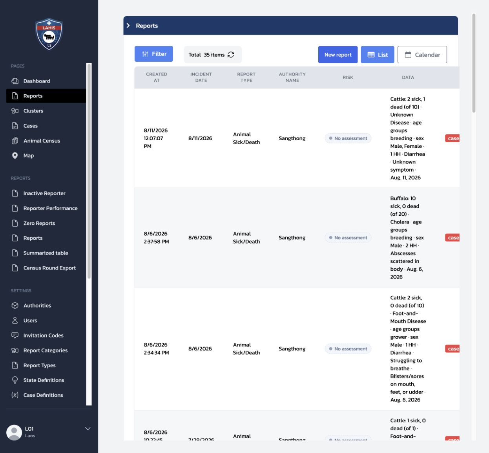

*ภาพที่ 40 — Officer เริ่มบันทึกเหตุการณ์ใหม่จากปุ่ม `New report` ในหน้า `Reports`*

### 11.2 เลือกประเภทรายงานและหมู่บ้าน

ในหน้า `New report` ให้กำหนดข้อมูลเริ่มต้น:

1. เลือก Report Type `Animal Sick/Death`
2. เลือก `Village` ที่เกิดเหตุ รายการหมู่บ้านที่เลือกได้จะอยู่ภายใต้ขอบเขต Authority ของ Officer
3. สำหรับการทดลองตามคู่มือนี้ ให้เลือก `Test report` เพื่อระบุว่าเป็นข้อมูลทดสอบ
4. ตรวจ Report Type และ Village อีกครั้ง แล้วกด `Continue to form`

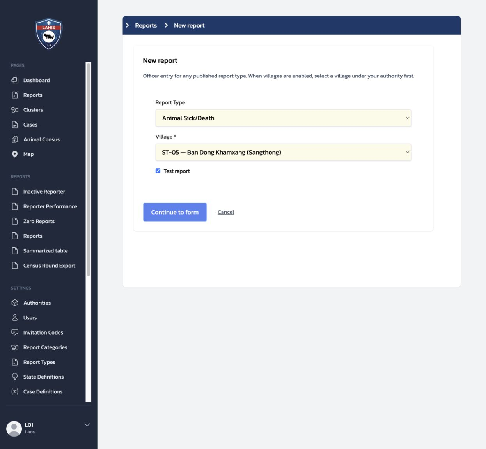

*ภาพที่ 41 — ตัวอย่างเลือก `Animal Sick/Death`, หมู่บ้าน และทำเครื่องหมาย `Test report` ก่อนเปิดแบบฟอร์ม*

> **จุดสำคัญ:** วิธีนี้ไม่ต้องลงทะเบียน Reporter ให้หมู่บ้านก่อน เพราะ Officer เป็นผู้เลือก Village และกรอก Report ผ่าน Dashboard โดยตรง

หากเลือก Report Type หรือ Village ผิดหลังเปิดแบบฟอร์มแล้ว ให้กด `Change setup` เพื่อกลับมาเลือกใหม่

### 11.3 กรอกข้อมูลเหตุการณ์

แบบฟอร์ม `Animal Sick/Death` แบ่งเป็น 8 ขั้น ให้กด `Next` หลังตรวจข้อมูลของแต่ละขั้น:

| ขั้น | ข้อมูลที่บันทึก |
|---|---|
| 1 | ชนิดสัตว์ กลุ่มอายุ และเพศ |
| 2 | โรคที่สงสัย |
| 3–5 | อาการในระบบต่าง ๆ อาการทั่วไป และความผิดปกติของซาก |
| 6 | รูปภาพสัตว์หรือเหตุการณ์ หากมี |
| 7 | วันที่เกิดเหตุ |
| 8 | จำนวนครัวเรือน จำนวนสัตว์ทั้งหมด จำนวนป่วย จำนวนตาย และจำนวนฟื้นตัว |

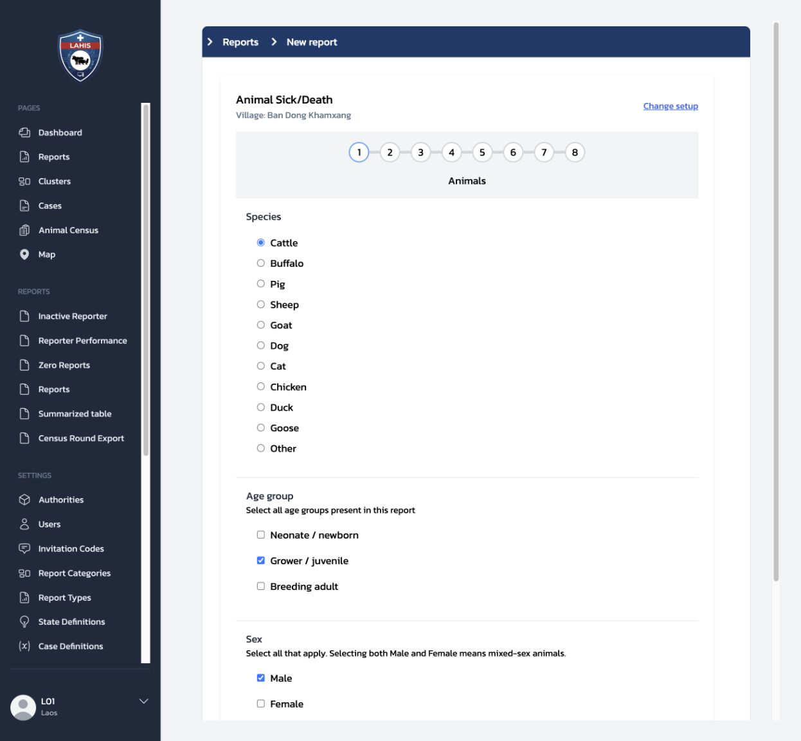

*ภาพที่ 42 — ขั้นที่ 1 ของแบบฟอร์ม แสดงชนิดสัตว์ กลุ่มอายุ และเพศ*

ในขั้นสุดท้าย ให้ตรวจความสัมพันธ์ของจำนวนก่อนส่ง เช่น จำนวนป่วย ตาย และฟื้นตัวไม่ควรมากกว่าจำนวนสัตว์ทั้งหมด

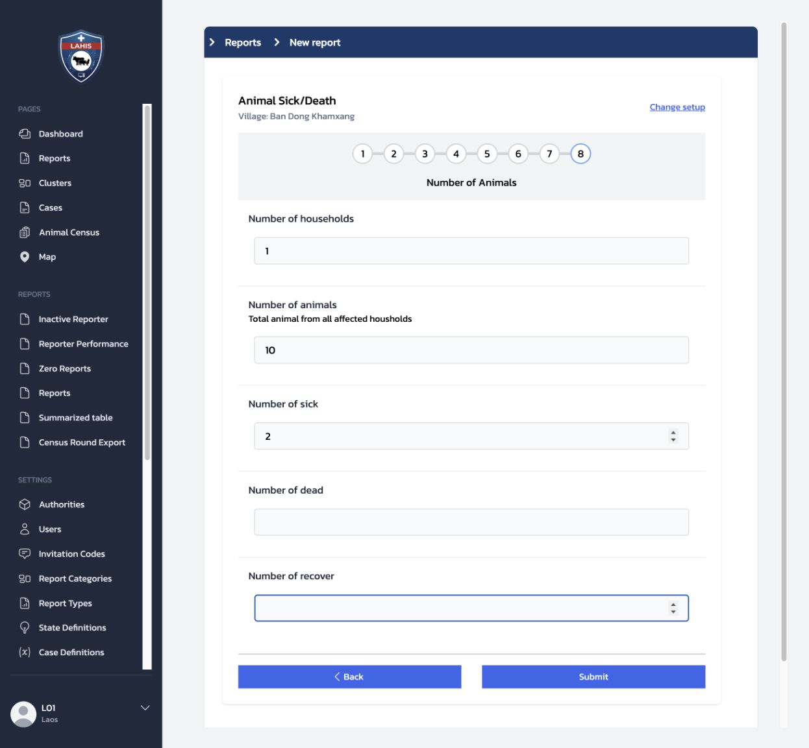

*ภาพที่ 43 — ขั้นที่ 8 สำหรับกรอกจำนวนครัวเรือนและจำนวนสัตว์ก่อนกด `Submit`*

### 11.4 ส่งและตรวจ Report บน Dashboard

1. ตรวจชื่อ Report Type และ Village ที่แสดงเหนือแบบฟอร์ม
2. ตรวจข้อมูลทุกขั้น โดยใช้ปุ่ม `Back` เพื่อย้อนกลับไปแก้ไขได้
3. เมื่อข้อมูลถูกต้อง กด `Submit`
4. กลับไปที่ `Reports` และค้นหา Report ที่เพิ่งสร้าง โดยใช้วันเวลา Report Type และ Village ช่วยตรวจสอบ
5. เปิดหน้า Report detail แล้วตรวจว่าข้อมูลสัตว์ อาการ วันที่เกิดเหตุ และจำนวนตรงกับที่กรอก

หลังจากพบ Report แล้ว ให้ใช้เส้นทางทดสอบในบทก่อนหน้าได้ตามความเหมาะสม:

- บทที่ 7: เพิ่ม Follow-up และตรวจยอดรวมสะสม
- บทที่ 8: ตรวจ AI Suspected และความคิดเห็นจาก AI
- บทที่ 9: ตรวจหรือแก้ไข Risk Level
- บทที่ 10: ตรวจการ Promote Report เป็น Case

### 11.5 จุดตรวจสำหรับผู้ทดสอบ

| จุดที่ตรวจ | ผลที่ควรเห็น |
|---|---|
| สิทธิ์ของ Officer | เลือกได้เฉพาะ Village ภายใต้ขอบเขต Authority ของตน |
| พื้นที่ไม่มี Reporter | สร้าง Report ได้โดยเลือก Village โดยไม่ต้องลงทะเบียน Reporter ก่อน |
| Test report | Report ถูกระบุเป็นข้อมูลทดสอบเมื่อเลือกตัวเลือกนี้ก่อนกรอกแบบฟอร์ม |
| ความครบถ้วนของแบบฟอร์ม | กรอกข้อมูลตามขั้นของ `Animal Sick/Death` และย้อนกลับไปแก้ไขได้ |
| หลัง Submit | พบ Report ใหม่ในหน้า `Reports` และเปิดหน้า Detail ได้ |
| การใช้งานต่อ | Report รองรับ Risk, AI, Follow-up และการ Promote to case ตามกติกาเดียวกับ Report จาก Mobile |

<a id="chapter-12"></a>

## 12. Cluster — ดูกลุ่มรายงานที่อาจเกี่ยวข้องกัน

Cluster ช่วยให้ Officer มองเห็น Report หลายรายการที่ระบบวิเคราะห์ภายนอกเห็นว่าอาจเกี่ยวข้องกัน เช่น เกิดในช่วงเวลาใกล้กัน อยู่ในพื้นที่ใกล้กัน หรือมีลักษณะของเหตุการณ์คล้ายกัน ระบบภายนอกจะส่งผลการจัดกลุ่มกลับมาให้ LAHIS แสดงในหน้า `Clusters` และเชื่อมกลับไปยัง Report ต้นทางแต่ละรายการ

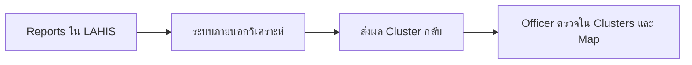
```mermaid
flowchart LR
    A["Reports ใน LAHIS"] --> B["ระบบภายนอกวิเคราะห์"]
    B --> C["ส่งผล Cluster กลับ"]
    C --> D["Officer ตรวจใน Clusters และ Map"]
```

> **ข้อควรเข้าใจ:** Cluster เป็นสัญญาณช่วยคัดกรองและจัดลำดับการตรวจสอบ ไม่ใช่คำยืนยันว่าเกิดการระบาด Officer ต้องเปิดดู Report ที่เชื่อมอยู่และพิจารณาข้อมูลประกอบก่อนดำเนินการต่อ

การนำ Report เข้า Cluster ไม่ได้รวม Report ให้กลายเป็นรายการเดียว และไม่เปลี่ยนสถานะ Report หรือ Case เดิม

### 12.1 เปิดรายการ Cluster

1. Login ด้วยบัญชี Officer หรือ Admin
2. เลือก `Clusters` จากเมนูด้านซ้าย
3. ระบบแสดงรายการ Cluster ที่อยู่ในขอบเขตข้อมูลของผู้ใช้
4. กด `Filter` เมื่อต้องการค้นหาจากชื่อหรือคำอธิบาย จำกัดช่วงวันที่ หรือเลือกระดับ Risk

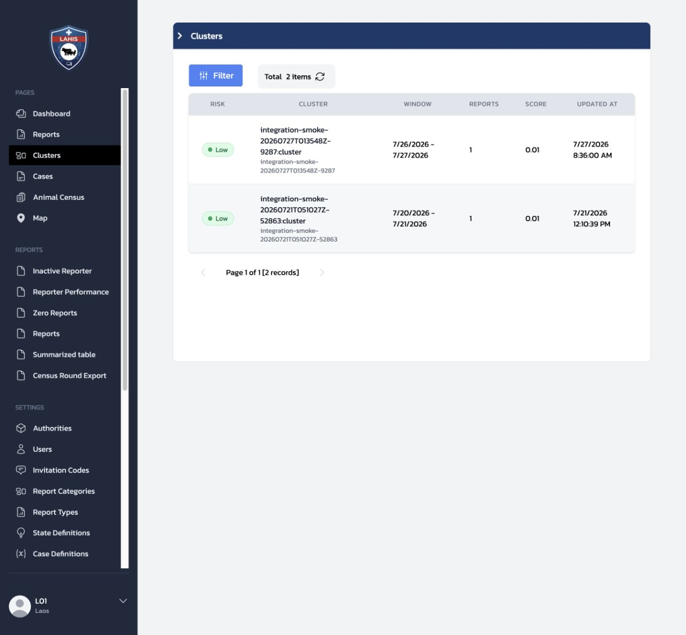

*ภาพที่ 44 — หน้า `Clusters` แสดงผลการจัดกลุ่มที่ส่งกลับมาจากระบบภายนอก*

ข้อมูลสำคัญในแต่ละแถวมีดังนี้:

| คอลัมน์ | ความหมายสำหรับผู้ทดสอบ |
|---|---|
| Risk | ระดับความเสี่ยงของ Cluster ที่ระบบภายนอกส่งมา |
| Cluster | ชื่อหรือรหัสที่ใช้อ้างอิงกลุ่มเหตุการณ์ |
| Window | ช่วงวันที่ของเหตุการณ์ที่นำมาพิจารณาในกลุ่ม |
| Reports | จำนวน Report ที่เชื่อมอยู่กับ Cluster |
| Score | คะแนนประกอบผลการจัดกลุ่มจากระบบภายนอก การตีความขึ้นอยู่กับระบบที่ส่งผลมา |
| Updated At | วันและเวลาที่ข้อมูล Cluster ถูกปรับปรุงล่าสุด |

จำนวนรายการและค่าที่เห็นระหว่างการทดสอบอาจเปลี่ยนได้ตามข้อมูลที่ระบบภายนอกส่งเข้ามา จึงควรตรวจโครงสร้างและความเชื่อมโยงของข้อมูล แทนการเปรียบเทียบกับค่าตัวเลขตายตัวในภาพตัวอย่าง

### 12.2 เปิดดูรายละเอียด Cluster

คลิกแถวที่ต้องการในหน้า `Clusters` แล้วตรวจส่วนสำคัญ:

- ชื่อ Cluster และ Risk
- `Window`, จำนวน Reports, Score และ Radius หากระบบภายนอกส่งค่าพื้นที่ครอบคลุมมา
- แผนที่ของ Cluster หากมีข้อมูลตำแหน่ง
- `Explanation` ซึ่งอธิบายเหตุผลหรือรายละเอียดจากระบบภายนอก
- `Linked Reports` ซึ่งแสดง Report ต้นทางทั้งหมดในกลุ่ม

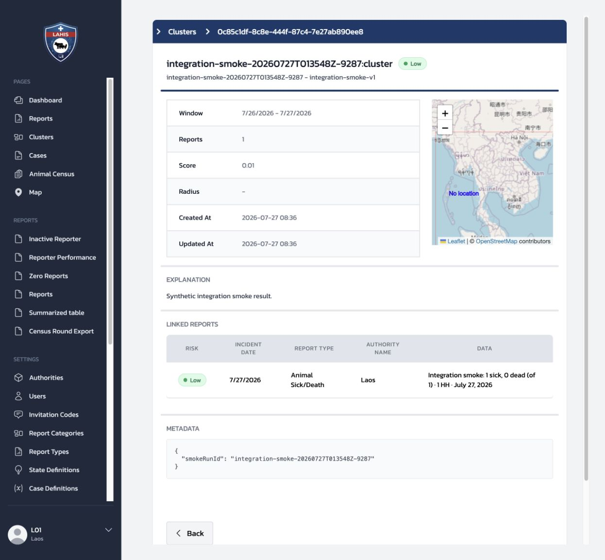

*ภาพที่ 45 — หน้า Cluster detail แสดงข้อมูลสรุป แผนที่ คำอธิบาย และ `Linked Reports`*

ภาพตัวอย่างเป็นข้อมูลทดสอบจากการตรวจ Integration บางค่าอาจแสดง `-` หรือ `No location` เมื่อระบบภายนอกไม่ได้ส่งค่านั้นมา ไม่ควรตีความว่าหน้าจอผิดพลาดทันที ให้ตรวจข้อมูลต้นทางที่ใช้ในการทดสอบก่อน

### 12.3 เปิด Report ต้นทางจาก Cluster

1. เลื่อนไปที่ส่วน `Linked Reports`
2. ตรวจ Risk, Incident Date, Report Type, Authority Name และข้อความสรุปของแต่ละ Report
3. คลิกแถว Report ที่ต้องการ
4. ระบบควรเปิดหน้า Report detail ของรายการนั้น
5. ตรวจว่าข้อมูลใน Report สอดคล้องกับ Cluster ที่เลือก เช่น วันเกิดเหตุ พื้นที่ ชนิดรายงาน และระดับความเสี่ยง

การเปิด Report จากส่วนนี้เป็นเพียงการนำทางไปดูข้อมูลต้นทาง ไม่ได้ Promote Report เป็น Case และไม่เปลี่ยนข้อมูลใน Report

### 12.4 ดูข้อมูลเหตุการณ์บน Map

เลือก `Map` จากเมนูด้านซ้ายเพื่อดูตำแหน่งของข้อมูลเหตุการณ์ในภาพรวม แต่ละ Marker อ้างอิงข้อมูลตำแหน่งที่ระบบได้รับมา ตำแหน่งที่ไม่มีพิกัดหรือมีพิกัดตัวอย่างอาจไม่ปรากฏในพื้นที่ที่คาดไว้

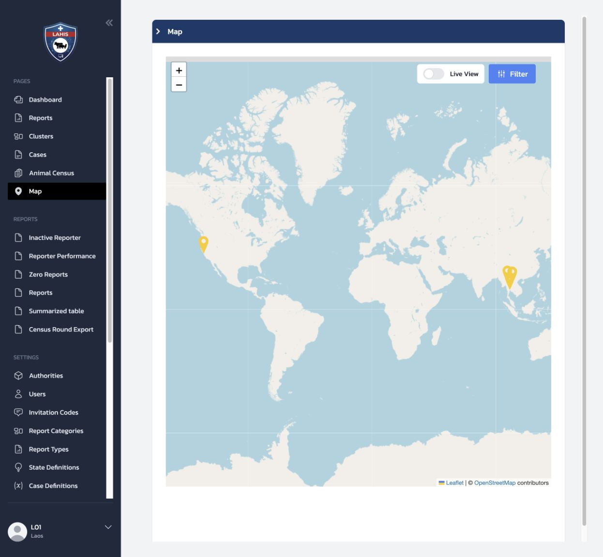

*ภาพที่ 46 — หน้า `Map` ใช้ดู Marker ของข้อมูลเหตุการณ์ในภาพรวม*

กด `Filter` เพื่อจำกัดข้อมูลบนแผนที่ โดยเลือกช่วงวันที่และ Report Type แล้วกด `Apply` หากต้องการกลับไปดูข้อมูลทั้งหมด ให้กด `Reset`

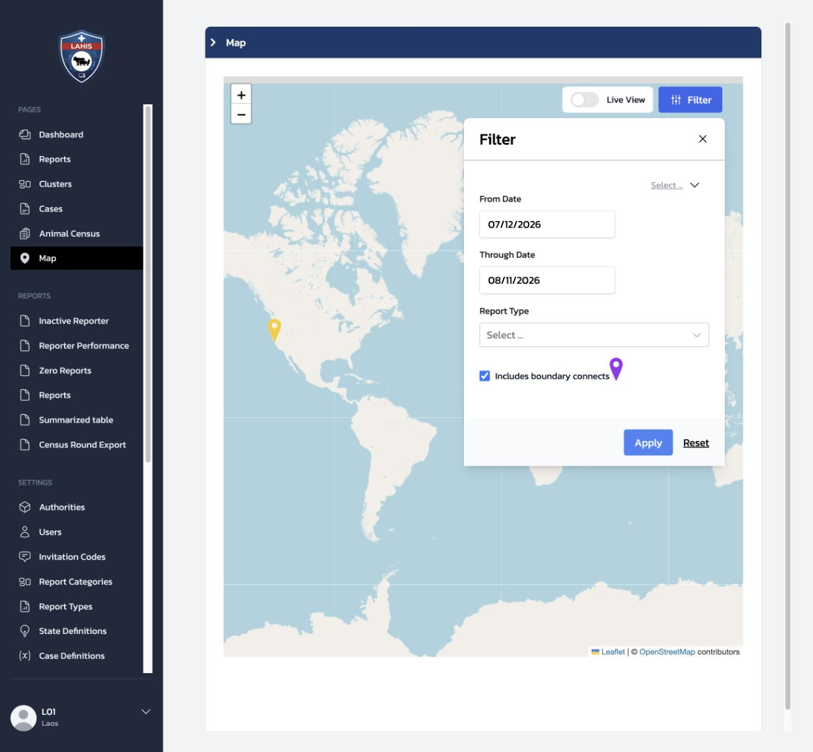

*ภาพที่ 47 — ตัวกรองบน Map สำหรับจำกัดช่วงวันที่และ Report Type*

ตัวเลือก `Includes boundary connects` ใช้กำหนดว่าจะรวมข้อมูลที่มีความเชื่อมโยงข้ามขอบเขตพื้นที่ในการแสดงผลด้วยหรือไม่ สำหรับการทดสอบทั่วไปให้คงค่าตามที่ระบบตั้งไว้ก่อน

### 12.5 จุดตรวจสำหรับผู้ทดสอบ

| จุดที่ตรวจ | ผลที่ควรเห็น |
|---|---|
| รายการ Cluster | แสดง Risk, ชื่อหรือรหัส, ช่วงเวลา, จำนวน Reports, Score และเวลาปรับปรุง |
| Filter | ค้นหาและจำกัดรายการตามช่วงวันที่หรือ Risk ได้ |
| Cluster detail | แสดงข้อมูลสรุป Explanation และ Linked Reports |
| Linked Reports | กดแถวแล้วเปิด Report detail ต้นทางที่ถูกต้อง |
| ความเป็นอิสระของ Report | การอยู่ใน Cluster ไม่รวม Report และไม่เปลี่ยนสถานะ Report หรือ Case |
| Map | แสดง Marker ตามข้อมูลตำแหน่งที่มีอยู่ และจำกัดข้อมูลด้วยช่วงวันที่หรือ Report Type ได้ |
| ข้อมูลไม่ครบ | ช่องที่ระบบภายนอกไม่ได้ส่งมาแสดงเป็นค่าว่าง `-` หรือข้อความที่สื่อว่าไม่มีข้อมูล โดยหน้าอื่นยังใช้งานต่อได้ |

<a id="chapter-13"></a>

## 13. Animal Census — บันทึกและติดตามข้อมูลสำมะโนสัตว์

Animal Census ใช้บันทึกภาพรวมจำนวนครัวเรือนและจำนวนสัตว์ของแต่ละหมู่บ้านตามรอบเวลาที่กำหนด ข้อมูลนี้ต่างจาก Report ซึ่งใช้แจ้งเหตุการณ์สัตว์ป่วยหรือตายเป็นรายเหตุการณ์

| Animal Census | Report |
|---|---|
| เป็นข้อมูลภาพรวมของหมู่บ้านใน Census Round | เป็นข้อมูลเหตุการณ์ที่เกิดขึ้นครั้งหนึ่ง |
| ติดตามว่าหมู่บ้านใดส่งแล้ว ขาดส่ง หรือส่งล่าช้า | ติดตามเหตุการณ์ผ่าน Risk, AI, Follow-up และ Case |
| การส่งครั้งล่าสุดเป็นค่าปัจจุบันของหมู่บ้านในรอบนั้น | หนึ่งหมู่บ้านส่ง Report ได้หลายรายการ |

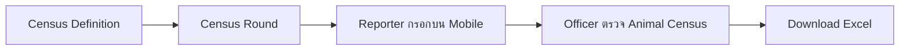
```mermaid
flowchart LR
    A["Census Definition"] --> B["Census Round"]
    B --> C["Reporter กรอกบน Mobile"]
    C --> D["Officer ตรวจ Animal Census"]
    D --> E["Download Excel"]
```

### 13.1 ข้อมูลที่เตรียมไว้สำหรับการทดสอบ

> **สำหรับผู้ทดสอบทั่วไป:** ส่วนนี้เป็นข้อมูลประกอบสำหรับผู้ดูแลระบบ ไม่จำเป็นต้องอ่านรายละเอียดการตั้งค่า และไม่ต้องกด `Ensure Defaults`, `Add` หรือแก้ Census Definition และ Census Round ระหว่างการทดสอบ สามารถข้ามไปเริ่มตาม flow ที่หัวข้อ **13.2 Reporter เปิด Animal Census บน Mobile** ได้เลย

Tenant นี้มี Census Definition สำหรับ Animal Census และ Human Census ที่ Published แล้ว แต่รอบที่เปิดให้ทดสอบในบทนี้คือ:

| รายการ | ค่าที่ใช้ทดสอบ |
|---|---|
| Mode | `Production` |
| Round | `DEMO_ANIMAL_2026` |
| Census | Animal Census |
| Target authority | ไม่ได้กำหนด จึงครอบคลุมทุกหมู่บ้านที่ Active |

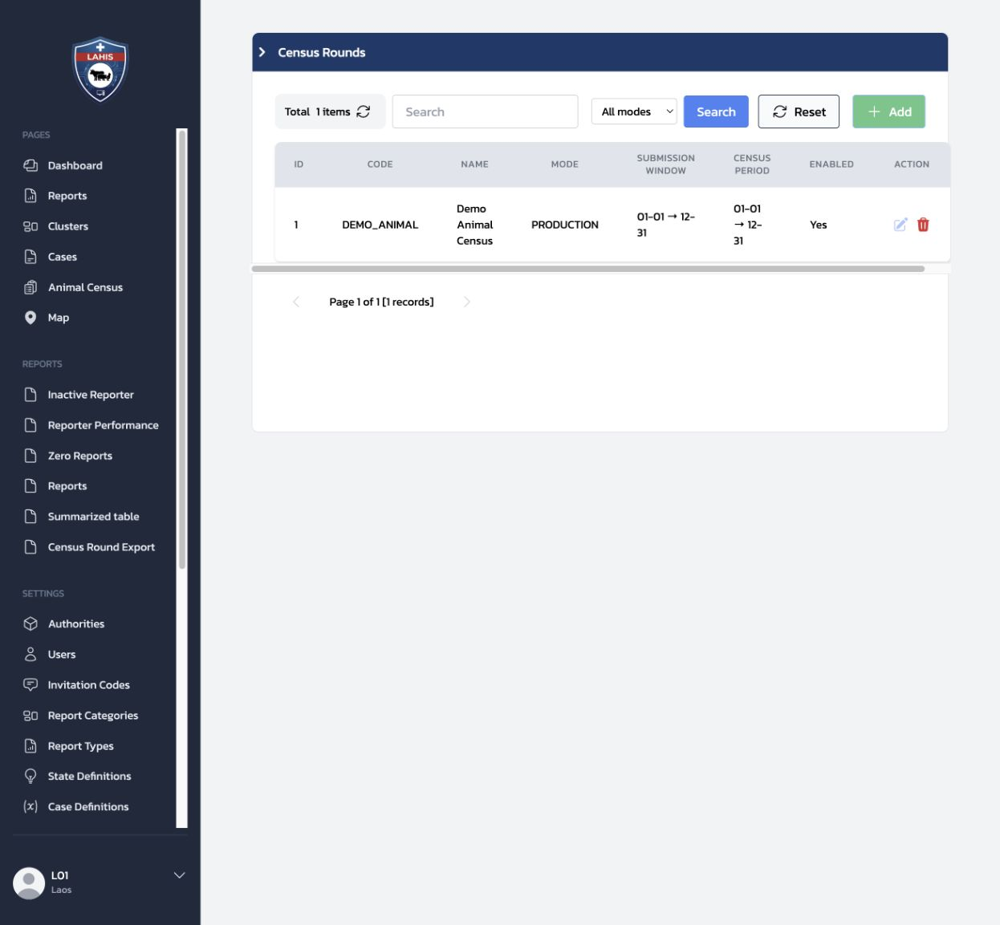

*ภาพที่ 48 — เมนู `Census Rounds` แสดงรอบสำมะโนสัตว์แบบ Production ที่เปิดใช้งาน*

ในหน้าจอ `Census Definition` สถานะ `PUBLISHED` หมายถึงแบบฟอร์มเวอร์ชันนั้นถูกนำไปแสดงให้ Reporter ใช้บน Mobile ส่วน `Active` หมายถึงเปิดให้ Mobile เรียกใช้งานได้

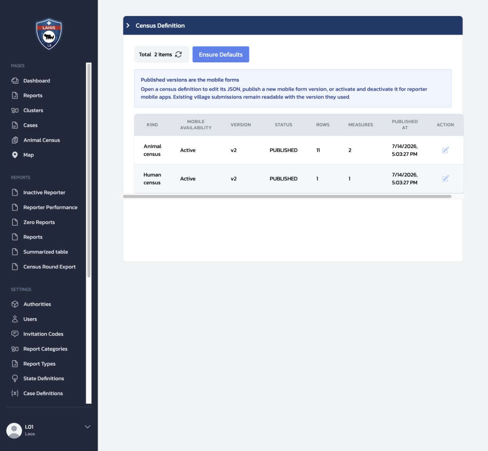

*ภาพที่ 49 — Census Definition ของสัตว์และประชากรที่ Published สำหรับ Mobile*

### 13.2 Reporter เปิด Animal Census บน Mobile

1. Login บน LAHIS Mobile ด้วยบัญชี Reporter ที่ลงทะเบียนและผูกกับหมู่บ้านแล้ว
2. เลือกแท็บ `สำมะโน` ที่แถบเมนูด้านล่าง
3. ตรวจชื่อหมู่บ้านและ Authority ที่แสดงด้านบน
4. เลือก `สำมะโนสัตว์`

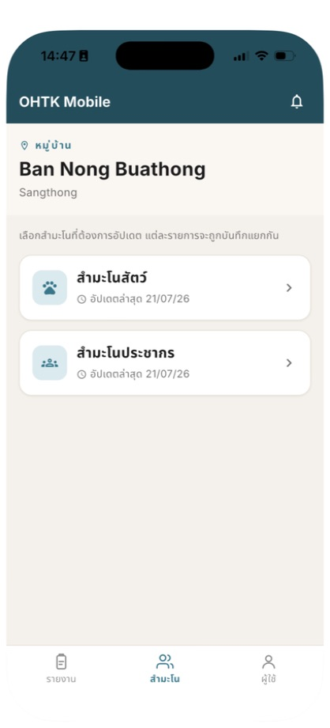

*ภาพที่ 50 — หน้า Mobile แสดงสำมะโนสัตว์และสำมะโนประชากรของหมู่บ้านที่ Reporter สังกัด*

วันที่ `อัปเดตล่าสุด` ช่วยให้ Reporter ทราบว่าหมู่บ้านเคยส่งข้อมูลครั้งล่าสุดเมื่อใด หากส่งข้อมูลใหม่ในรอบเดิม ระบบจะใช้ค่าจากการส่งครั้งล่าสุดเป็นข้อมูลปัจจุบันของหมู่บ้าน

### 13.3 กรอกข้อมูลสำมะโนสัตว์

หลังเลือก `สำมะโนสัตว์` ให้ตรวจว่า Mobile แสดง Round `DEMO_ANIMAL_2026` แล้วกรอกข้อมูลตามลำดับ:

1. ตรวจจำนวนครัวเรือนทั้งหมดของหมู่บ้าน
2. ตรวจจำนวนครัวเรือนที่มีสัตว์
3. ในแต่ละกลุ่มสัตว์ กรอกจำนวนครัวเรือนที่เลี้ยงสัตว์ชนิดนั้น
4. กรอกจำนวนสัตว์ของแต่ละชนิด
5. เลื่อนดูและกรอกชนิดสัตว์ที่เกี่ยวข้องให้ครบ
6. ตรวจค่าทั้งหมดก่อนกด `บันทึกสำมะโนปีปัจจุบัน`

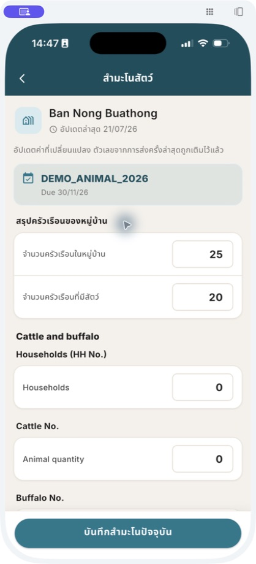

*ภาพที่ 51 — แบบฟอร์ม Animal Census แสดง Round ข้อมูลสรุปครัวเรือน และช่องจำนวนสัตว์ตามชนิด*

> **ข้อควรระวัง:** ปุ่มบันทึกจะปรับข้อมูล Production ของหมู่บ้านนั้น ให้ใช้เฉพาะบัญชีและหมู่บ้านที่ทีมกำหนดสำหรับทดสอบ และจดค่าก่อนแก้ไขไว้เพื่อเปรียบเทียบผล

### 13.4 Officer ตรวจความครบถ้วนบน Dashboard

1. Login บน Dashboard ด้วยบัญชี Officer หรือ Admin
2. เลือก `Animal Census` จากเมนูด้านซ้าย
3. เลือก Mode `Production`
4. เลือก Round `DEMO_ANIMAL_2026`
5. เลือก Status ที่ต้องการตรวจ แล้วกด `Refresh`

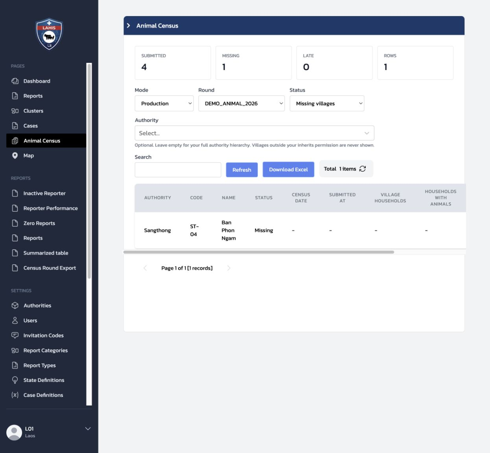

*ภาพที่ 52 — หน้า `Animal Census` แสดงตัวนับสถานะและรายการหมู่บ้านของ Census Round*

สถานะที่ใช้ตรวจมีดังนี้:

| Status | ความหมาย |
|---|---|
| Missing villages | หมู่บ้านเป้าหมายที่ยังไม่มีข้อมูลส่งเข้ามาในรอบนี้ |
| Submitted villages | หมู่บ้านที่ส่งข้อมูลแล้ว |
| Late submissions | หมู่บ้านที่ส่งข้อมูลหลังช่วงเวลาที่กำหนด |
| All target villages | หมู่บ้านเป้าหมายทั้งหมด ไม่จำกัดสถานะ |

สามารถเลือก Authority เพื่อจำกัดพื้นที่เพิ่มเติม หรือเว้นว่างเพื่อดูข้อมูลทั้งหมดภายใต้สังกัดของ User สิทธิ์การมองเห็นข้อมูลถูกกำกับโดย Authority ที่ User สังกัด เช่น User ที่สังกัดระดับแขวงจะเห็นเฉพาะหมู่บ้านภายในแขวงของตน และไม่เห็นหมู่บ้านในแขวงอื่น

### 13.5 ตรวจข้อมูลหมู่บ้านที่ส่งแล้ว

เลือก Status `Submitted villages` แล้วตรวจข้อมูลแต่ละแถว:

| คอลัมน์ | สิ่งที่ใช้ตรวจ |
|---|---|
| Authority, Code, Name | หมู่บ้านและหน่วยงานต้นสังกัด |
| Census date | วันที่ของข้อมูลสำมะโน |
| Submitted at | วันและเวลาที่ข้อมูลเข้าสู่ระบบ |
| Village households | จำนวนครัวเรือนทั้งหมดของหมู่บ้าน |
| Households with animals | จำนวนครัวเรือนที่มีสัตว์ |
| Animals | จำนวนสัตว์รวมจากข้อมูลที่ส่ง |

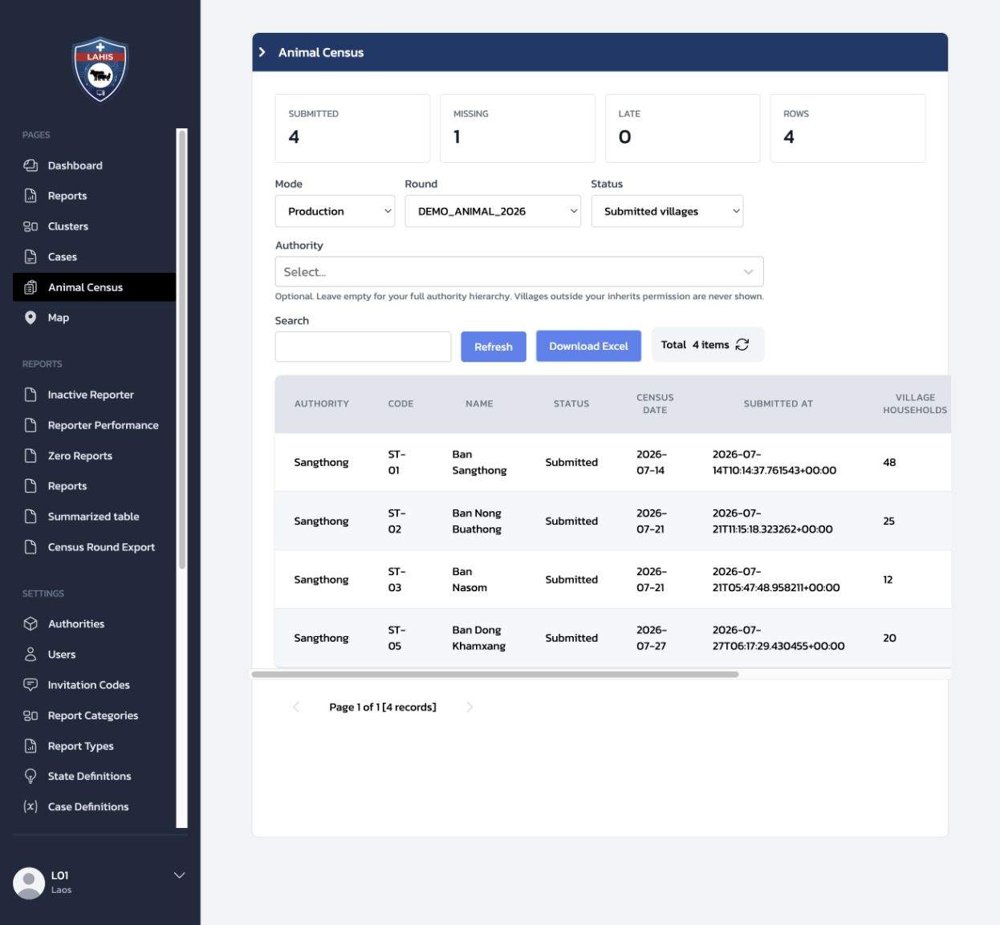

*ภาพที่ 53 — รายการ `Submitted villages` พร้อมวันที่ส่งและยอดสรุประดับหมู่บ้าน*

ค่าตัวเลขในภาพเป็นข้อมูล ณ เวลาที่จัดทำคู่มือและอาจเปลี่ยนเมื่อมีการส่งใหม่ ผู้ทดสอบควรเปรียบเทียบชื่อหมู่บ้าน วันที่ และค่าที่เพิ่งบันทึกจาก Mobile แทนการยึดตัวเลขในภาพ

### 13.6 ส่งออกข้อมูลเป็น Excel

หลังเลือก Mode และ Round ที่ต้องการแล้ว กด `Download Excel` เพื่อดาวน์โหลดข้อมูลของ Census Round สำหรับตรวจสอบหรือวิเคราะห์ต่อ ก่อนนำไฟล์ไปใช้ ให้ตรวจว่า Round ในหน้าจอตรงกับรอบที่ต้องการส่งออก

การทดสอบไฟล์ควรตรวจอย่างน้อย:

- เปิดไฟล์ได้และมีหัวตาราง
- มีรหัสและชื่อหมู่บ้าน
- สถานะและวันที่ส่งตรงกับ Dashboard
- ยอดครัวเรือนและจำนวนสัตว์ของหมู่บ้านทดสอบตรงกับข้อมูลล่าสุด
- ข้อมูลในไฟล์อยู่ภายใต้สังกัดของ User เช่น User ระดับแขวงมีเฉพาะหมู่บ้านภายในแขวงของตน

### 13.7 จุดตรวจสำหรับผู้ทดสอบ

| จุดที่ตรวจ | ผลที่ควรเห็น |
|---|---|
| Mobile | Reporter เห็น Animal Census ของหมู่บ้านที่ตนสังกัด |
| Round | แบบฟอร์มแสดง `DEMO_ANIMAL_2026` |
| การบันทึกซ้ำ | ค่าจากการส่งล่าสุดกลายเป็นข้อมูลปัจจุบันของหมู่บ้านในรอบเดิม |
| Dashboard summary | ตัวนับ Submitted, Missing และ Late สอดคล้องกับข้อมูลในรายการ |
| Submitted villages | แสดงวันที่ส่ง จำนวนครัวเรือน และจำนวนสัตว์ของหมู่บ้าน |
| ขอบเขตสิทธิ์ | Officer เห็นข้อมูลตาม Authority ที่ตนสังกัด เช่น User ระดับแขวงเห็นเฉพาะหมู่บ้านภายในแขวงของตน |
| Excel | ดาวน์โหลดไฟล์ของ Round ที่เลือกและตรวจข้อมูลสำคัญเทียบกับ Dashboard ได้ |

<a id="chapter-14"></a>

## 14. Summarized table — ตารางสรุปสำหรับ FAO Laos

`Summarized table` เป็นฟีเจอร์หลักของบทนี้ และเป็นรูปแบบตารางสรุปที่ FAO และทีม Laos กำหนดสำหรับนำข้อมูล `Animal Sick/Death` ไปตรวจสอบและวิเคราะห์ต่อ ผู้ทดสอบควรให้ความสำคัญกับการดาวน์โหลดและตรวจความถูกต้องของไฟล์นี้ก่อน Export แบบอื่น

> **ลำดับการทดสอบ:** ให้ทดสอบ `Summarized table` เป็นรายการหลัก ส่วน `Reports` และ `Census Round Export` เป็นไฟล์สนับสนุนสำหรับตรวจข้อมูลเพิ่มเติมเมื่อจำเป็น

LAHIS มีไฟล์ส่งออกที่เกี่ยวข้องดังนี้:

| เมนู | ใช้เมื่อ | ลักษณะข้อมูล |
|---|---|---|
| **`Summarized table` — ฟีเจอร์หลัก** | ตารางสรุป Animal Sick/Death ตามรูปแบบที่ FAO และทีม Laos กำหนด | ข้อมูลหมู่บ้าน วันที่ โรคที่สงสัย ผลตรวจ และยอดสัตว์แยกชนิด |
| `Reports` ในกลุ่ม REPORTS — ไฟล์สนับสนุน | ตรวจข้อมูลราย Report และคำตอบจากแบบฟอร์ม | ข้อมูลระดับราย Report พร้อมเลือก Authority และ Report Type |
| `Census Round Export` — ไฟล์สนับสนุน | ตรวจข้อมูล Animal Census ของรอบที่เลือก | หนึ่งหมู่บ้านต่อหนึ่งแถว พร้อมลำดับ Authority และยอดครัวเรือน/สัตว์ |

สิทธิ์การเห็นและส่งออกข้อมูลถูกกำกับโดย Authority ที่ User สังกัด เช่น User ระดับแขวงทำงานกับข้อมูลหมู่บ้านภายในแขวงของตน ส่วนบัญชี `L01` สังกัดระดับประเทศจึงใช้ตรวจข้อมูลภาพรวมได้

### 14.1 ทดสอบ Summarized table — เส้นทางหลัก

`Summarized table` เป็นไฟล์ที่จัดรูปแบบสำหรับข้อมูล `Animal Sick/Death` โดยเฉพาะ ผู้ใช้ไม่ต้องเลือก Report Type หรือ Authority บนหน้าจอนี้

1. เลือก `Summarized table` จากกลุ่มเมนู REPORTS ด้านซ้าย
2. กำหนด `From Date` และ `To Date`
3. ตรวจช่วงวันที่อีกครั้ง
4. กด `Download Excel`

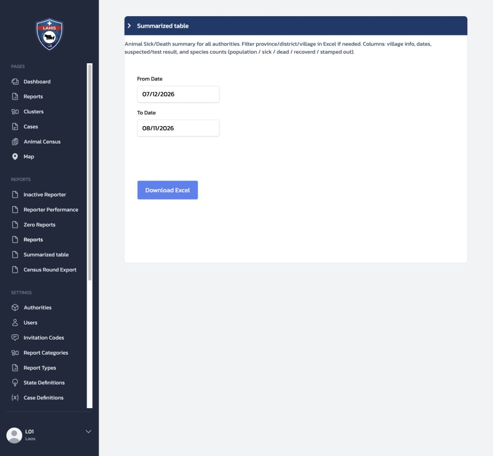

*ภาพที่ 54 — หน้า `Summarized table` ให้กำหนดช่วงวันที่ก่อนดาวน์โหลดไฟล์ Animal Sick/Death*

ไฟล์นี้ประกอบด้วยข้อมูลที่ช่วยวิเคราะห์เหตุการณ์ เช่น:

- ข้อมูล Province, District และ Village
- วันที่ของ Report และเหตุการณ์
- โรคที่สงสัยและ Test result
- จำนวนสัตว์ทั้งหมด ป่วย ตาย ฟื้นตัว และ Stamped out แยกตามชนิดสัตว์

หลังเปิด Excel สามารถใช้ Filter ของ Excel จำกัด Province, District หรือ Village เพิ่มเติมได้

### 14.2 ไฟล์สนับสนุน: ข้อมูลราย Report

เมนู `Reports` ในกลุ่ม REPORTS เป็นหน้าส่งออกข้อมูลราย Report ซึ่งเป็นคนละหน้ากับเมนู `Reports` ในกลุ่ม PAGES ที่ใช้ดูรายการบน Dashboard

1. เลือก `Reports` ภายใต้หัวข้อ REPORTS ในแถบด้านซ้าย
2. กำหนด `From Date` และ `To Date`
3. เลือก Authority ภายใต้สังกัดของ User
4. เลือก Report Type `Animal Sick/Death`
5. เลือกรูปแบบคอลัมน์ แล้วกด `Download Excel`

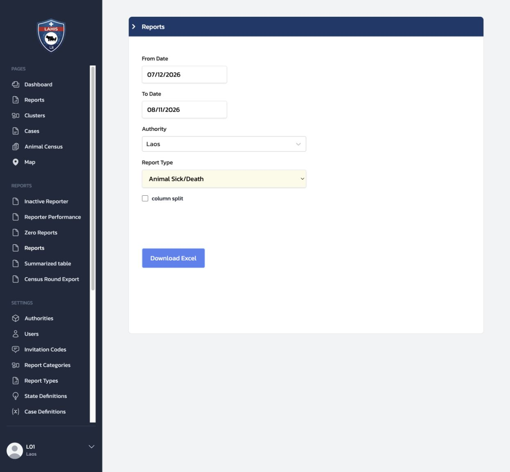

*ภาพที่ 55 — หน้า Export `Reports` มีตัวกรองช่วงวันที่ Authority และ Report Type*

ตัวเลือก `column split` มีผลต่อรูปแบบไฟล์:

| การเลือก | รูปแบบที่ได้ |
|---|---|
| ไม่เลือก | ข้อมูลคำตอบของแบบฟอร์มอยู่รวมในคอลัมน์ `DATA` เหมาะกับการเก็บข้อมูลต้นฉบับ |
| เลือก | แยกคำตอบจากแบบฟอร์มออกเป็นหลายคอลัมน์ เหมาะกับการกรองและวิเคราะห์ใน Excel |

ไฟล์แบบแยกคอลัมน์ยังมีข้อมูลประกอบ เช่น Report ID, Case ID, AI Suspected, Test result, Stamped out และข้อมูลการปิด Case เมื่อมีค่า

> **หมายเหตุ:** Generic Reports export ไม่รวม Report ที่ทำเครื่องหมาย `Test report` หากต้องการตรวจไฟล์ด้วยข้อมูลที่เพิ่งสร้าง ให้ใช้ Report ที่ไม่ได้ทำเครื่องหมายดังกล่าวและอยู่ในช่วงวันที่ที่เลือก

### 14.3 ไฟล์สนับสนุน: Census Round Export

เส้นทางนี้เป็นอีกทางเลือกหนึ่งของการส่งออก Animal Census ที่กล่าวถึงในบทที่ 13:

1. เลือก `Census Round Export`
2. เลือก Round `DEMO_ANIMAL_2026`
3. เลือก Authority ที่ต้องการภายใต้สังกัดของ User
4. กด `Download Excel`

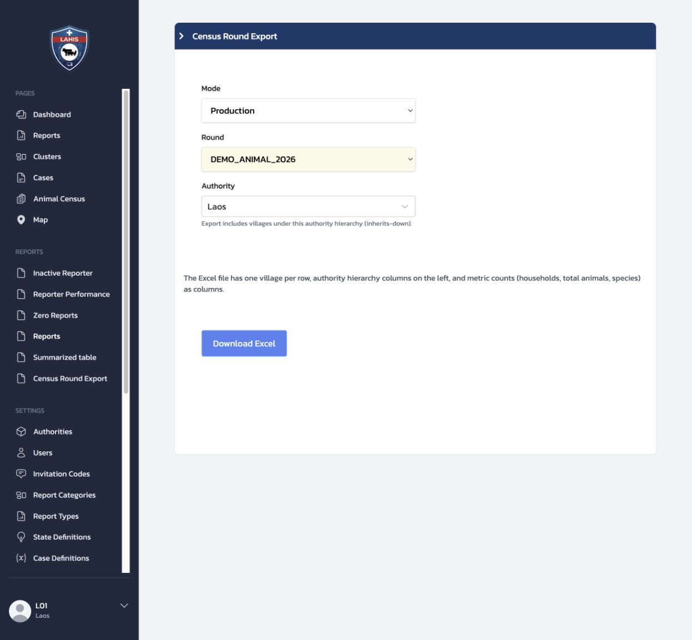

*ภาพที่ 56 — `Census Round Export` ส่งออกหนึ่งหมู่บ้านต่อหนึ่งแถวตาม Round และ Authority ที่เลือก*

ในไฟล์จะมีคอลัมน์ลำดับ Authority ทางซ้าย ตามด้วยสถานะ วันที่ส่ง จำนวนครัวเรือน จำนวนสัตว์รวม และจำนวนแยกตามชนิดสัตว์

### 14.4 ตรวจไฟล์ Summarized table หลังดาวน์โหลด

การกดดาวน์โหลดสำเร็จเพียงอย่างเดียวยังไม่เพียงพอ ให้เปิดไฟล์และตรวจอย่างน้อย:

| จุดที่ตรวจ | ผลที่ควรเห็น |
|---|---|
| ชื่อและรูปแบบไฟล์ | เป็นไฟล์ Excel และเปิดได้โดยไม่แจ้งว่าไฟล์เสีย |
| ช่วงวันที่ | ข้อมูลอยู่ในช่วงที่กำหนดบนหน้าจอ Export |
| ขอบเขตพื้นที่ | มีเฉพาะข้อมูลภายใต้ Authority ที่ User สังกัด |
| โครงสร้างหลัก | มีข้อมูลหมู่บ้าน วันที่ โรค และยอดสัตว์สำหรับ Animal Sick/Death |
| ยอดสัตว์ | มี Population, Sick, Dead, Recovered และ Stamped out แยกตามชนิดสัตว์ |
| ผลการตรวจ | มี Suspected disease และ Test result เมื่อข้อมูลต้นทางมีค่า |
| การเทียบต้นทาง | เลือกตัวอย่างหนึ่งรายการแล้วตรวจค่ากับ Report detail บน Dashboard |

ค่าจำนวนแถวและยอดในไฟล์จะเปลี่ยนตามช่วงวันที่ ขอบเขตสิทธิ์ และข้อมูลที่มีอยู่ ณ เวลาทดสอบ จึงไม่ควรเปรียบเทียบกับตัวเลขตายตัวในภาพคู่มือ

<a id="chapter-15"></a>

## 15. การเชื่อมต่อกับระบบภายนอก

ฟีเจอร์ AI Suspected, AI feedback, Risk Level และ Cluster ที่ทดสอบในบทก่อนหน้าไม่ได้เกิดขึ้นจากการกรอกข้อมูลบน LAHIS เพียงอย่างเดียว แต่เป็นผลจากการแลกเปลี่ยนข้อมูลกับระบบวิเคราะห์ภายนอก

เมื่อมี Report ใหม่ LAHIS สามารถแจ้งระบบภายนอกให้เริ่มวิเคราะห์ จากนั้นระบบภายนอกส่งผลที่ได้กลับมาเก็บกับ Report หรือ Cluster ที่เกี่ยวข้อง Officer และ Reporter จึงเห็นผลผ่านหน้าจอปกติโดยไม่ต้องเปิดระบบภายนอกเอง

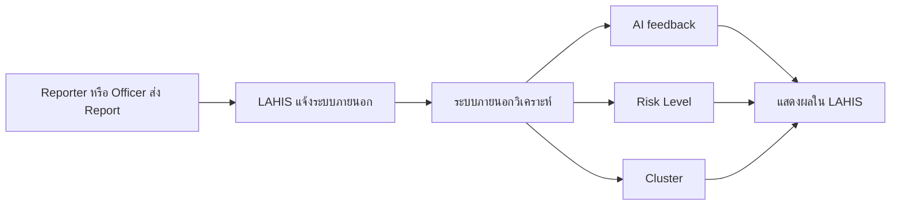
```mermaid
flowchart LR
    A["Reporter หรือ Officer ส่ง Report"] --> B["LAHIS แจ้งระบบภายนอก"]
    B --> C["ระบบภายนอกวิเคราะห์"]
    C --> D["AI feedback"]
    C --> E["Risk Level"]
    C --> F["Cluster"]
    D --> G["แสดงผลใน LAHIS"]
    E --> G
    F --> G
```

> **สำหรับผู้ทดสอบทั่วไป:** ไม่ต้องแก้เมนูในกลุ่ม `Integration` ให้เริ่มทดสอบผลลัพธ์ตามหัวข้อ 15.3 ได้เลย ส่วนหัวข้อ 15.1–15.2 เป็นข้อมูลประกอบสำหรับ Admin หรือผู้ประสานงานระบบ

### 15.1 ตรวจว่าฟีเจอร์ Integration เปิดอยู่

Admin สามารถเลือก `Integration Settings` จากกลุ่มเมนู Integration เพื่อตรวจสถานะของ tenant

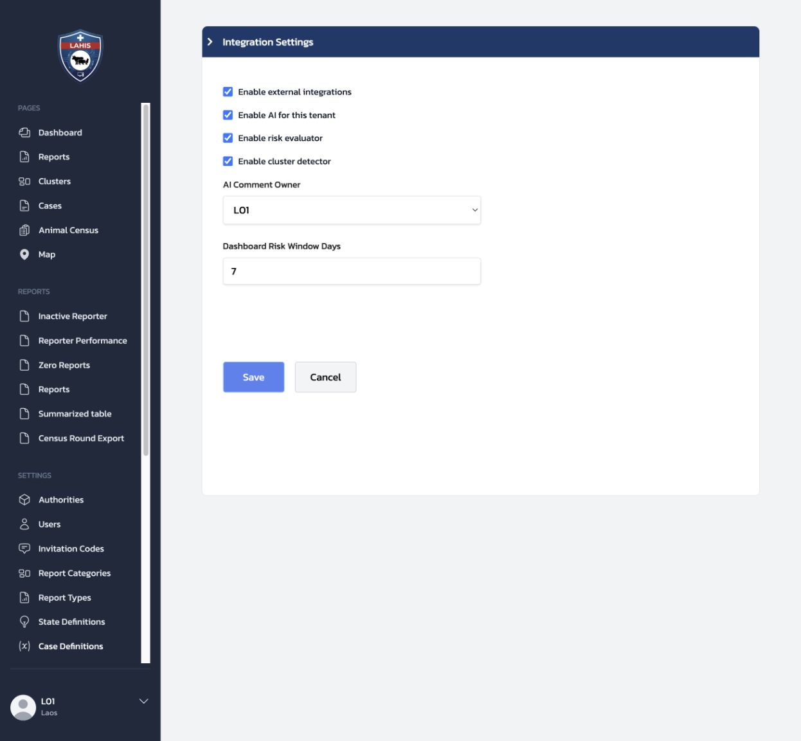

*ภาพที่ 57 — หน้า `Integration Settings` แสดงสวิตช์สำหรับ External Integration, AI, Risk และ Cluster*

| การตั้งค่า | ความหมาย |
|---|---|
| Enable external integrations | สวิตช์หลักสำหรับอนุญาตให้ tenant แลกเปลี่ยนข้อมูลกับระบบภายนอก |
| Enable AI for this tenant | อนุญาตให้ใช้ผลและความคิดเห็นจาก AI |
| Enable risk evaluator | อนุญาตให้รับผลประเมิน Risk จากระบบภายนอก |
| Enable cluster detector | อนุญาตให้รับผลการจัดกลุ่ม Report |
| AI Comment Owner | บัญชีที่ใช้แสดงเป็นเจ้าของความคิดเห็นซึ่งส่งมาจาก AI |
| Dashboard Risk Window Days | ค่าจำนวนวันที่ใช้เป็นช่วงข้อมูล Risk บน Dashboard |

ในการทดสอบให้ตรวจว่าสวิตช์ของฟีเจอร์ที่ต้องการทดสอบเปิดอยู่เท่านั้น ไม่ต้องกด `Save` หากไม่ได้รับมอบหมายให้เปลี่ยน Configuration

### 15.2 หน้าที่ของเมนูสำหรับผู้ดูแลระบบ

เมนูในกลุ่ม Integration มีหน้าที่ต่างกัน:

| เมนู | หน้าที่ |
|---|---|
| Integration Settings | เปิดหรือปิดความสามารถของ Integration ในระดับ tenant |
| Integration Clients | กำหนดระบบภายนอกที่ได้รับอนุญาตให้อ่านข้อมูลและส่งผลกลับ พร้อมจำกัดขอบเขตการทำงานของแต่ละระบบ |
| Webhook Endpoints | กำหนดปลายทางที่ LAHIS ใช้แจ้งเหตุการณ์ เช่น เมื่อมี Report ใหม่ |

ข้อมูล Client ID, Client secret, token และรายละเอียดการเชื่อมต่อเป็นข้อมูลสำหรับผู้ดูแลระบบ ไม่ควรถ่ายภาพ คัดลอก หรือใส่ไว้ในรายงานผลการทดสอบ หากต้องตรวจปัญหาการเชื่อมต่อ ให้ส่งเฉพาะ Report ID, วันเวลา และอาการที่พบแก่ผู้ดูแล

### 15.3 ทดสอบผลลัพธ์แบบ End-to-end

ผู้ทดสอบไม่จำเป็นต้องเรียก Integration โดยตรง ให้เริ่มจากการทำงานตามปกติ:

1. ใช้ Reporter บน Mobile หรือ Officer บน Dashboard ส่ง Report `Animal Sick/Death` ที่ทีมกำหนดสำหรับทดสอบ
2. จด Report ID และเวลาที่ส่ง
3. เปิด Report detail บน Dashboard และรอให้ระบบภายนอกประมวลผล
4. ตรวจ AI Suspected และ AI feedback ตามบทที่ 8
5. ตรวจ Risk Level ตามบทที่ 9
6. ตรวจว่า Report เชื่อมกับ Cluster หรือไม่ตามบทที่ 12 เมื่อระบบภายนอกจัด Report นี้เข้ากลุ่ม

ผลจากระบบภายนอกอาจไม่ได้กลับมาพร้อมกัน และ Report บางรายการอาจไม่มีผลบางชนิด เช่น ไม่ได้ถูกจัดเข้า Cluster การไม่มีผลจึงต้องพิจารณาร่วมกับกติกาของระบบวิเคราะห์และเวลาที่ใช้ประมวลผล

### 15.4 เมื่อไม่พบผลจากระบบภายนอก

ให้ตรวจตามลำดับโดยไม่เปลี่ยน Configuration:

1. ยืนยันว่าเปิด Report ต้นทางที่ถูกต้อง
2. ตรวจว่า Report ID และวันเวลาตรงกับรายการที่เพิ่งส่ง
3. Refresh หน้า Report detail หลังรอการประมวลผลตามเวลาที่ทีมกำหนด
4. ตรวจว่า `Integration Settings` ของฟีเจอร์นั้นเปิดอยู่
5. เก็บ Report ID, วันเวลาที่ส่ง, ฟีเจอร์ที่ไม่แสดงผล และ Screenshot ของหน้าจอ
6. ส่งข้อมูลดังกล่าวให้ผู้ดูแล Integration ตรวจต่อ

ไม่ควรสร้าง Client ใหม่ เปลี่ยน Scope แก้ Webhook URL หรือเปิดเผยข้อมูลรับรองเพื่อทดลองแก้ปัญหาด้วยตนเอง

### 15.5 จุดตรวจสำหรับผู้ทดสอบ

| จุดที่ตรวจ | ผลที่ควรเห็น |
|---|---|
| Integration Settings | ฟีเจอร์ที่อยู่ในขอบเขตทดสอบเปิดใช้งาน |
| Report ต้นทาง | มี Report ID ที่ใช้อ้างอิงผลจากระบบภายนอกได้ |
| AI | Reporter หรือ Officer เห็นผลในตำแหน่งที่อธิบายในบทที่ 8 |
| Risk | Dashboard แสดงระดับความเสี่ยงและ Officer แก้ไขได้ตามบทที่ 9 |
| Cluster | Cluster detail เชื่อมกลับมายัง Report ต้นทางได้ตามบทที่ 12 |
| ความปลอดภัย | ไม่มี Client secret, token หรือข้อมูลรับรองปรากฏในหลักฐานการทดสอบ |
| เมื่อเกิดปัญหา | มี Report ID เวลา และ Screenshot เพียงพอให้ผู้ดูแลตรวจสอบต่อ |
